## 빅콘테스트
  * 빅데이터 문제를 기계학습에 기반하여 직접 체험 및 분석하는 기회를 제공함으로써, 현안 문제를 해결할 수 있는 빅데이터 전문가를 발굴하고 취업 연계 지원 
  * 기간 8.1 ~ 9.30
  * http://contest.kbig.kr/
  

###  챌린지리그
  
  * 빅데이터 분석을 통한 보험사기 예측 알고리즘 개발
  * 최근 약 10여년 간의 보험사기자와 일반고객으로 구분하여 구성된 데이터공 제공
  * 고객정보, 계약정보, 지급정보, 설계사 정보 등 포함
  
  * 결과 및 평가
    * Test-set 내에서의 보험사기자 및 일반고객 구분 결과표
    * F-measure 값(Precision/Recall의 조화평균)을 비교하여 높은 참가자 순으로 2차 평가 대상자 선정
    * Precision: 참가자가 보험사기자로 판별한 사람 중 실제 보험사기자의 비율
    * Recall: 실제보험사기자 전체 중 참가자가 보험사기자로 판별한 사람의 비율 
    
    
###  데이터 소개
    
  * BGCON_CUST_DATA
    * 보험 계약자 관련 데이터
    * CUST_ID(고객 번호) 기준으로 개인별 1개씩 필드를 가지고 있음
    * CUST_ID기준으로 BGCON_CLAIM_DATA, BGCON_CNTT_DATA, BGCON_FMLY_DATA 데이터와 연결되어 있음
    
  * BGCON_CLAIM_DATA
    * 보험 신청 관련 데이터음
    * CUST_ID(고객 번호) 기준으로 여러건의 보험 청구 건수를 가지고 있으
    
  * BGCON_CNTT_DATA
    * 보험 계약 관련 데이터
    * CUST_ID(고객 번호) 기준으로 여러건의 보험계약사항을 가지고 있음
    * CLLT_FP_PRNO(FP사번)을 기준으로 BGCON_FPINFO_DATA와 연결되어 있음

  * BGCON_FMLY_DATA
    * 보험자간 관계 데이터음
    * CUST_ID(고객 번호) - SUB_CUST_ID(고객 번호) 번호를 기준으로 고객간의 관계에 대해 표시
    
  * BGCON_FPINFO_DATA
    * 보험설계사(FP) 관련 데이터
    * CLLT_FP_PRNO(FP사번) 기준으로 BGCON_CNTT_DATA와 연결되어 있음.
    * 한 FP는 여러 보험 계약 건수를 가지고 있음

#### 목적은 BGCON_CUST_DATA 데이터의  보험사기여부(SIU_CUST_YN)필드의 보험사기(Y) 보험사기아님(N)을 분류하는 문제


### 탐색적 데이터 분석

#### 결측치 확인

  * 실효년월(LAPS_YM) 이 대부분 비어 있음
  * 소멸년월(EXTN_YM) 많이 비어 있음
  * FP와 고객간의거리(DISTANCE)는 일부 비어 있음
  * MAXCRDT, MINCRDT는 중요한 factor로 보이지만 많은 데이터가 비어 있음

#### SIU_CUST_YN 보험사기자를 기준으로 데이터를 확인
#### BGCON_CUST_DATA

  * FP경력(FP_CAREER)이 5% 더 높음 하지만, 모수가 많지 않음

  * 신용등급_최소(MINCRDT)의 경우 7등급 이하의 하위가 더 높음
  * 신용등급_최대(MAXCRDT)의 경우 7등급 이하의 하위가 더 높음

  * 결혼여부(WEDD_YN) 결혼한 경우가 4% 더 높음

  * FMLY_RELN_CODE 형제 자매의 관계에서 사기로 분류된 경우가 많음, 가족 아이디로 엮인 부분이 더 많음


#### BGCON_CLAIM_DATA

  * CLAIM 데이터의 경우, 보험처리건수로 여러개일 수 있기 때문에 중복 집계될 가능성이 높음
  * 좀더 정확히 보기 위해, 보험처리건수별 아이디 한개로 제한해서 테스트 해야함

  * 직업그룹코드1(ACCI_OCCP_GRP1)
    * 1.주부인 경우 6% 더 높음
    * 자영업 경우 6% 더 높음
    * 서비스직인 경우 3% 더 높음
    * 전문직인 경우 3% 더 낮음
    * 제조업인 경우 3% 더 낮음
  
  * 직업그룹코드2(ACCI_OCCP_GRP2)
    * 3차산업 종사자 경우 5% 더 높음
    * 1차산업종사자 1%, 2차산업종사자 3% 더 낮음
    * 자영업 경우 5% 더 높음
    * 주부 경우 6% 더 높음
    * 법무직 종사자의 경우 사기건수 미존재
    * 고소득 전문직의 경우 사기건수 미존재
  
  * 청구사유 코드(DMND_RESN_CODE)
    * 02(입원)이 유의미하게 높음 23%
    * 대신 수술(05)는 절반정도 낮음
  
  * 실소처리여부(PMMI_DLNG_YN)은 현격하게 낮음 15%
  
  * 금감원 유의병원 대상(HEED_HOSP_YN)유의 병원인 경우가 2%더 높음
  
  * 병원종별구분(HOSP_SPEC_DVSN)에서
    * 한방병원(80) 8%, 의료기관이외(95) 7%로 유의미 하게 높음
    * 종합병원(10) 20%로 유의미 하게 낮음
  
  * 유효입원/통원일수(VLID_HOSP_OTDA) 최소, 평균, 최대 모두 높게 나옴

  * 뉴스기사 : 지난해 보험사기 적발 6549억원…사상 최대
    * 위 뉴스기사와 비슷한 결과를 보이는 factor들이 많이 존재
    * 주부, 자영업의 직업군 영향이 높

#### BGCON_CNTT_DATA

  * FP경력(FP_CAREER)이 5% 더 높음 하지만, 모수가 많지 않음

  * 신용등급_최소(MINCRDT)의 경우 7등급 이하의 하위가 더 높음
  * 신용등급_최대(MAXCRDT)의 경우 7등급 이하의 하위가 더 높음

  * 결혼여부(WEDD_YN) 결혼한 경우가 4% 더 높음

  * FMLY_RELN_CODE 형제 자매의 관계에서 사기로 분류된 경우가 많음, 가족 아이디로 엮인 부분이 더 많음


### 상관분석

  * 의미 있는 상관관계 파악


```{r}
#Set path
setwd("C:\\xxxxx\\xxxxx\\xxxx")

#######################################################################
########################### PRE PROCESSING ############################
#######################################################################
#라이브러리 불러오기
#install.packages("corrplot")
suppressPackageStartupMessages({
  library(caret)
  library(corrplot)			# plot correlations
  library(doParallel)		# parallel processing
  library(dplyr)        # Used by caret
  library(gbm)				  # GBM Models
  library(pROC)				  # plot the ROC curve
  library(xgboost)      # Extreme Gradient Boosting
  library(missForest)   # Missing Data 채우는 패키지
  library(caretEnsemble)
  library(DMwR)
  library(randomForest) # for feature importance
})

###################### Set up for parallel procerssing
set.seed(13784)
registerDoParallel(4,cores=4)
getDoParWorkers()


# CSV Raw Data 불러오기
BGCON_CLAIM_DATA <- read.csv("data/BGCON_CLAIM_DATA.csv")
BGCON_CNTT_DATA <- read.csv("data/BGCON_CNTT_DATA.csv")
BGCON_CUST_DATA <- read.csv("data/BGCON_CUST_DATA.csv") # 기준 데이터
BGCON_FMLY_DATA <- read.csv("data/BGCON_FMLY_DATA.csv")
BGCON_FPINFO_DATA <- read.csv("data/BGCON_FPINFO_DATA.csv")


############################################ Train Test, 정확히 분리하기
# 제출용 Test 데이터를 분리
BGCON_CUST_DATA.TRAIN <- BGCON_CUST_DATA[which(BGCON_CUST_DATA$DIVIDED_SET == 1), ]
BGCON_CUST_DATA.TEST <- BGCON_CUST_DATA[which(BGCON_CUST_DATA$DIVIDED_SET == 2), ]

############################# TRAIN ###################################
# CLAIM 데이터에서 CUST ID에 해당하는 ROW들만 추출해서 새로운 DF로 저장함
#cust_id <- data.frame(CUST_ID=train.batch.down$CUST_ID) 
#BGCON_CLAIM_DATA.TRAIN <- merge(x=BGCON_CLAIM_DATA, y=cust_id, by="CUST_ID", All.x=TRUE)
BGCON_CLAIM_DATA.TRAIN <- BGCON_CLAIM_DATA[BGCON_CLAIM_DATA$CUST_ID %in% BGCON_CUST_DATA.TRAIN$CUST_ID, ] #위 2줄과 동일한 효과
#for debugging
#head(unique(sort(train.batch.down$CUST_ID)), n = 10)
#head(unique(sort(BGCON_CLAIM_DATA.TRAIN$CUST_ID)), n = 10)

# BGCON_FMLY_DATA
BGCON_FMLY_DATA.TRAIN <- BGCON_FMLY_DATA[BGCON_FMLY_DATA$CUST_ID %in% BGCON_CUST_DATA.TRAIN$CUST_ID, ] 
#for debugging
#head(unique(sort(train.batch.down$CUST_ID)), n = 100)
#head(unique(sort(BGCON_FMLY_DATA.TRAIN$CUST_ID)), n = 100)

# BGCON_CNTT_DATA
BGCON_CNTT_DATA.TRAIN <- BGCON_CNTT_DATA[BGCON_CNTT_DATA$CUST_ID %in% BGCON_CUST_DATA.TRAIN$CUST_ID, ] 
#for debugging
#head(unique(sort(train.batch.down$CUST_ID)), n = 10)
#head(unique(sort(BGCON_CNTT_DATA.TRAIN$CUST_ID)), n = 10)

# BGCON_FPINFO_DATA
BGCON_FPINFO_DATA.TRAIN <- BGCON_FPINFO_DATA[BGCON_FPINFO_DATA$CLLT_FP_PRNO %in% BGCON_CNTT_DATA.TRAIN$CLLT_FP_PRNO, ]
#for debugging
#head(unique(sort(BGCON_CNTT_DATA.TRAIN$CLLT_FP_PRNO)), n = 10)
#head(unique(sort(BGCON_FPINFO_DATA.TRAIN$CLLT_FP_PRNO)), n = 10)

############################# TEST ###################################
# CLAIM 데이터에서 CUST ID에 해당하는 ROW들만 추출해서 새로운 DF로 저장함
BGCON_CLAIM_DATA.TEST <- BGCON_CLAIM_DATA[BGCON_CLAIM_DATA$CUST_ID %in% BGCON_CUST_DATA.TEST$CUST_ID, ]
BGCON_FMLY_DATA.TEST <- BGCON_FMLY_DATA[BGCON_FMLY_DATA$CUST_ID %in% BGCON_CUST_DATA.TEST$CUST_ID, ] 
BGCON_CNTT_DATA.TEST <- BGCON_CNTT_DATA[BGCON_CNTT_DATA$CUST_ID %in% BGCON_CUST_DATA.TEST$CUST_ID, ] 
BGCON_FPINFO_DATA.TEST <- BGCON_FPINFO_DATA[BGCON_FPINFO_DATA$CLLT_FP_PRNO %in% BGCON_CNTT_DATA.TEST$CLLT_FP_PRNO, ]
#head(unique(sort(BGCON_CNTT_DATA.TEST$CLLT_FP_PRNO)), n = 10)
#head(unique(sort(BGCON_FPINFO_DATA.TEST$CLLT_FP_PRNO)), n = 10)


############################# TRAIN ###################################
####DATE 변수들에서 YEAR를 추출함
#BGCON_CLAIM_DATA
BGCON_CLAIM_DATA.TRAIN$RECP_DATE_YEAR <- as.numeric(format(as.Date(as.character(BGCON_CLAIM_DATA.TRAIN$RECP_DATE), format = "%Y%m%d"), "%Y"))
BGCON_CLAIM_DATA.TRAIN$ORIG_RESN_DATE_YEAR <- as.numeric(format(as.Date(as.character(BGCON_CLAIM_DATA.TRAIN$ORIG_RESN_DATE), format = "%Y%m%d"), "%Y"))
BGCON_CLAIM_DATA.TRAIN$RESN_DATE_YEAR <- as.numeric(format(as.Date(as.character(BGCON_CLAIM_DATA.TRAIN$RESN_DATE), format = "%Y%m%d"), "%Y"))
BGCON_CLAIM_DATA.TRAIN$PAYM_DATE_YEAR <- as.numeric(format(as.Date(as.character(BGCON_CLAIM_DATA.TRAIN$PAYM_DATE), format = "%Y%m%d"), "%Y"))

#BGCON_CLAIM_DATA
BGCON_CUST_DATA.TRAIN$CUST_RGST_YEAR <- as.numeric(format(as.Date(paste(as.character(BGCON_CUST_DATA.TRAIN$CUST_RGST), c("01"), sep=""), format = "%Y%m%d"), "%Y"))
BGCON_CUST_DATA.TRAIN$MAX_PAYM_YM_YEAR <- as.numeric(format(as.Date(paste(as.character(BGCON_CUST_DATA.TRAIN$MAX_PAYM_YM), c("01"), sep=""), format = "%Y%m%d"), "%Y"))

#BGCON_CNTT_DATA
BGCON_CNTT_DATA.TRAIN$CNTT_YM_YEAR <- as.numeric(format(as.Date(paste(as.character(BGCON_CNTT_DATA.TRAIN$CNTT_YM), c("01"), sep=""), format = "%Y%m%d"), "%Y"))
BGCON_CNTT_DATA.TRAIN$EXPR_YM_YEAR <- as.numeric(format(as.Date(paste(as.character(BGCON_CNTT_DATA.TRAIN$EXPR_YM), c("01"), sep=""), format = "%Y%m%d"), "%Y"))
BGCON_CNTT_DATA.TRAIN$EXTN_YM_YEAR <- as.numeric(format(as.Date(paste(as.character(BGCON_CNTT_DATA.TRAIN$EXTN_YM), c("01"), sep=""), format = "%Y%m%d"), "%Y"))
BGCON_CNTT_DATA.TRAIN$LAPS_YM_YEAR <- as.numeric(format(as.Date(paste(as.character(BGCON_CNTT_DATA.TRAIN$LAPS_YM), c("01"), sep=""), format = "%Y%m%d"), "%Y"))

#BGCON_FPINFO_DATA
BGCON_FPINFO_DATA.TRAIN$ETRS_YM_YEAR <- as.numeric(format(as.Date(paste(as.character(BGCON_FPINFO_DATA.TRAIN$ETRS_YM), c("01"), sep=""), format = "%Y%m%d"), "%Y"))
BGCON_FPINFO_DATA.TRAIN$FIRE_YM_YEAR <- as.numeric(format(as.Date(paste(as.character(BGCON_FPINFO_DATA.TRAIN$FIRE_YM), c("01"), sep=""), format = "%Y%m%d"), "%Y"))

##BGCON_CLAIM_DATA 데이터에서 병명 데이터 앞글자를 분리 
BGCON_CLAIM_DATA.TRAIN$CAUS_CODE_FIRST <- substring(BGCON_CLAIM_DATA.TRAIN$CAUS_CODE, 1, 1)
BGCON_CLAIM_DATA.TRAIN$RESL_CD1_FIRST <- substring(BGCON_CLAIM_DATA.TRAIN$RESL_CD1, 1, 1)


############################# TEST ###################################
####DATE 변수들에서 YEAR를 추출함
BGCON_CLAIM_DATA.TEST$RECP_DATE_YEAR <- as.numeric(format(as.Date(as.character(BGCON_CLAIM_DATA.TEST$RECP_DATE), format = "%Y%m%d"), "%Y"))
BGCON_CLAIM_DATA.TEST$ORIG_RESN_DATE_YEAR <- as.numeric(format(as.Date(as.character(BGCON_CLAIM_DATA.TEST$ORIG_RESN_DATE), format = "%Y%m%d"), "%Y"))
BGCON_CLAIM_DATA.TEST$RESN_DATE_YEAR <- as.numeric(format(as.Date(as.character(BGCON_CLAIM_DATA.TEST$RESN_DATE), format = "%Y%m%d"), "%Y"))
BGCON_CLAIM_DATA.TEST$PAYM_DATE_YEAR <- as.numeric(format(as.Date(as.character(BGCON_CLAIM_DATA.TEST$PAYM_DATE), format = "%Y%m%d"), "%Y"))
BGCON_CUST_DATA.TEST$CUST_RGST_YEAR <- as.numeric(format(as.Date(paste(as.character(BGCON_CUST_DATA.TEST$CUST_RGST), c("01"), sep=""), format = "%Y%m%d"), "%Y"))
BGCON_CUST_DATA.TEST$MAX_PAYM_YM_YEAR <- as.numeric(format(as.Date(paste(as.character(BGCON_CUST_DATA.TEST$MAX_PAYM_YM), c("01"), sep=""), format = "%Y%m%d"), "%Y"))
BGCON_CNTT_DATA.TEST$CNTT_YM_YEAR <- as.numeric(format(as.Date(paste(as.character(BGCON_CNTT_DATA.TEST$CNTT_YM), c("01"), sep=""), format = "%Y%m%d"), "%Y"))
BGCON_CNTT_DATA.TEST$EXPR_YM_YEAR <- as.numeric(format(as.Date(paste(as.character(BGCON_CNTT_DATA.TEST$EXPR_YM), c("01"), sep=""), format = "%Y%m%d"), "%Y"))
BGCON_CNTT_DATA.TEST$EXTN_YM_YEAR <- as.numeric(format(as.Date(paste(as.character(BGCON_CNTT_DATA.TEST$EXTN_YM), c("01"), sep=""), format = "%Y%m%d"), "%Y"))
BGCON_CNTT_DATA.TEST$LAPS_YM_YEAR <- as.numeric(format(as.Date(paste(as.character(BGCON_CNTT_DATA.TEST$LAPS_YM), c("01"), sep=""), format = "%Y%m%d"), "%Y"))
BGCON_FPINFO_DATA.TEST$ETRS_YM_YEAR <- as.numeric(format(as.Date(paste(as.character(BGCON_FPINFO_DATA.TEST$ETRS_YM), c("01"), sep=""), format = "%Y%m%d"), "%Y"))
BGCON_FPINFO_DATA.TEST$FIRE_YM_YEAR <- as.numeric(format(as.Date(paste(as.character(BGCON_FPINFO_DATA.TEST$FIRE_YM), c("01"), sep=""), format = "%Y%m%d"), "%Y"))
##BGCON_CLAIM_DATA 데이터에서 병명 데이터 앞글자를 분리 
BGCON_CLAIM_DATA.TEST$CAUS_CODE_FIRST <- substring(BGCON_CLAIM_DATA.TEST$CAUS_CODE, 1, 1)
BGCON_CLAIM_DATA.TEST$RESL_CD1_FIRST <- substring(BGCON_CLAIM_DATA.TEST$RESL_CD1, 1, 1)


####다른 필드의 값을 Sum 하여 df1 필드에 채워줌
#df_from : 가져오려는 필드가 있는 df
#df_to : df_from에서 가져온 필드를 저장하려는 df
#t_col_name : df_from에서 가져오려 column 명
#c_col_name : 만들려는 column 이름
#by_col_name : merge 하기위해서 기준이 되는 column 명
#FUN : 적용할 function  ex) sum
#t_na : NA값 이 생길경우 넣을 값  ex)숫자의 경우 0으로 채움
merge_after_aggregate <- function(df_from, df_to, by_col_name, t_col_name, c_col_name, FUN, t_na=NULL){
  agg_df_temp <- aggregate(df_from[, t_col_name], by=list(df_from[, by_col_name]), FUN=FUN)
  colnames(agg_df_temp) <- c(by_col_name, c_col_name)
  ret_df <- merge(x = df_to, y = agg_df_temp, by = by_col_name, all=TRUE)
  #NA 값 채우기
  if(!is.null(t_na)){
    ret_df[is.na(ret_df[, c_col_name]), c_col_name] <- t_na
  }
  return (ret_df)
}

############################# TRAIN ###################################
## 각 아이디별 총 CLAIM(보험처리건수)를 기록하여 BGCON_CUST_DATA에 merge 함 
is.not.na <- function(x){ sum(!is.na(x)) }
BGCON_CUST_DATA.TRAIN <- merge_after_aggregate(BGCON_CLAIM_DATA.TRAIN, BGCON_CUST_DATA.TRAIN, "CUST_ID", "POLY_NO", "CLAIM_TOTAL", is.not.na, 0)

## BGCON_CLAIM_DATA의 numeric 값의 데이터중 TOTAL(SUM)이 가능한 값들을 SUM하여 BGCON_CUST_DATA에 merge 함
BGCON_CUST_DATA.TRAIN <- merge_after_aggregate(BGCON_CLAIM_DATA.TRAIN, BGCON_CUST_DATA.TRAIN, "CUST_ID", "VLID_HOSP_OTDA", "VLID_HOSP_OTDA_TOTAL", sum)
BGCON_CUST_DATA.TRAIN <- merge_after_aggregate(BGCON_CLAIM_DATA.TRAIN, BGCON_CUST_DATA.TRAIN, "CUST_ID", "VLID_HOSP_OTDA", "VLID_HOSP_OTDA_MEAN", mean)
BGCON_CUST_DATA.TRAIN <- merge_after_aggregate(BGCON_CLAIM_DATA.TRAIN, BGCON_CUST_DATA.TRAIN, "CUST_ID", "VLID_HOSP_OTDA", "VLID_HOSP_OTDA_MEDIAN", median)

BGCON_CUST_DATA.TRAIN <- merge_after_aggregate(BGCON_CLAIM_DATA.TRAIN, BGCON_CUST_DATA.TRAIN, "CUST_ID", "HOUSE_HOSP_DIST", "HOUSE_HOSP_DIST_TOTAL", sum)
BGCON_CUST_DATA.TRAIN <- merge_after_aggregate(BGCON_CLAIM_DATA.TRAIN, BGCON_CUST_DATA.TRAIN, "CUST_ID", "HOUSE_HOSP_DIST", "HOUSE_HOSP_DIST_MEAN", mean)
BGCON_CUST_DATA.TRAIN <- merge_after_aggregate(BGCON_CLAIM_DATA.TRAIN, BGCON_CUST_DATA.TRAIN, "CUST_ID", "HOUSE_HOSP_DIST", "HOUSE_HOSP_DIST_MEDIAN", median)
#정규분포로 정규화 하기위해 log + 1을 해줌
BGCON_CUST_DATA.TRAIN <- merge_after_aggregate(BGCON_CLAIM_DATA.TRAIN, BGCON_CUST_DATA.TRAIN, "CUST_ID", "DMND_AMT", "DMND_AMT_TOTAL", function(x){log(sum(x)+1)})
BGCON_CUST_DATA.TRAIN <- merge_after_aggregate(BGCON_CLAIM_DATA.TRAIN, BGCON_CUST_DATA.TRAIN, "CUST_ID", "DMND_AMT", "DMND_AMT_MEAN",  function(x){log(mean(x)+1)})
BGCON_CUST_DATA.TRAIN <- merge_after_aggregate(BGCON_CLAIM_DATA.TRAIN, BGCON_CUST_DATA.TRAIN, "CUST_ID", "DMND_AMT", "DMND_AMT_MEDIAN", function(x){log(median(x)+1)})

BGCON_CUST_DATA.TRAIN <- merge_after_aggregate(BGCON_CLAIM_DATA.TRAIN, BGCON_CUST_DATA.TRAIN, "CUST_ID", "PAYM_AMT", "PAYM_AMT_TOTAL", function(x){log(sum(x)+1)})
BGCON_CUST_DATA.TRAIN <- merge_after_aggregate(BGCON_CLAIM_DATA.TRAIN, BGCON_CUST_DATA.TRAIN, "CUST_ID", "PAYM_AMT", "PAYM_AMT_MEAN", function(x){log(mean(x)+1)})
BGCON_CUST_DATA.TRAIN <- merge_after_aggregate(BGCON_CLAIM_DATA.TRAIN, BGCON_CUST_DATA.TRAIN, "CUST_ID", "PAYM_AMT", "PAYM_AMT_MEDIAN", function(x){log(median(x)+1)})

BGCON_CUST_DATA.TRAIN <- merge_after_aggregate(BGCON_CLAIM_DATA.TRAIN, BGCON_CUST_DATA.TRAIN, "CUST_ID", "SELF_CHAM", "SELF_CHAM_TOTAL", sum)
BGCON_CUST_DATA.TRAIN <- merge_after_aggregate(BGCON_CLAIM_DATA.TRAIN, BGCON_CUST_DATA.TRAIN, "CUST_ID", "SELF_CHAM", "SELF_CHAM_MEAN", mean)
BGCON_CUST_DATA.TRAIN <- merge_after_aggregate(BGCON_CLAIM_DATA.TRAIN, BGCON_CUST_DATA.TRAIN, "CUST_ID", "SELF_CHAM", "SELF_CHAM_MEDIAN", median)

BGCON_CUST_DATA.TRAIN <- merge_after_aggregate(BGCON_CLAIM_DATA.TRAIN, BGCON_CUST_DATA.TRAIN, "CUST_ID", "NON_PAY", "NON_PAY_TOTAL", sum)
BGCON_CUST_DATA.TRAIN <- merge_after_aggregate(BGCON_CLAIM_DATA.TRAIN, BGCON_CUST_DATA.TRAIN, "CUST_ID", "NON_PAY", "NON_PAY_MEAN", mean)
BGCON_CUST_DATA.TRAIN <- merge_after_aggregate(BGCON_CLAIM_DATA.TRAIN, BGCON_CUST_DATA.TRAIN, "CUST_ID", "NON_PAY", "NON_PAY_MEDIAN", median)

BGCON_CUST_DATA.TRAIN <- merge_after_aggregate(BGCON_CLAIM_DATA.TRAIN, BGCON_CUST_DATA.TRAIN, "CUST_ID", "TAMT_SFCA", "TAMT_SFCA_TOTAL", sum)
BGCON_CUST_DATA.TRAIN <- merge_after_aggregate(BGCON_CLAIM_DATA.TRAIN, BGCON_CUST_DATA.TRAIN, "CUST_ID", "TAMT_SFCA", "TAMT_SFCA_MEAN", mean)
BGCON_CUST_DATA.TRAIN <- merge_after_aggregate(BGCON_CLAIM_DATA.TRAIN, BGCON_CUST_DATA.TRAIN, "CUST_ID", "TAMT_SFCA", "TAMT_SFCA_MEDIAN", median)

BGCON_CUST_DATA.TRAIN <- merge_after_aggregate(BGCON_CLAIM_DATA.TRAIN, BGCON_CUST_DATA.TRAIN, "CUST_ID", "PATT_CHRG_TOTA", "PATT_CHRG_TOTA_TOTAL",sum)
BGCON_CUST_DATA.TRAIN <- merge_after_aggregate(BGCON_CLAIM_DATA.TRAIN, BGCON_CUST_DATA.TRAIN, "CUST_ID", "PATT_CHRG_TOTA", "PATT_CHRG_TOTA_MEAN", mean)
BGCON_CUST_DATA.TRAIN <- merge_after_aggregate(BGCON_CLAIM_DATA.TRAIN, BGCON_CUST_DATA.TRAIN, "CUST_ID", "PATT_CHRG_TOTA", "PATT_CHRG_TOTA_MEDIAN", median)

BGCON_CUST_DATA.TRAIN <- merge_after_aggregate(BGCON_CLAIM_DATA.TRAIN, BGCON_CUST_DATA.TRAIN, "CUST_ID", "DSCT_AMT", "DSCT_AMT_TOTAL", sum)
BGCON_CUST_DATA.TRAIN <- merge_after_aggregate(BGCON_CLAIM_DATA.TRAIN, BGCON_CUST_DATA.TRAIN, "CUST_ID", "DSCT_AMT", "DSCT_AMT_MEAN", mean)
BGCON_CUST_DATA.TRAIN <- merge_after_aggregate(BGCON_CLAIM_DATA.TRAIN, BGCON_CUST_DATA.TRAIN, "CUST_ID", "DSCT_AMT", "DSCT_AMT_MEDIAN", median)

BGCON_CUST_DATA.TRAIN <- merge_after_aggregate(BGCON_CLAIM_DATA.TRAIN, BGCON_CUST_DATA.TRAIN, "CUST_ID", "COUNT_TRMT_ITEM", "COUNT_TRMT_ITEM_TOTAL",sum)
BGCON_CUST_DATA.TRAIN <- merge_after_aggregate(BGCON_CLAIM_DATA.TRAIN, BGCON_CUST_DATA.TRAIN, "CUST_ID", "COUNT_TRMT_ITEM", "COUNT_TRMT_ITEM_MEAN", mean)
BGCON_CUST_DATA.TRAIN <- merge_after_aggregate(BGCON_CLAIM_DATA.TRAIN, BGCON_CUST_DATA.TRAIN, "CUST_ID", "COUNT_TRMT_ITEM", "COUNT_TRMT_ITEM_MEDIAN", median)


## 각 아이디별 총 CNTT(보험가입건수)를 기록하여 BGCON_CUST_DATA에 merge 함 
BGCON_CUST_DATA.TRAIN <- merge_after_aggregate(BGCON_CNTT_DATA.TRAIN, BGCON_CUST_DATA.TRAIN, "CUST_ID", "POLY_NO", "CNTT_TOTAL", is.not.na, 0)

## BGCON_CNTT_DATA의 numeric 값의 데이터중 TOTAL(SUM)이 가능한 값들을 SUM하여 BGCON_CUST_DATA에 merge 함
BGCON_CUST_DATA.TRAIN <- merge_after_aggregate(BGCON_CNTT_DATA.TRAIN, BGCON_CUST_DATA.TRAIN, "CUST_ID", "REAL_PAYM_TERM", "REAL_PAYM_TERM_TOTAL",sum)
BGCON_CUST_DATA.TRAIN <- merge_after_aggregate(BGCON_CNTT_DATA.TRAIN, BGCON_CUST_DATA.TRAIN, "CUST_ID", "REAL_PAYM_TERM", "REAL_PAYM_TERM_MEAN", mean)
BGCON_CUST_DATA.TRAIN <- merge_after_aggregate(BGCON_CNTT_DATA.TRAIN, BGCON_CUST_DATA.TRAIN, "CUST_ID", "REAL_PAYM_TERM", "REAL_PAYM_TERM_MEDIAN", median)

BGCON_CUST_DATA.TRAIN <- merge_after_aggregate(BGCON_CNTT_DATA.TRAIN, BGCON_CUST_DATA.TRAIN, "CUST_ID", "MAIN_INSR_AMT", "MAIN_INSR_AMT_TOTAL", function(x){log(sum(as.numeric(x))+1)})
BGCON_CUST_DATA.TRAIN <- merge_after_aggregate(BGCON_CNTT_DATA.TRAIN, BGCON_CUST_DATA.TRAIN, "CUST_ID", "MAIN_INSR_AMT", "MAIN_INSR_AMT_MEAN", function(x){log(mean(x)+1)})
BGCON_CUST_DATA.TRAIN <- merge_after_aggregate(BGCON_CNTT_DATA.TRAIN, BGCON_CUST_DATA.TRAIN, "CUST_ID", "MAIN_INSR_AMT", "MAIN_INSR_AMT_MEDIAN", function(x){log(median(x)+1)})

BGCON_CUST_DATA.TRAIN <- merge_after_aggregate(BGCON_CNTT_DATA.TRAIN, BGCON_CUST_DATA.TRAIN, "CUST_ID", "SUM_ORIG_PREM", "SUM_ORIG_PREM_TOTAL", function(x){log(sum(x)+1)})
BGCON_CUST_DATA.TRAIN <- merge_after_aggregate(BGCON_CNTT_DATA.TRAIN, BGCON_CUST_DATA.TRAIN, "CUST_ID", "SUM_ORIG_PREM", "SUM_ORIG_PREM_MEAN", function(x){log(mean(x)+1)})
BGCON_CUST_DATA.TRAIN <- merge_after_aggregate(BGCON_CNTT_DATA.TRAIN, BGCON_CUST_DATA.TRAIN, "CUST_ID", "SUM_ORIG_PREM", "SUM_ORIG_PREM_MEDIAN", function(x){log(median(x)+1)})

BGCON_CUST_DATA.TRAIN <- merge_after_aggregate(BGCON_CNTT_DATA.TRAIN, BGCON_CUST_DATA.TRAIN, "CUST_ID", "MNTH_INCM_AMT", "MNTH_INCM_AMT_TOTAL", function(x){log(sum(x)+1)})
BGCON_CUST_DATA.TRAIN <- merge_after_aggregate(BGCON_CNTT_DATA.TRAIN, BGCON_CUST_DATA.TRAIN, "CUST_ID", "MNTH_INCM_AMT", "MNTH_INCM_AMT_MEAN", function(x){log(mean(x)+1)})
BGCON_CUST_DATA.TRAIN <- merge_after_aggregate(BGCON_CNTT_DATA.TRAIN, BGCON_CUST_DATA.TRAIN, "CUST_ID", "MNTH_INCM_AMT", "MNTH_INCM_AMT_MEDIAN", function(x){log(median(x)+1)})

BGCON_CUST_DATA.TRAIN <- merge_after_aggregate(BGCON_CNTT_DATA.TRAIN, BGCON_CUST_DATA.TRAIN, "CUST_ID", "DISTANCE", "DISTANCE_TOTAL", sum)
BGCON_CUST_DATA.TRAIN <- merge_after_aggregate(BGCON_CNTT_DATA.TRAIN, BGCON_CUST_DATA.TRAIN, "CUST_ID", "DISTANCE", "DISTANCE_MEAN", mean)
BGCON_CUST_DATA.TRAIN <- merge_after_aggregate(BGCON_CNTT_DATA.TRAIN, BGCON_CUST_DATA.TRAIN, "CUST_ID", "DISTANCE", "DISTANCE_MEDIAN", median)

## 부동산금액 정규화
BGCON_CUST_DATA.TRAIN <- transform(BGCON_CUST_DATA.TRAIN, TOTALPREM_LOG = log(TOTALPREM + 1))
BGCON_CUST_DATA.TRAIN <- transform(BGCON_CUST_DATA.TRAIN, MAX_PRM_LOG = log(MAX_PRM + 1))

## 정규 분포가 적절한지 히스토그램으로 확인해서 적용함.
#summary(BGCON_CUST_DATA$TOTALPREM_LOG)
#hist(BGCON_CUST_DATA$MAX_PRM_LOG, breaks=50, freq=TRUE) # INCOME 히스토그램


############################# TEST ###################################
## 각 아이디별 총 CLAIM(보험처리건수)를 기록하여 BGCON_CUST_DATA에 merge 함 
is.not.na <- function(x){ sum(!is.na(x)) }
BGCON_CUST_DATA.TEST <- merge_after_aggregate(BGCON_CLAIM_DATA.TEST, BGCON_CUST_DATA.TEST, "CUST_ID", "POLY_NO", "CLAIM_TOTAL", is.not.na, 0)

## BGCON_CLAIM_DATA의 numeric 값의 데이터중 TOTAL(SUM)이 가능한 값들을 SUM하여 BGCON_CUST_DATA에 merge 함
BGCON_CUST_DATA.TEST <- merge_after_aggregate(BGCON_CLAIM_DATA.TEST, BGCON_CUST_DATA.TEST, "CUST_ID", "VLID_HOSP_OTDA", "VLID_HOSP_OTDA_TOTAL", sum)
BGCON_CUST_DATA.TEST <- merge_after_aggregate(BGCON_CLAIM_DATA.TEST, BGCON_CUST_DATA.TEST, "CUST_ID", "VLID_HOSP_OTDA", "VLID_HOSP_OTDA_MEAN", mean)
BGCON_CUST_DATA.TEST <- merge_after_aggregate(BGCON_CLAIM_DATA.TEST, BGCON_CUST_DATA.TEST, "CUST_ID", "VLID_HOSP_OTDA", "VLID_HOSP_OTDA_MEDIAN", median)

BGCON_CUST_DATA.TEST <- merge_after_aggregate(BGCON_CLAIM_DATA.TEST, BGCON_CUST_DATA.TEST, "CUST_ID", "HOUSE_HOSP_DIST", "HOUSE_HOSP_DIST_TOTAL", sum)
BGCON_CUST_DATA.TEST <- merge_after_aggregate(BGCON_CLAIM_DATA.TEST, BGCON_CUST_DATA.TEST, "CUST_ID", "HOUSE_HOSP_DIST", "HOUSE_HOSP_DIST_MEAN", mean)
BGCON_CUST_DATA.TEST <- merge_after_aggregate(BGCON_CLAIM_DATA.TEST, BGCON_CUST_DATA.TEST, "CUST_ID", "HOUSE_HOSP_DIST", "HOUSE_HOSP_DIST_MEDIAN", median)
#정규분포로 정규화 하기위해 log + 1을 해줌
BGCON_CUST_DATA.TEST <- merge_after_aggregate(BGCON_CLAIM_DATA.TEST, BGCON_CUST_DATA.TEST, "CUST_ID", "DMND_AMT", "DMND_AMT_TOTAL", function(x){log(sum(x)+1)})
BGCON_CUST_DATA.TEST <- merge_after_aggregate(BGCON_CLAIM_DATA.TEST, BGCON_CUST_DATA.TEST, "CUST_ID", "DMND_AMT", "DMND_AMT_MEAN",  function(x){log(mean(x)+1)})
BGCON_CUST_DATA.TEST <- merge_after_aggregate(BGCON_CLAIM_DATA.TEST, BGCON_CUST_DATA.TEST, "CUST_ID", "DMND_AMT", "DMND_AMT_MEDIAN", function(x){log(median(x)+1)})

BGCON_CUST_DATA.TEST <- merge_after_aggregate(BGCON_CLAIM_DATA.TEST, BGCON_CUST_DATA.TEST, "CUST_ID", "PAYM_AMT", "PAYM_AMT_TOTAL", function(x){log(sum(x)+1)})
BGCON_CUST_DATA.TEST <- merge_after_aggregate(BGCON_CLAIM_DATA.TEST, BGCON_CUST_DATA.TEST, "CUST_ID", "PAYM_AMT", "PAYM_AMT_MEAN", function(x){log(mean(x)+1)})
BGCON_CUST_DATA.TEST <- merge_after_aggregate(BGCON_CLAIM_DATA.TEST, BGCON_CUST_DATA.TEST, "CUST_ID", "PAYM_AMT", "PAYM_AMT_MEDIAN", function(x){log(median(x)+1)})

BGCON_CUST_DATA.TEST <- merge_after_aggregate(BGCON_CLAIM_DATA.TEST, BGCON_CUST_DATA.TEST, "CUST_ID", "SELF_CHAM", "SELF_CHAM_TOTAL", sum)
BGCON_CUST_DATA.TEST <- merge_after_aggregate(BGCON_CLAIM_DATA.TEST, BGCON_CUST_DATA.TEST, "CUST_ID", "SELF_CHAM", "SELF_CHAM_MEAN", mean)
BGCON_CUST_DATA.TEST <- merge_after_aggregate(BGCON_CLAIM_DATA.TEST, BGCON_CUST_DATA.TEST, "CUST_ID", "SELF_CHAM", "SELF_CHAM_MEDIAN", median)

BGCON_CUST_DATA.TEST <- merge_after_aggregate(BGCON_CLAIM_DATA.TEST, BGCON_CUST_DATA.TEST, "CUST_ID", "NON_PAY", "NON_PAY_TOTAL", sum)
BGCON_CUST_DATA.TEST <- merge_after_aggregate(BGCON_CLAIM_DATA.TEST, BGCON_CUST_DATA.TEST, "CUST_ID", "NON_PAY", "NON_PAY_MEAN", mean)
BGCON_CUST_DATA.TEST <- merge_after_aggregate(BGCON_CLAIM_DATA.TEST, BGCON_CUST_DATA.TEST, "CUST_ID", "NON_PAY", "NON_PAY_MEDIAN", median)

BGCON_CUST_DATA.TEST <- merge_after_aggregate(BGCON_CLAIM_DATA.TEST, BGCON_CUST_DATA.TEST, "CUST_ID", "TAMT_SFCA", "TAMT_SFCA_TOTAL", sum)
BGCON_CUST_DATA.TEST <- merge_after_aggregate(BGCON_CLAIM_DATA.TEST, BGCON_CUST_DATA.TEST, "CUST_ID", "TAMT_SFCA", "TAMT_SFCA_MEAN", mean)
BGCON_CUST_DATA.TEST <- merge_after_aggregate(BGCON_CLAIM_DATA.TEST, BGCON_CUST_DATA.TEST, "CUST_ID", "TAMT_SFCA", "TAMT_SFCA_MEDIAN", median)

BGCON_CUST_DATA.TEST <- merge_after_aggregate(BGCON_CLAIM_DATA.TEST, BGCON_CUST_DATA.TEST, "CUST_ID", "PATT_CHRG_TOTA", "PATT_CHRG_TOTA_TOTAL",sum)
BGCON_CUST_DATA.TEST <- merge_after_aggregate(BGCON_CLAIM_DATA.TEST, BGCON_CUST_DATA.TEST, "CUST_ID", "PATT_CHRG_TOTA", "PATT_CHRG_TOTA_MEAN", mean)
BGCON_CUST_DATA.TEST <- merge_after_aggregate(BGCON_CLAIM_DATA.TEST, BGCON_CUST_DATA.TEST, "CUST_ID", "PATT_CHRG_TOTA", "PATT_CHRG_TOTA_MEDIAN", median)

BGCON_CUST_DATA.TEST <- merge_after_aggregate(BGCON_CLAIM_DATA.TEST, BGCON_CUST_DATA.TEST, "CUST_ID", "DSCT_AMT", "DSCT_AMT_TOTAL", sum)
BGCON_CUST_DATA.TEST <- merge_after_aggregate(BGCON_CLAIM_DATA.TEST, BGCON_CUST_DATA.TEST, "CUST_ID", "DSCT_AMT", "DSCT_AMT_MEAN", mean)
BGCON_CUST_DATA.TEST <- merge_after_aggregate(BGCON_CLAIM_DATA.TEST, BGCON_CUST_DATA.TEST, "CUST_ID", "DSCT_AMT", "DSCT_AMT_MEDIAN", median)

BGCON_CUST_DATA.TEST <- merge_after_aggregate(BGCON_CLAIM_DATA.TEST, BGCON_CUST_DATA.TEST, "CUST_ID", "COUNT_TRMT_ITEM", "COUNT_TRMT_ITEM_TOTAL",sum)
BGCON_CUST_DATA.TEST <- merge_after_aggregate(BGCON_CLAIM_DATA.TEST, BGCON_CUST_DATA.TEST, "CUST_ID", "COUNT_TRMT_ITEM", "COUNT_TRMT_ITEM_MEAN", mean)
BGCON_CUST_DATA.TEST <- merge_after_aggregate(BGCON_CLAIM_DATA.TEST, BGCON_CUST_DATA.TEST, "CUST_ID", "COUNT_TRMT_ITEM", "COUNT_TRMT_ITEM_MEDIAN", median)


## 각 아이디별 총 CNTT(보험가입건수)를 기록하여 BGCON_CUST_DATA에 merge 함 
BGCON_CUST_DATA.TEST <- merge_after_aggregate(BGCON_CNTT_DATA.TEST, BGCON_CUST_DATA.TEST, "CUST_ID", "POLY_NO", "CNTT_TOTAL", is.not.na, 0)

## BGCON_CNTT_DATA의 numeric 값의 데이터중 TOTAL(SUM)이 가능한 값들을 SUM하여 BGCON_CUST_DATA에 merge 함
BGCON_CUST_DATA.TEST <- merge_after_aggregate(BGCON_CNTT_DATA.TEST, BGCON_CUST_DATA.TEST, "CUST_ID", "REAL_PAYM_TERM", "REAL_PAYM_TERM_TOTAL",sum)
BGCON_CUST_DATA.TEST <- merge_after_aggregate(BGCON_CNTT_DATA.TEST, BGCON_CUST_DATA.TEST, "CUST_ID", "REAL_PAYM_TERM", "REAL_PAYM_TERM_MEAN", mean)
BGCON_CUST_DATA.TEST <- merge_after_aggregate(BGCON_CNTT_DATA.TEST, BGCON_CUST_DATA.TEST, "CUST_ID", "REAL_PAYM_TERM", "REAL_PAYM_TERM_MEDIAN", median)

BGCON_CUST_DATA.TEST <- merge_after_aggregate(BGCON_CNTT_DATA.TEST, BGCON_CUST_DATA.TEST, "CUST_ID", "MAIN_INSR_AMT", "MAIN_INSR_AMT_TOTAL", function(x){log(sum(as.numeric(x))+1)})
BGCON_CUST_DATA.TEST <- merge_after_aggregate(BGCON_CNTT_DATA.TEST, BGCON_CUST_DATA.TEST, "CUST_ID", "MAIN_INSR_AMT", "MAIN_INSR_AMT_MEAN", function(x){log(mean(x)+1)})
BGCON_CUST_DATA.TEST <- merge_after_aggregate(BGCON_CNTT_DATA.TEST, BGCON_CUST_DATA.TEST, "CUST_ID", "MAIN_INSR_AMT", "MAIN_INSR_AMT_MEDIAN", function(x){log(median(x)+1)})

BGCON_CUST_DATA.TEST <- merge_after_aggregate(BGCON_CNTT_DATA.TEST, BGCON_CUST_DATA.TEST, "CUST_ID", "SUM_ORIG_PREM", "SUM_ORIG_PREM_TOTAL", function(x){log(sum(x)+1)})
BGCON_CUST_DATA.TEST <- merge_after_aggregate(BGCON_CNTT_DATA.TEST, BGCON_CUST_DATA.TEST, "CUST_ID", "SUM_ORIG_PREM", "SUM_ORIG_PREM_MEAN", function(x){log(mean(x)+1)})
BGCON_CUST_DATA.TEST <- merge_after_aggregate(BGCON_CNTT_DATA.TEST, BGCON_CUST_DATA.TEST, "CUST_ID", "SUM_ORIG_PREM", "SUM_ORIG_PREM_MEDIAN", function(x){log(median(x)+1)})

BGCON_CUST_DATA.TEST <- merge_after_aggregate(BGCON_CNTT_DATA.TEST, BGCON_CUST_DATA.TEST, "CUST_ID", "MNTH_INCM_AMT", "MNTH_INCM_AMT_TOTAL", function(x){log(sum(x)+1)})
BGCON_CUST_DATA.TEST <- merge_after_aggregate(BGCON_CNTT_DATA.TEST, BGCON_CUST_DATA.TEST, "CUST_ID", "MNTH_INCM_AMT", "MNTH_INCM_AMT_MEAN", function(x){log(mean(x)+1)})
BGCON_CUST_DATA.TEST <- merge_after_aggregate(BGCON_CNTT_DATA.TEST, BGCON_CUST_DATA.TEST, "CUST_ID", "MNTH_INCM_AMT", "MNTH_INCM_AMT_MEDIAN", function(x){log(median(x)+1)})

BGCON_CUST_DATA.TEST <- merge_after_aggregate(BGCON_CNTT_DATA.TEST, BGCON_CUST_DATA.TEST, "CUST_ID", "DISTANCE", "DISTANCE_TOTAL", sum)
BGCON_CUST_DATA.TEST <- merge_after_aggregate(BGCON_CNTT_DATA.TEST, BGCON_CUST_DATA.TEST, "CUST_ID", "DISTANCE", "DISTANCE_MEAN", mean)
BGCON_CUST_DATA.TEST <- merge_after_aggregate(BGCON_CNTT_DATA.TEST, BGCON_CUST_DATA.TEST, "CUST_ID", "DISTANCE", "DISTANCE_MEDIAN", median)

## 부동산금액 정규화
BGCON_CUST_DATA.TEST <- transform(BGCON_CUST_DATA.TEST, TOTALPREM_LOG = log(TOTALPREM + 1))
BGCON_CUST_DATA.TEST <- transform(BGCON_CUST_DATA.TEST, MAX_PRM_LOG = log(MAX_PRM + 1))


#df_from : 가져오려는 필드가 있는 df
#df_to : df_from에서 가져온 필드를 저장하려는 df
#t_col_name : df_from에서 가져오려 column 명
#by_col_name : merge 하기위해서 기준이 되는 column 명
#t_na : NA값 이 생길경우 넣을 값  ex)숫자의 경우 0으로 채움
add_count_of_value_by_colname <- function(df_from, df_from2, df_to, t_col_name, by_col_name, t_na=NULL){
  
  df_from[, t_col_name] <- factor(df_from[, t_col_name])
  df_from2[, t_col_name] <- factor(df_from2[, t_col_name])
  
  #t_col_arr <- levels(df_from[, t_col_name])
  t_col_arr <- unique(c(levels(df_from[, t_col_name]), levels(df_from2[, t_col_name])))
  levels(df_from[, t_col_name]) <- t_col_arr
  cat("levels(df_from[, t_col_name])", levels(df_from[, t_col_name]), "\n")
  cat("levels(df_from2[, t_col_name])", levels(df_from2[, t_col_name]), "\n")
  cat(t_col_arr, "\n")
  
  for (t_val in t_col_arr){
    
    col_temp <- paste(t_col_name, "_", t_val, sep="")
    
    if(nrow(df_from[which(df_from[, t_col_name]== t_val), ]) > 0){
      
      agg_temp <- aggregate(df_from[which(df_from[, t_col_name]== t_val), t_col_name], by=list(df_from[which(df_from[, t_col_name] == t_val), by_col_name]), FUN=function(x){ sum(!is.na(x))
      })
      
      colnames(agg_temp) <- c(by_col_name, col_temp)
      
      df_to <- merge(x = df_to, y = agg_temp, by = by_col_name, all=TRUE)
      
      #NA 
      if(!is.null(t_na)){
        df_to[is.na(df_to[, col_temp]), col_temp] <- t_na
      }
    }else{
      
      df_to[, col_temp] <- NA
      
      #NA 
      if(!is.null(t_na)){
        df_to[is.na(df_to[, col_temp]), col_temp] <- t_na
      }
    }
  }
  return (df_to)
}


############################# TRAIN ###################################
## BGCON_CUST_DATA의  YEAR로 추출한 데이터를 하나의 컬럼으로 만들어 BGCON_CUST_DATA에 merge함
BGCON_CUST_DATA.TRAIN <- add_count_of_value_by_colname(BGCON_CUST_DATA.TRAIN, BGCON_CUST_DATA.TEST, BGCON_CUST_DATA.TRAIN, "CUST_RGST_YEAR", "CUST_ID", 0)
BGCON_CUST_DATA.TRAIN <- add_count_of_value_by_colname(BGCON_CUST_DATA.TRAIN, BGCON_CUST_DATA.TEST, BGCON_CUST_DATA.TRAIN, "MAX_PAYM_YM_YEAR", "CUST_ID", 0)

## BGCON_CLAIM_DATA에서 YEAR로 추출한 데이터를 하나의 컬럼으로 만들어 BGCON_CUST_DATA에 merge함
BGCON_CUST_DATA.TRAIN <- add_count_of_value_by_colname(BGCON_CLAIM_DATA.TRAIN, BGCON_CLAIM_DATA.TEST, BGCON_CUST_DATA.TRAIN, "RECP_DATE_YEAR", "CUST_ID", 0)
BGCON_CUST_DATA.TRAIN <- add_count_of_value_by_colname(BGCON_CLAIM_DATA.TRAIN, BGCON_CLAIM_DATA.TEST, BGCON_CUST_DATA.TRAIN, "ORIG_RESN_DATE_YEAR", "CUST_ID", 0)
BGCON_CUST_DATA.TRAIN <- add_count_of_value_by_colname(BGCON_CLAIM_DATA.TRAIN, BGCON_CLAIM_DATA.TEST, BGCON_CUST_DATA.TRAIN, "RESN_DATE_YEAR", "CUST_ID", 0)
BGCON_CUST_DATA.TRAIN <- add_count_of_value_by_colname(BGCON_CLAIM_DATA.TRAIN, BGCON_CLAIM_DATA.TEST, BGCON_CUST_DATA.TRAIN, "PAYM_DATE_YEAR", "CUST_ID", 0)

## BGCON_CNTT_DATA에서 YEAR로 추출한 데이터를 하나의 컬럼으로 만들어 BGCON_CUST_DATA에 merge함
BGCON_CUST_DATA.TRAIN <- add_count_of_value_by_colname(BGCON_CNTT_DATA.TRAIN, BGCON_CNTT_DATA.TEST, BGCON_CUST_DATA.TRAIN, "CNTT_YM_YEAR", "CUST_ID", 0)
BGCON_CUST_DATA.TRAIN <- add_count_of_value_by_colname(BGCON_CNTT_DATA.TRAIN, BGCON_CNTT_DATA.TEST, BGCON_CUST_DATA.TRAIN, "EXPR_YM_YEAR", "CUST_ID", 0)
BGCON_CUST_DATA.TRAIN <- add_count_of_value_by_colname(BGCON_CNTT_DATA.TRAIN, BGCON_CNTT_DATA.TEST, BGCON_CUST_DATA.TRAIN, "EXTN_YM_YEAR", "CUST_ID", 0)
BGCON_CUST_DATA.TRAIN <- add_count_of_value_by_colname(BGCON_CNTT_DATA.TRAIN, BGCON_CNTT_DATA.TEST, BGCON_CUST_DATA.TRAIN, "LAPS_YM_YEAR", "CUST_ID", 0)

## BGCON_FPINFO_DATA에서 YEAR로 추출한 데이터를 하나의 컬럼으로 만들어 BGCON_CNTT_DATA에 merge함
BGCON_CNTT_DATA.TRAIN <- add_count_of_value_by_colname(BGCON_FPINFO_DATA.TRAIN, BGCON_FPINFO_DATA.TEST, BGCON_CNTT_DATA.TRAIN, "ETRS_YM_YEAR", "CLLT_FP_PRNO", 0)
BGCON_CNTT_DATA.TRAIN <- add_count_of_value_by_colname(BGCON_FPINFO_DATA.TRAIN, BGCON_FPINFO_DATA.TEST, BGCON_CNTT_DATA.TRAIN, "FIRE_YM_YEAR", "CLLT_FP_PRNO", 0)


## BGCON_CLAIM_DATA에서 병명 앞글자로 추출한 데이터를 하나의 컬럼으로 만들어 BGCON_CUST_DATA에 merge함
BGCON_CUST_DATA.TRAIN <- add_count_of_value_by_colname(BGCON_CLAIM_DATA.TRAIN, BGCON_CLAIM_DATA.TEST, BGCON_CUST_DATA.TRAIN, "CAUS_CODE_FIRST", "CUST_ID", 0)
BGCON_CUST_DATA.TRAIN <- add_count_of_value_by_colname(BGCON_CLAIM_DATA.TRAIN, BGCON_CLAIM_DATA.TEST, BGCON_CUST_DATA.TRAIN, "RESL_CD1_FIRST", "CUST_ID", 0)

## BGCON_CLAIM_DATA에서 FP 변경 여부(CHANG_FP_YN)데이터를 하나의 컬럼으로 만들어 BGCON_CUST_DATA에 merge함
BGCON_CUST_DATA.TRAIN <- add_count_of_value_by_colname(BGCON_CLAIM_DATA.TRAIN, BGCON_CLAIM_DATA.TEST, BGCON_CUST_DATA.TRAIN, "CHANG_FP_YN", "CUST_ID", 0)

## BGCON_CLAIM_DATA에서 현재진행구분(CRNT_PROG_DVSN)데이터를 하나의 컬럼으로 만들어 BGCON_CUST_DATA에 merge함
BGCON_CUST_DATA.TRAIN <- add_count_of_value_by_colname(BGCON_CLAIM_DATA.TRAIN, BGCON_CLAIM_DATA.TEST, BGCON_CUST_DATA.TRAIN, "CRNT_PROG_DVSN", "CUST_ID", 0)

## BGCON_CLAIM_DATA에서 사고구분(ACCI_DVSN)데이터를 하나의 컬럼으로 만들어 BGCON_CUST_DATA에 merge함
BGCON_CUST_DATA.TRAIN <- add_count_of_value_by_colname(BGCON_CLAIM_DATA.TRAIN, BGCON_CLAIM_DATA.TEST, BGCON_CUST_DATA.TRAIN, "ACCI_DVSN", "CUST_ID", 0)

## BGCON_CLAIM_DATA에서 청구사유코드(DMND_RESN_CODE)데이터를 하나의 컬럼으로 만들어 BGCON_CUST_DATA에 merge함
BGCON_CUST_DATA.TRAIN <- add_count_of_value_by_colname(BGCON_CLAIM_DATA.TRAIN, BGCON_CLAIM_DATA.TEST, BGCON_CUST_DATA.TRAIN, "DMND_RESN_CODE", "CUST_ID", 0)

## BGCON_CLAIM_DATA에서 유의병원여부(ACCI_HOSP_ADDR)데이터를 하나의 컬럼으로 만들어 BGCON_CUST_DATA에 merge함
BGCON_CUST_DATA.TRAIN <- add_count_of_value_by_colname(BGCON_CLAIM_DATA.TRAIN, BGCON_CLAIM_DATA.TEST, BGCON_CUST_DATA.TRAIN, "ACCI_HOSP_ADDR", "CUST_ID", 0)

## BGCON_CLAIM_DATA에서 병원종별구분(HOSP_SPEC_DVSN)데이터를 하나의 컬럼으로 만들어 BGCON_CUST_DATA에 merge함
BGCON_CUST_DATA.TRAIN <- add_count_of_value_by_colname(BGCON_CLAIM_DATA.TRAIN, BGCON_CLAIM_DATA.TEST, BGCON_CUST_DATA.TRAIN, "HOSP_SPEC_DVSN", "CUST_ID", 0)

## BGCON_CLAIM_DATA에서 유의병원여부(HEED_HOSP_YN)데이터를 하나의 컬럼으로 만들어 BGCON_CUST_DATA에 merge함
BGCON_CUST_DATA.TRAIN <- add_count_of_value_by_colname(BGCON_CLAIM_DATA.TRAIN, BGCON_CLAIM_DATA.TEST, BGCON_CUST_DATA.TRAIN, "HEED_HOSP_YN", "CUST_ID", 0)

## CLAIM 건수별 유의병원여부(VLID_HOSP_OTDA_TOTAL) = 총 유의병원여부 / 보험처리건
BGCON_CUST_DATA.TRAIN$HEED_HOSP_YN_Y_DIV_BY_CLAIM <- BGCON_CUST_DATA.TRAIN$HEED_HOSP_YN_Y / BGCON_CUST_DATA.TRAIN$CLAIM_TOTAL


## FMLY에서 각 연관 아이디별로 보험사기 여부
BGCON_CUST_DATA.TRAIN.TEMP <- BGCON_CUST_DATA.TRAIN[, c("CUST_ID", "SIU_CUST_YN")]
colnames(BGCON_CUST_DATA.TRAIN.TEMP) <- c("SUB_CUST_ID", "FMLY_SIU_CUST_YN")
MERGE.TEMP.TRAIN <- merge(x=BGCON_FMLY_DATA.TRAIN, y=BGCON_CUST_DATA.TRAIN.TEMP, by = "SUB_CUST_ID", all.x=TRUE)
## FMLY 데이터에 대하여 각 Column을 생성
BGCON_CUST_DATA.TRAIN <- add_count_of_value_by_colname(MERGE.TEMP.TRAIN, MERGE.TEMP.TRAIN, BGCON_CUST_DATA.TRAIN, "FMLY_SIU_CUST_YN", "CUST_ID", 0)
BGCON_CUST_DATA.TRAIN <- add_count_of_value_by_colname(MERGE.TEMP.TRAIN, MERGE.TEMP.TRAIN, BGCON_CUST_DATA.TRAIN, "FMLY_RELN_CODE", "CUST_ID", 0)


## BGCON_CNTT_DATA에서 고객역할코드(CUST_ROLE)데이터를 하나의 컬럼으로 만들어 BGCON_CUST_DATA에 merge함
BGCON_CUST_DATA.TRAIN <- add_count_of_value_by_colname(BGCON_CNTT_DATA.TRAIN, BGCON_CNTT_DATA.TEST, BGCON_CUST_DATA.TRAIN, "CUST_ROLE", "CUST_ID", 0)

## BGCON_CNTT_DATA에서 상품분류(GOOD_CLSF_CDNM)데이터를 하나의 컬럼으로 만들어 BGCON_CUST_DATA에 merge함
#BGCON_CNTT_DATA.TRAIN$GOOD_CLSF_CDNM <- factor(as.numeric(factor(BGCON_CNTT_DATA.TRAIN$GOOD_CLSF_CDNM))) #### 한글변수 테스트
#BGCON_CNTT_DATA.TEST$GOOD_CLSF_CDNM <- factor(as.numeric(factor(BGCON_CNTT_DATA.TEST$GOOD_CLSF_CDNM)))  #### 한글변수 테스트
BGCON_CUST_DATA.TRAIN <- add_count_of_value_by_colname(BGCON_CNTT_DATA.TRAIN, BGCON_CNTT_DATA.TEST, BGCON_CUST_DATA.TRAIN, "GOOD_CLSF_CDNM", "CUST_ID", 0)

## BGCON_CNTT_DATA에서 판매채널코(SALE_CHNL_CODE)데이터를 하나의 컬럼으로 만들어 BGCON_CUST_DATA에 merge함
BGCON_CUST_DATA.TRAIN <- add_count_of_value_by_colname(BGCON_CNTT_DATA.TRAIN, BGCON_CNTT_DATA.TEST, BGCON_CUST_DATA.TRAIN, "SALE_CHNL_CODE", "CUST_ID", 0)

## BGCON_CNTT_DATA에서 계약상태코드(CNTT_STAT_CODE)데이터를 하나의 컬럼으로 만들어 BGCON_CUST_DATA에 merge함
BGCON_CUST_DATA.TRAIN <- add_count_of_value_by_colname(BGCON_CNTT_DATA.TRAIN, BGCON_CNTT_DATA.TEST, BGCON_CUST_DATA.TRAIN, "CNTT_STAT_CODE", "CUST_ID", 0)

## BGCON_CNTT_DATA에서 납입주기코드(PAYM_CYCL_CODE)데이터를 하나의 컬럼으로 만들어 BGCON_CUST_DATA에 merge함
BGCON_CUST_DATA.TRAIN <- add_count_of_value_by_colname(BGCON_CNTT_DATA.TRAIN, BGCON_CNTT_DATA.TEST, BGCON_CUST_DATA.TRAIN, "PAYM_CYCL_CODE", "CUST_ID", 0)


# 신용도
BGCON_CUST_DATA.TRAIN <- add_count_of_value_by_colname(BGCON_CUST_DATA.TRAIN, BGCON_CUST_DATA.TEST, BGCON_CUST_DATA.TRAIN, "MAXCRDT", "CUST_ID", 0)

# 최소 신용도
BGCON_CUST_DATA.TRAIN <- add_count_of_value_by_colname(BGCON_CUST_DATA.TRAIN, BGCON_CUST_DATA.TEST, BGCON_CUST_DATA.TRAIN, "MINCRDT", "CUST_ID", 0)


## BGCON_FPINFO_DATA 재직구분(INCB_DVSN)데이터를 하나의 컬럼으로 만들어 BGCON_CNTT_DATA merge함
BGCON_CNTT_DATA.TRAIN <- add_count_of_value_by_colname(BGCON_FPINFO_DATA.TRAIN, BGCON_FPINFO_DATA.TEST, BGCON_CNTT_DATA.TRAIN, "INCB_DVSN", "CLLT_FP_PRNO", 0)

## BGCON_FPINFO_DATA 최종학력(EDGB)데이터를 하나의 컬럼으로 만들어 BGCON_CNTT_DATA merge함
#BGCON_FPINFO_DATA.TRAIN$EDGB <- factor(as.numeric(BGCON_FPINFO_DATA.TRAIN$EDGB)) #### 한글변수 테스트
#BGCON_FPINFO_DATA.TEST$EDGB <- factor(as.numeric(BGCON_FPINFO_DATA.TEST$EDGB)) #### 한글변수 테스트
BGCON_CNTT_DATA.TRAIN <- add_count_of_value_by_colname(BGCON_FPINFO_DATA.TRAIN, BGCON_FPINFO_DATA.TEST, BGCON_CNTT_DATA.TRAIN, "EDGB", "CLLT_FP_PRNO", 0)

## BGCON_FPINFO_DATA 입사전직업(BEFO_JOB)데이터를 하나의 컬럼으로 만들어 BGCON_CNTT_DATA merge함
#BGCON_FPINFO_DATA.TRAIN$BEFO_JOB <- factor(as.numeric(BGCON_FPINFO_DATA.TRAIN$BEFO_JOB)) #### 한글변수 테스트
BGCON_CNTT_DATA.TRAIN <- add_count_of_value_by_colname(BGCON_FPINFO_DATA.TRAIN, BGCON_FPINFO_DATA.TEST, BGCON_CNTT_DATA.TRAIN, "BEFO_JOB", "CLLT_FP_PRNO", 0)


# 테스트중
BGCON_CUST_DATA.TRAIN <- merge_after_aggregate(BGCON_CNTT_DATA.TRAIN, BGCON_CUST_DATA.TRAIN, "CUST_ID", "CLLT_FP_PRNO", "CLLT_FP_TOTAL", is.not.na, 0)

BGCON_CUST_DATA.TRAIN <- merge_after_aggregate(BGCON_CNTT_DATA.TRAIN, BGCON_CUST_DATA.TRAIN, "CUST_ID", "INCB_DVSN_", "INCB_DVSN__TOTAL", mean)
BGCON_CUST_DATA.TRAIN <- merge_after_aggregate(BGCON_CNTT_DATA.TRAIN, BGCON_CUST_DATA.TRAIN, "CUST_ID", "INCB_DVSN_#", "INCB_DVSN_SHAP_TOTAL", mean)
BGCON_CUST_DATA.TRAIN <- merge_after_aggregate(BGCON_CNTT_DATA.TRAIN, BGCON_CUST_DATA.TRAIN, "CUST_ID", "INCB_DVSN_C", "INCB_DVSN_C_TOTAL", mean)
BGCON_CUST_DATA.TRAIN <- merge_after_aggregate(BGCON_CNTT_DATA.TRAIN, BGCON_CUST_DATA.TRAIN, "CUST_ID", "INCB_DVSN_D", "INCB_DVSN_D_TOTAL", mean)
BGCON_CUST_DATA.TRAIN <- merge_after_aggregate(BGCON_CNTT_DATA.TRAIN, BGCON_CUST_DATA.TRAIN, "CUST_ID", "INCB_DVSN_P", "INCB_DVSN_P_TOTAL", mean)
BGCON_CUST_DATA.TRAIN <- merge_after_aggregate(BGCON_CNTT_DATA.TRAIN, BGCON_CUST_DATA.TRAIN, "CUST_ID", "INCB_DVSN_R", "INCB_DVSN_R_TOTAL", mean)

BGCON_CUST_DATA.TRAIN <- merge_after_aggregate(BGCON_CNTT_DATA.TRAIN, BGCON_CUST_DATA.TRAIN, "CUST_ID", "EDGB_", "EDGB__TOTAL", mean)
BGCON_CUST_DATA.TRAIN <- merge_after_aggregate(BGCON_CNTT_DATA.TRAIN, BGCON_CUST_DATA.TRAIN, "CUST_ID", "EDGB_#", "EDGB_SHAP_TOTAL", mean)
BGCON_CUST_DATA.TRAIN <- merge_after_aggregate(BGCON_CNTT_DATA.TRAIN, BGCON_CUST_DATA.TRAIN, "CUST_ID", "EDGB_고졸", "EDGB_고졸_TOTAL", mean)
BGCON_CUST_DATA.TRAIN <- merge_after_aggregate(BGCON_CNTT_DATA.TRAIN, BGCON_CUST_DATA.TRAIN, "CUST_ID", "EDGB_대학원졸", "EDGB_대학원졸_TOTAL", mean)
BGCON_CUST_DATA.TRAIN <- merge_after_aggregate(BGCON_CNTT_DATA.TRAIN, BGCON_CUST_DATA.TRAIN, "CUST_ID", "EDGB_대학졸", "EDGB_대학졸_TOTAL", mean)
BGCON_CUST_DATA.TRAIN <- merge_after_aggregate(BGCON_CNTT_DATA.TRAIN, BGCON_CUST_DATA.TRAIN, "CUST_ID", "EDGB_전문대졸", "EDGB_전문대졸_TOTAL", mean)
BGCON_CUST_DATA.TRAIN <- merge_after_aggregate(BGCON_CNTT_DATA.TRAIN, BGCON_CUST_DATA.TRAIN, "CUST_ID", "EDGB_중졸", "EDGB_중졸_TOTAL", mean)
BGCON_CUST_DATA.TRAIN <- merge_after_aggregate(BGCON_CNTT_DATA.TRAIN, BGCON_CUST_DATA.TRAIN, "CUST_ID", "EDGB_초등졸", "EDGB_초등졸_TOTAL", mean)

BGCON_CUST_DATA.TRAIN <- merge_after_aggregate(BGCON_CNTT_DATA.TRAIN, BGCON_CUST_DATA.TRAIN, "CUST_ID", "BEFO_JOB_", "BEFO_JOB__TOTAL", mean)
BGCON_CUST_DATA.TRAIN <- merge_after_aggregate(BGCON_CNTT_DATA.TRAIN, BGCON_CUST_DATA.TRAIN, "CUST_ID", "BEFO_JOB_#", "BEFO_JOB_SHAP_TOTAL", mean)
BGCON_CUST_DATA.TRAIN <- merge_after_aggregate(BGCON_CNTT_DATA.TRAIN, BGCON_CUST_DATA.TRAIN, "CUST_ID", "BEFO_JOB_경찰", "BEFO_JOB_경찰_TOTAL", mean)
BGCON_CUST_DATA.TRAIN <- merge_after_aggregate(BGCON_CNTT_DATA.TRAIN, BGCON_CUST_DATA.TRAIN, "CUST_ID", "BEFO_JOB_공무원", "BEFO_JOB_공무원_TOTAL", mean)
BGCON_CUST_DATA.TRAIN <- merge_after_aggregate(BGCON_CNTT_DATA.TRAIN, BGCON_CUST_DATA.TRAIN, "CUST_ID", "BEFO_JOB_교육공무원", "BEFO_JOB_교육공무원_TOTAL", mean)
BGCON_CUST_DATA.TRAIN <- merge_after_aggregate(BGCON_CNTT_DATA.TRAIN, BGCON_CUST_DATA.TRAIN, "CUST_ID", "BEFO_JOB_교육부문", "BEFO_JOB_교육부문_TOTAL", mean)
BGCON_CUST_DATA.TRAIN <- merge_after_aggregate(BGCON_CNTT_DATA.TRAIN, BGCON_CUST_DATA.TRAIN, "CUST_ID", "BEFO_JOB_국영기업체", "BEFO_JOB_국영기업체_TOTAL", mean)
BGCON_CUST_DATA.TRAIN <- merge_after_aggregate(BGCON_CNTT_DATA.TRAIN, BGCON_CUST_DATA.TRAIN, "CUST_ID", "BEFO_JOB_군인", "BEFO_JOB_군인_TOTAL", mean)
BGCON_CUST_DATA.TRAIN <- merge_after_aggregate(BGCON_CNTT_DATA.TRAIN, BGCON_CUST_DATA.TRAIN, "CUST_ID", "BEFO_JOB_금융부문", "BEFO_JOB_금융부문_TOTAL", mean)
BGCON_CUST_DATA.TRAIN <- merge_after_aggregate(BGCON_CNTT_DATA.TRAIN, BGCON_CUST_DATA.TRAIN, "CUST_ID", "BEFO_JOB_기타", "BEFO_JOB_기타_TOTAL", mean)
BGCON_CUST_DATA.TRAIN <- merge_after_aggregate(BGCON_CNTT_DATA.TRAIN, BGCON_CUST_DATA.TRAIN, "CUST_ID", "BEFO_JOB_농수축산업", "BEFO_JOB_농수축산업_TOTAL", mean)
BGCON_CUST_DATA.TRAIN <- merge_after_aggregate(BGCON_CNTT_DATA.TRAIN, BGCON_CUST_DATA.TRAIN, "CUST_ID", "BEFO_JOB_무직", "BEFO_JOB_무직_TOTAL", sum)
BGCON_CUST_DATA.TRAIN <- merge_after_aggregate(BGCON_CNTT_DATA.TRAIN, BGCON_CUST_DATA.TRAIN, "CUST_ID", "BEFO_JOB_보험관계인", "BEFO_JOB_보험관계인_TOTAL", mean)
BGCON_CUST_DATA.TRAIN <- merge_after_aggregate(BGCON_CNTT_DATA.TRAIN, BGCON_CUST_DATA.TRAIN, "CUST_ID", "BEFO_JOB_사기업체", "BEFO_JOB_사기업체_TOTAL", mean)
BGCON_CUST_DATA.TRAIN <- merge_after_aggregate(BGCON_CNTT_DATA.TRAIN, BGCON_CUST_DATA.TRAIN, "CUST_ID", "BEFO_JOB_영업직(판", "BEFO_JOB_영업직_TOTAL", mean)
BGCON_CUST_DATA.TRAIN <- merge_after_aggregate(BGCON_CNTT_DATA.TRAIN, BGCON_CUST_DATA.TRAIN, "CUST_ID", "BEFO_JOB_의료부문", "BEFO_JOB_의료부문_TOTAL", mean)
BGCON_CUST_DATA.TRAIN <- merge_after_aggregate(BGCON_CNTT_DATA.TRAIN, BGCON_CUST_DATA.TRAIN, "CUST_ID", "BEFO_JOB_일반공무원", "BEFO_JOB_일반공무원_TOTAL", mean)
BGCON_CUST_DATA.TRAIN <- merge_after_aggregate(BGCON_CNTT_DATA.TRAIN, BGCON_CUST_DATA.TRAIN, "CUST_ID", "BEFO_JOB_일반기업", "BEFO_JOB_일반기업_TOTAL", mean)
BGCON_CUST_DATA.TRAIN <- merge_after_aggregate(BGCON_CNTT_DATA.TRAIN, BGCON_CUST_DATA.TRAIN, "CUST_ID", "BEFO_JOB_자유업", "BEFO_JOB_자유업_TOTAL", mean)
BGCON_CUST_DATA.TRAIN <- merge_after_aggregate(BGCON_CNTT_DATA.TRAIN, BGCON_CUST_DATA.TRAIN, "CUST_ID", "BEFO_JOB_자영업", "BEFO_JOB_자영업_TOTAL", mean)
BGCON_CUST_DATA.TRAIN <- merge_after_aggregate(BGCON_CNTT_DATA.TRAIN, BGCON_CUST_DATA.TRAIN, "CUST_ID", "BEFO_JOB_학생", "BEFO_JOB_학생_TOTAL", mean)


## BGCON_FPINFO_DATA 각 연관 아이디별로 보험사기 여부
#BGCON_CUST_DATA.FOR.FP.SIU <- train.batch
#BGCON_CNTT_DATA.FOR.FP.SIU <- BGCON_CNTT_DATA[BGCON_CNTT_DATA$CUST_ID %in% BGCON_CUST_DATA.FOR.FP.SIU$CUST_ID, ] 

#BGCON_CUST_DATA.FOR.FP.SIU.TEMP <- BGCON_CUST_DATA.FOR.FP.SIU[, c("CUST_ID", "SIU_CUST_YN")]
#BGCON_CNTT_DATA.FOR.FP.SIU.TEMP <- BGCON_CNTT_DATA.FOR.FP.SIU[, c("CUST_ID", "CLLT_FP_PRNO")]
#MERGE.TEMP <- merge(x=BGCON_CNTT_DATA.FOR.FP.SIU.TEMP, y=BGCON_CUST_DATA.FOR.FP.SIU.TEMP, by = "CUST_ID", all=TRUE)

## BGCON_FPINFO_DATA 데이터에 대하여 각 Column을 생성
#BGCON_FPINFO_DATA.FOR.FP.SIU.TEMP <- add_count_of_value_by_colname(MERGE.TEMP, MERGE.TEMP, BGCON_FPINFO_DATA, "SIU_CUST_YN", "CLLT_FP_PRNO", 0)

## BGCON_FPINFO_DATA FP 보험 사기자 보험 가입 여부 비율 계산
#BGCON_FPINFO_DATA.FOR.FP.SIU.TEMP$SIU_CUST_YN_DIV <- (BGCON_FPINFO_DATA.FOR.FP.SIU.TEMP$SIU_CUST_YN_Y + 1) / (BGCON_FPINFO_DATA.FOR.FP.SIU.TEMP$SIU_CUST_YN_N + 1)

#
#BGCON_CNTT_DATA.FOR.FP.SIU <- merge(x=BGCON_CNTT_DATA, y=BGCON_FPINFO_DATA.FOR.FP.SIU.TEMP, by = "CLLT_FP_PRNO", all=TRUE)

################################################
#BGCON_CNTT_DATA.FOR.FP.SIU <- BGCON_CNTT_DATA.FOR.FP.SIU[BGCON_CNTT_DATA.FOR.FP.SIU$CUST_ID %in% #BGCON_CUST_DATA.TRAIN$CUST_ID, ] 
#BGCON_CUST_DATA.TRAIN <- merge_after_aggregate(BGCON_CNTT_DATA.FOR.FP.SIU, BGCON_CUST_DATA.TRAIN, "CUST_ID", "SIU_CUST_YN_DIV", "FP_SIU_CUST_YN_DIV_MEDIAN", median, 0)


############################# TEST ###################################
## BGCON_CUST_DATA의  YEAR로 추출한 데이터를 하나의 컬럼으로 만들어 BGCON_CUST_DATA에 merge함
BGCON_CUST_DATA.TEST <- add_count_of_value_by_colname(BGCON_CUST_DATA.TEST, BGCON_CUST_DATA.TRAIN, BGCON_CUST_DATA.TEST, "CUST_RGST_YEAR", "CUST_ID", 0)
BGCON_CUST_DATA.TEST <- add_count_of_value_by_colname(BGCON_CUST_DATA.TEST, BGCON_CUST_DATA.TRAIN, BGCON_CUST_DATA.TEST, "MAX_PAYM_YM_YEAR", "CUST_ID", 0)

## BGCON_CLAIM_DATA에서 YEAR로 추출한 데이터를 하나의 컬럼으로 만들어 BGCON_CUST_DATA에 merge함
BGCON_CUST_DATA.TEST <- add_count_of_value_by_colname(BGCON_CLAIM_DATA.TEST, BGCON_CLAIM_DATA.TRAIN, BGCON_CUST_DATA.TEST, "RECP_DATE_YEAR", "CUST_ID", 0)
BGCON_CUST_DATA.TEST <- add_count_of_value_by_colname(BGCON_CLAIM_DATA.TEST, BGCON_CLAIM_DATA.TRAIN, BGCON_CUST_DATA.TEST, "ORIG_RESN_DATE_YEAR", "CUST_ID", 0)
BGCON_CUST_DATA.TEST <- add_count_of_value_by_colname(BGCON_CLAIM_DATA.TEST, BGCON_CLAIM_DATA.TRAIN, BGCON_CUST_DATA.TEST, "RESN_DATE_YEAR", "CUST_ID", 0)
BGCON_CUST_DATA.TEST <- add_count_of_value_by_colname(BGCON_CLAIM_DATA.TEST, BGCON_CLAIM_DATA.TRAIN, BGCON_CUST_DATA.TEST, "PAYM_DATE_YEAR", "CUST_ID", 0)

## BGCON_CNTT_DATA.TEST에서 YEAR로 추출한 데이터를 하나의 컬럼으로 만들어 BGCON_CUST_DATA에 merge함
BGCON_CUST_DATA.TEST <- add_count_of_value_by_colname(BGCON_CNTT_DATA.TEST, BGCON_CNTT_DATA.TRAIN, BGCON_CUST_DATA.TEST, "CNTT_YM_YEAR", "CUST_ID", 0)
BGCON_CUST_DATA.TEST <- add_count_of_value_by_colname(BGCON_CNTT_DATA.TEST, BGCON_CNTT_DATA.TRAIN, BGCON_CUST_DATA.TEST, "EXPR_YM_YEAR", "CUST_ID", 0)
BGCON_CUST_DATA.TEST <- add_count_of_value_by_colname(BGCON_CNTT_DATA.TEST, BGCON_CNTT_DATA.TRAIN, BGCON_CUST_DATA.TEST, "EXTN_YM_YEAR", "CUST_ID", 0)
BGCON_CUST_DATA.TEST <- add_count_of_value_by_colname(BGCON_CNTT_DATA.TEST, BGCON_CNTT_DATA.TRAIN, BGCON_CUST_DATA.TEST, "LAPS_YM_YEAR", "CUST_ID", 0)

## BGCON_FPINFO_DATA에서 YEAR로 추출한 데이터를 하나의 컬럼으로 만들어 BGCON_CNTT_DATA에 merge함
BGCON_CNTT_DATA.TEST <- add_count_of_value_by_colname(BGCON_FPINFO_DATA.TEST, BGCON_FPINFO_DATA.TRAIN, BGCON_CNTT_DATA.TEST, "ETRS_YM_YEAR", "CLLT_FP_PRNO", 0)
BGCON_CNTT_DATA.TEST <- add_count_of_value_by_colname(BGCON_FPINFO_DATA.TEST, BGCON_FPINFO_DATA.TRAIN, BGCON_CNTT_DATA.TEST, "FIRE_YM_YEAR", "CLLT_FP_PRNO", 0)


## BGCON_CLAIM_DATA에서 병명 앞글자로 추출한 데이터를 하나의 컬럼으로 만들어 BGCON_CUST_DATA에 merge함
BGCON_CUST_DATA.TEST <- add_count_of_value_by_colname(BGCON_CLAIM_DATA.TEST, BGCON_CLAIM_DATA.TRAIN, BGCON_CUST_DATA.TEST, "CAUS_CODE_FIRST", "CUST_ID", 0)
BGCON_CUST_DATA.TEST <- add_count_of_value_by_colname(BGCON_CLAIM_DATA.TEST, BGCON_CLAIM_DATA.TRAIN, BGCON_CUST_DATA.TEST, "RESL_CD1_FIRST", "CUST_ID", 0)

## BGCON_CLAIM_DATA.TEST에서 FP 변경 여부(CHANG_FP_YN)데이터를 하나의 컬럼으로 만들어 BGCON_CUST_DATA에 merge함
BGCON_CUST_DATA.TEST <- add_count_of_value_by_colname(BGCON_CLAIM_DATA.TEST, BGCON_CLAIM_DATA.TRAIN, BGCON_CUST_DATA.TEST, "CHANG_FP_YN", "CUST_ID", 0)

## BGCON_CLAIM_DATA.TEST에서 현재진행구분(CRNT_PROG_DVSN)데이터를 하나의 컬럼으로 만들어 BGCON_CUST_DATA.TEST에 merge함
BGCON_CUST_DATA.TEST <- add_count_of_value_by_colname(BGCON_CLAIM_DATA.TEST, BGCON_CLAIM_DATA.TRAIN, BGCON_CUST_DATA.TEST, "CRNT_PROG_DVSN", "CUST_ID", 0)

## BGCON_CLAIM_DATA.TEST에서 사고구분(ACCI_DVSN)데이터를 하나의 컬럼으로 만들어 BGCON_CUST_DATA.TEST에 merge함
BGCON_CUST_DATA.TEST <- add_count_of_value_by_colname(BGCON_CLAIM_DATA.TEST, BGCON_CLAIM_DATA.TRAIN, BGCON_CUST_DATA.TEST, "ACCI_DVSN", "CUST_ID", 0)

## BGCON_CLAIM_DATA.TEST에서 청구사유코드(DMND_RESN_CODE)데이터를 하나의 컬럼으로 만들어 BGCON_CUST_DATA.TEST에 merge함
BGCON_CUST_DATA.TEST <- add_count_of_value_by_colname(BGCON_CLAIM_DATA.TEST, BGCON_CLAIM_DATA.TRAIN, BGCON_CUST_DATA.TEST, "DMND_RESN_CODE", "CUST_ID", 0)

## BGCON_CLAIM_DATA.TEST에서 유의병원여부(ACCI_HOSP_ADDR)데이터를 하나의 컬럼으로 만들어 BGCON_CUST_DATA.TEST에 merge함
BGCON_CUST_DATA.TEST <- add_count_of_value_by_colname(BGCON_CLAIM_DATA.TEST, BGCON_CLAIM_DATA.TRAIN, BGCON_CUST_DATA.TEST, "ACCI_HOSP_ADDR", "CUST_ID", 0)

## BGCON_CLAIM_DATA.TEST에서 병원종별구분(HOSP_SPEC_DVSN)데이터를 하나의 컬럼으로 만들어 BGCON_CUST_DATA.TEST에 merge함
BGCON_CUST_DATA.TEST <- add_count_of_value_by_colname(BGCON_CLAIM_DATA.TEST, BGCON_CLAIM_DATA.TRAIN, BGCON_CUST_DATA.TEST, "HOSP_SPEC_DVSN", "CUST_ID", 0)

## BGCON_CLAIM_DATA.TEST에서 유의병원여부(HEED_HOSP_YN)데이터를 하나의 컬럼으로 만들어 BGCON_CUST_DATA.TEST에 merge함
BGCON_CUST_DATA.TEST <- add_count_of_value_by_colname(BGCON_CLAIM_DATA.TEST, BGCON_CLAIM_DATA.TRAIN, BGCON_CUST_DATA.TEST, "HEED_HOSP_YN", "CUST_ID", 0)

## CLAIM 건수별 유의병원여부(VLID_HOSP_OTDA_TOTAL) = 총 유의병원여부 / 보험처리건
BGCON_CUST_DATA.TEST$HEED_HOSP_YN_Y_DIV_BY_CLAIM <- BGCON_CUST_DATA.TEST$HEED_HOSP_YN_Y / BGCON_CUST_DATA.TEST$CLAIM_TOTAL


## FMLY에서 각 연관 아이디별로 보험사기 여부
BGCON_CUST_DATA.TEST.TEMP <- BGCON_CUST_DATA.TEST[, c("CUST_ID", "SIU_CUST_YN")]
colnames(BGCON_CUST_DATA.TEST.TEMP) <- c("SUB_CUST_ID", "FMLY_SIU_CUST_YN")
MERGE.TEMP.TEST <- merge(x=BGCON_FMLY_DATA.TEST, y=BGCON_CUST_DATA.TEST.TEMP, by = "SUB_CUST_ID", all.x=TRUE)
## FMLY 데이터에 대하여 각 Column을 생성
BGCON_CUST_DATA.TEST <- add_count_of_value_by_colname(MERGE.TEMP.TEST, MERGE.TEMP.TRAIN, BGCON_CUST_DATA.TEST, "FMLY_SIU_CUST_YN", "CUST_ID", 0)
BGCON_CUST_DATA.TEST <- add_count_of_value_by_colname(MERGE.TEMP.TEST, MERGE.TEMP.TRAIN, BGCON_CUST_DATA.TEST, "FMLY_RELN_CODE", "CUST_ID", 0)


## BGCON_CNTT_DATA에서 고객역할코드(CUST_ROLE)데이터를 하나의 컬럼으로 만들어 BGCON_CUST_DATA.TEST에 merge함
BGCON_CUST_DATA.TEST <- add_count_of_value_by_colname(BGCON_CNTT_DATA.TEST, BGCON_CNTT_DATA.TRAIN, BGCON_CUST_DATA.TEST, "CUST_ROLE", "CUST_ID", 0)

## BGCON_CNTT_DATA에서 상품분류(GOOD_CLSF_CDNM)데이터를 하나의 컬럼으로 만들어 BGCON_CUST_DATA.TEST에 merge함
#BGCON_CNTT_DATA.TEST$GOOD_CLSF_CDNM <- factor(as.numeric(factor(BGCON_CNTT_DATA.TEST$GOOD_CLSF_CDNM)))
#BGCON_CNTT_DATA.TRAIN$GOOD_CLSF_CDNM <- factor(as.numeric(factor(BGCON_CNTT_DATA.TRAIN$GOOD_CLSF_CDNM)))
BGCON_CUST_DATA.TEST <- add_count_of_value_by_colname(BGCON_CNTT_DATA.TEST, BGCON_CNTT_DATA.TRAIN, BGCON_CUST_DATA.TEST, "GOOD_CLSF_CDNM", "CUST_ID", 0)

## BGCON_CNTT_DATA에서 판매채널코(SALE_CHNL_CODE)데이터를 하나의 컬럼으로 만들어 BGCON_CUST_DATA.TEST에 merge함
BGCON_CUST_DATA.TEST <- add_count_of_value_by_colname(BGCON_CNTT_DATA.TEST, BGCON_CNTT_DATA.TRAIN, BGCON_CUST_DATA.TEST, "SALE_CHNL_CODE", "CUST_ID", 0)

## BGCON_CNTT_DATA에서 계약상태코드(CNTT_STAT_CODE)데이터를 하나의 컬럼으로 만들어 BGCON_CUST_DATA.TEST에 merge함
BGCON_CUST_DATA.TEST <- add_count_of_value_by_colname(BGCON_CNTT_DATA.TEST, BGCON_CNTT_DATA.TRAIN, BGCON_CUST_DATA.TEST, "CNTT_STAT_CODE", "CUST_ID", 0)

## BGCON_CNTT_DATA에서 납입주기코드(PAYM_CYCL_CODE)데이터를 하나의 컬럼으로 만들어 BGCON_CUST_DATA.TEST에 merge함
BGCON_CUST_DATA.TEST <- add_count_of_value_by_colname(BGCON_CNTT_DATA.TEST, BGCON_CNTT_DATA.TRAIN, BGCON_CUST_DATA.TEST, "PAYM_CYCL_CODE", "CUST_ID", 0)


# 신용도
BGCON_CUST_DATA.TEST <- add_count_of_value_by_colname(BGCON_CUST_DATA.TEST, BGCON_CUST_DATA.TRAIN, BGCON_CUST_DATA.TEST, "MAXCRDT", "CUST_ID", 0)

# 최소 신용도
BGCON_CUST_DATA.TEST <- add_count_of_value_by_colname(BGCON_CUST_DATA.TEST, BGCON_CUST_DATA.TRAIN, BGCON_CUST_DATA.TEST, "MINCRDT", "CUST_ID", 0)


## BGCON_FPINFO_DATA 재직구분(INCB_DVSN)데이터를 하나의 컬럼으로 만들어 BGCON_CNTT_DATA merge함
BGCON_CNTT_DATA.TEST <- add_count_of_value_by_colname(BGCON_FPINFO_DATA.TEST, BGCON_FPINFO_DATA.TRAIN, BGCON_CNTT_DATA.TEST, "INCB_DVSN", "CLLT_FP_PRNO", 0)

## BGCON_FPINFO_DATA 최종학력(EDGB)데이터를 하나의 컬럼으로 만들어 BGCON_CNTT_DATA merge함
#BGCON_FPINFO_DATA.TEST$EDGB <- factor(as.numeric(BGCON_FPINFO_DATA.TEST$EDGB))
#BGCON_FPINFO_DATA.TRAIN$EDGB <- factor(as.numeric(BGCON_FPINFO_DATA.TRAIN$EDGB))
BGCON_CNTT_DATA.TEST <- add_count_of_value_by_colname(BGCON_FPINFO_DATA.TEST, BGCON_FPINFO_DATA.TRAIN, BGCON_CNTT_DATA.TEST, "EDGB", "CLLT_FP_PRNO", 0)

## BGCON_FPINFO_DATA 입사전직업(BEFO_JOB)데이터를 하나의 컬럼으로 만들어 BGCON_CNTT_DATA merge함
#BGCON_FPINFO_DATA.TEST$BEFO_JOB <- factor(as.numeric(BGCON_FPINFO_DATA.TEST$BEFO_JOB))
#BGCON_FPINFO_DATA.TRAIN$BEFO_JOB <- factor(as.numeric(BGCON_FPINFO_DATA.TRAIN$BEFO_JOB))
BGCON_CNTT_DATA.TEST <- add_count_of_value_by_colname(BGCON_FPINFO_DATA.TEST, BGCON_FPINFO_DATA.TRAIN, BGCON_CNTT_DATA.TEST, "BEFO_JOB", "CLLT_FP_PRNO", 0)


# 테스트중
BGCON_CUST_DATA.TEST <- merge_after_aggregate(BGCON_CNTT_DATA.TEST, BGCON_CUST_DATA.TEST, "CUST_ID", "CLLT_FP_PRNO", "CLLT_FP_TOTAL", is.not.na, 0)

BGCON_CUST_DATA.TEST <- merge_after_aggregate(BGCON_CNTT_DATA.TEST, BGCON_CUST_DATA.TEST, "CUST_ID", "INCB_DVSN_", "INCB_DVSN__TOTAL", mean)
BGCON_CUST_DATA.TEST <- merge_after_aggregate(BGCON_CNTT_DATA.TEST, BGCON_CUST_DATA.TEST, "CUST_ID", "INCB_DVSN_#", "INCB_DVSN_SHAP_TOTAL", mean)
BGCON_CUST_DATA.TEST <- merge_after_aggregate(BGCON_CNTT_DATA.TEST, BGCON_CUST_DATA.TEST, "CUST_ID", "INCB_DVSN_C", "INCB_DVSN_C_TOTAL", mean)
BGCON_CUST_DATA.TEST <- merge_after_aggregate(BGCON_CNTT_DATA.TEST, BGCON_CUST_DATA.TEST, "CUST_ID", "INCB_DVSN_D", "INCB_DVSN_D_TOTAL", mean)
BGCON_CUST_DATA.TEST <- merge_after_aggregate(BGCON_CNTT_DATA.TEST, BGCON_CUST_DATA.TEST, "CUST_ID", "INCB_DVSN_P", "INCB_DVSN_P_TOTAL", mean)
BGCON_CUST_DATA.TEST <- merge_after_aggregate(BGCON_CNTT_DATA.TEST, BGCON_CUST_DATA.TEST, "CUST_ID", "INCB_DVSN_R", "INCB_DVSN_R_TOTAL", mean)

BGCON_CUST_DATA.TEST <- merge_after_aggregate(BGCON_CNTT_DATA.TEST, BGCON_CUST_DATA.TEST, "CUST_ID", "EDGB_", "EDGB__TOTAL", mean)
BGCON_CUST_DATA.TEST <- merge_after_aggregate(BGCON_CNTT_DATA.TEST, BGCON_CUST_DATA.TEST, "CUST_ID", "EDGB_#", "EDGB_SHAP_TOTAL", mean)
BGCON_CUST_DATA.TEST <- merge_after_aggregate(BGCON_CNTT_DATA.TEST, BGCON_CUST_DATA.TEST, "CUST_ID", "EDGB_고졸", "EDGB_고졸_TOTAL", mean)
BGCON_CUST_DATA.TEST <- merge_after_aggregate(BGCON_CNTT_DATA.TEST, BGCON_CUST_DATA.TEST, "CUST_ID", "EDGB_대학원졸", "EDGB_대학원졸_TOTAL", mean)
BGCON_CUST_DATA.TEST <- merge_after_aggregate(BGCON_CNTT_DATA.TEST, BGCON_CUST_DATA.TEST, "CUST_ID", "EDGB_대학졸", "EDGB_대학졸_TOTAL", mean)
BGCON_CUST_DATA.TEST <- merge_after_aggregate(BGCON_CNTT_DATA.TEST, BGCON_CUST_DATA.TEST, "CUST_ID", "EDGB_전문대졸", "EDGB_전문대졸_TOTAL", mean)
BGCON_CUST_DATA.TEST <- merge_after_aggregate(BGCON_CNTT_DATA.TEST, BGCON_CUST_DATA.TEST, "CUST_ID", "EDGB_중졸", "EDGB_중졸_TOTAL", mean)
BGCON_CUST_DATA.TEST <- merge_after_aggregate(BGCON_CNTT_DATA.TEST, BGCON_CUST_DATA.TEST, "CUST_ID", "EDGB_초등졸", "EDGB_초등졸_TOTAL", mean)

BGCON_CUST_DATA.TEST <- merge_after_aggregate(BGCON_CNTT_DATA.TEST, BGCON_CUST_DATA.TEST, "CUST_ID", "BEFO_JOB_", "BEFO_JOB__TOTAL", mean)
BGCON_CUST_DATA.TEST <- merge_after_aggregate(BGCON_CNTT_DATA.TEST, BGCON_CUST_DATA.TEST, "CUST_ID", "BEFO_JOB_#", "BEFO_JOB_SHAP_TOTAL", mean)
BGCON_CUST_DATA.TEST <- merge_after_aggregate(BGCON_CNTT_DATA.TEST, BGCON_CUST_DATA.TEST, "CUST_ID", "BEFO_JOB_경찰", "BEFO_JOB_경찰_TOTAL", mean)
BGCON_CUST_DATA.TEST <- merge_after_aggregate(BGCON_CNTT_DATA.TEST, BGCON_CUST_DATA.TEST, "CUST_ID", "BEFO_JOB_공무원", "BEFO_JOB_공무원_TOTAL", mean)
BGCON_CUST_DATA.TEST <- merge_after_aggregate(BGCON_CNTT_DATA.TEST, BGCON_CUST_DATA.TEST, "CUST_ID", "BEFO_JOB_교육공무원", "BEFO_JOB_교육공무원_TOTAL", mean)
BGCON_CUST_DATA.TEST <- merge_after_aggregate(BGCON_CNTT_DATA.TEST, BGCON_CUST_DATA.TEST, "CUST_ID", "BEFO_JOB_교육부문", "BEFO_JOB_교육부문_TOTAL", mean)
BGCON_CUST_DATA.TEST <- merge_after_aggregate(BGCON_CNTT_DATA.TEST, BGCON_CUST_DATA.TEST, "CUST_ID", "BEFO_JOB_국영기업체", "BEFO_JOB_국영기업체_TOTAL", mean)
BGCON_CUST_DATA.TEST <- merge_after_aggregate(BGCON_CNTT_DATA.TEST, BGCON_CUST_DATA.TEST, "CUST_ID", "BEFO_JOB_군인", "BEFO_JOB_군인_TOTAL", mean)
BGCON_CUST_DATA.TEST <- merge_after_aggregate(BGCON_CNTT_DATA.TEST, BGCON_CUST_DATA.TEST, "CUST_ID", "BEFO_JOB_금융부문", "BEFO_JOB_금융부문_TOTAL", mean)
BGCON_CUST_DATA.TEST <- merge_after_aggregate(BGCON_CNTT_DATA.TEST, BGCON_CUST_DATA.TEST, "CUST_ID", "BEFO_JOB_기타", "BEFO_JOB_기타_TOTAL", mean)
BGCON_CUST_DATA.TEST <- merge_after_aggregate(BGCON_CNTT_DATA.TEST, BGCON_CUST_DATA.TEST, "CUST_ID", "BEFO_JOB_농수축산업", "BEFO_JOB_농수축산업_TOTAL", mean)
BGCON_CUST_DATA.TEST <- merge_after_aggregate(BGCON_CNTT_DATA.TEST, BGCON_CUST_DATA.TEST, "CUST_ID", "BEFO_JOB_무직", "BEFO_JOB_무직_TOTAL", sum)
BGCON_CUST_DATA.TEST <- merge_after_aggregate(BGCON_CNTT_DATA.TEST, BGCON_CUST_DATA.TEST, "CUST_ID", "BEFO_JOB_보험관계인", "BEFO_JOB_보험관계인_TOTAL", mean)
BGCON_CUST_DATA.TEST <- merge_after_aggregate(BGCON_CNTT_DATA.TEST, BGCON_CUST_DATA.TEST, "CUST_ID", "BEFO_JOB_사기업체", "BEFO_JOB_사기업체_TOTAL", mean)
BGCON_CUST_DATA.TEST <- merge_after_aggregate(BGCON_CNTT_DATA.TEST, BGCON_CUST_DATA.TEST, "CUST_ID", "BEFO_JOB_영업직(판", "BEFO_JOB_영업직_TOTAL", mean)
BGCON_CUST_DATA.TEST <- merge_after_aggregate(BGCON_CNTT_DATA.TEST, BGCON_CUST_DATA.TEST, "CUST_ID", "BEFO_JOB_의료부문", "BEFO_JOB_의료부문_TOTAL", mean)
BGCON_CUST_DATA.TEST <- merge_after_aggregate(BGCON_CNTT_DATA.TEST, BGCON_CUST_DATA.TEST, "CUST_ID", "BEFO_JOB_일반공무원", "BEFO_JOB_일반공무원_TOTAL", mean)
BGCON_CUST_DATA.TEST <- merge_after_aggregate(BGCON_CNTT_DATA.TEST, BGCON_CUST_DATA.TEST, "CUST_ID", "BEFO_JOB_일반기업", "BEFO_JOB_일반기업_TOTAL", mean)
BGCON_CUST_DATA.TEST <- merge_after_aggregate(BGCON_CNTT_DATA.TEST, BGCON_CUST_DATA.TEST, "CUST_ID", "BEFO_JOB_자유업", "BEFO_JOB_자유업_TOTAL", mean)
BGCON_CUST_DATA.TEST <- merge_after_aggregate(BGCON_CNTT_DATA.TEST, BGCON_CUST_DATA.TEST, "CUST_ID", "BEFO_JOB_자영업", "BEFO_JOB_자영업_TOTAL", mean)
BGCON_CUST_DATA.TEST <- merge_after_aggregate(BGCON_CNTT_DATA.TEST, BGCON_CUST_DATA.TEST, "CUST_ID", "BEFO_JOB_학생", "BEFO_JOB_학생_TOTAL", mean)


##### Test Data 에 맞는 처리 방법 필요
## BGCON_FPINFO_DATA 각 연관 아이디별로 보험사기 여부
#BGCON_CUST_DATA.FOR.FP.SIU <- train.batch
#BGCON_CNTT_DATA.FOR.FP.SIU <- BGCON_CNTT_DATA[BGCON_CNTT_DATA$CUST_ID %in% BGCON_CUST_DATA.FOR.FP.SIU$CUST_ID, ] 
#BGCON_CUST_DATA.FOR.FP.SIU.TEMP <- BGCON_CUST_DATA.FOR.FP.SIU[, c("CUST_ID", "SIU_CUST_YN")]
#BGCON_CNTT_DATA.FOR.FP.SIU.TEMP <- BGCON_CNTT_DATA.FOR.FP.SIU[, c("CUST_ID", "CLLT_FP_PRNO")]
#MERGE.TEMP <- merge(x=BGCON_CNTT_DATA.FOR.FP.SIU.TEMP, y=BGCON_CUST_DATA.FOR.FP.SIU.TEMP, by = "CUST_ID", all=TRUE)
## BGCON_FPINFO_DATA 데이터에 대하여 각 Column을 생성
#BGCON_FPINFO_DATA.FOR.FP.SIU.TEMP <- add_count_of_value_by_colname(MERGE.TEMP, MERGE.TEMP, BGCON_FPINFO_DATA, "SIU_CUST_YN", "CLLT_FP_PRNO", 0)
## BGCON_FPINFO_DATA FP 보험 사기자 보험 가입 여부 비율 계산
#BGCON_FPINFO_DATA.FOR.FP.SIU.TEMP$SIU_CUST_YN_DIV <- (BGCON_FPINFO_DATA.FOR.FP.SIU.TEMP$SIU_CUST_YN_Y + 1) / (BGCON_FPINFO_DATA.FOR.FP.SIU.TEMP$SIU_CUST_YN_N + 1)
#
#BGCON_CNTT_DATA.FOR.FP.SIU <- merge(x=BGCON_CNTT_DATA, y=BGCON_FPINFO_DATA.FOR.FP.SIU.TEMP, by = "CLLT_FP_PRNO", all=TRUE)
################################################
#BGCON_CNTT_DATA.FOR.FP.SIU <- BGCON_CNTT_DATA.FOR.FP.SIU[BGCON_CNTT_DATA.FOR.FP.SIU$CUST_ID %in% #BGCON_CUST_DATA.TEST$CUST_ID, ] 
#BGCON_CUST_DATA.TEST <- merge_after_aggregate(BGCON_CNTT_DATA.FOR.FP.SIU, BGCON_CUST_DATA.TEST, "CUST_ID", "SIU_CUST_YN_DIV", "FP_SIU_CUST_YN_DIV_MEDIAN", median, 0)


#######################################################################
############################ WRITE RESULT #############################
#######################################################################
# 처리된 데이터 csv 파일로 저장
#write.csv(BGCON_CLAIM_DATA.TRAIN, "data/BGCON_CLAIM_DATA_TRAIN.csv")
#write.csv(BGCON_CNTT_DATA.TRAIN, "data/BGCON_CNTT_DATA_TRAIN.csv")
#write.csv(BGCON_CUST_DATA.TRAIN, "data/BGCON_CUST_DATA_TRAIN.csv")
#write.csv(BGCON_FMLY_DATA.TRAIN, "data/BGCON_FMLY_DATA_TRAIN.csv")
#write.csv(BGCON_FPINFO_DATA.TRAIN, "data/BGCON_FPINFO_DATA_TRAIN.csv")

#write.csv(BGCON_CLAIM_DATA.TEST, "data/BGCON_CLAIM_DATA_TEST.csv")
#write.csv(BGCON_CNTT_DATA.TEST, "data/BGCON_CNTT_DATA_TEST.csv")
#write.csv(BGCON_CUST_DATA.TEST, "data/BGCON_CUST_DATA_TEST.csv")
#write.csv(BGCON_FMLY_DATA.TEST, "data/BGCON_FMLY_DATA_TEST.csv")
#write.csv(BGCON_FPINFO_DATA.TEST, "data/BGCON_FPINFO_DATA_TEST.csv")


#######################################################################
########################### MISSING VALUE #############################
#######################################################################
print_missing_count <- function(df, all = FALSE){
   num_data <- nrow(df)
   for (name in colnames(df)){
       sum_col <- sum(is.na(df[, name]))
       if (all == TRUE || sum_col > 0) {
           cat(name, "(", class(df[, name]), ")" , "====", sum_col, "\t\trate = ", round(sum_col/num_data*100, 1))
           cat("\n")
       }
   }
}
remove_missing_data_column <- function(df, threshold = 100){
   num_data <- nrow(df)
   for (name in colnames(df)){
       sum_mis_row <- sum(is.na(df[, name]))
       if (sum_mis_row > 0) {
         rate <- round(sum_mis_row/num_data*100, 1)
         cat(name, "(", class(df[, name]), ")" , "====", sum_mis_row, "\t\trate = ", rate)
         cat("\n")
         if(rate > threshold) {
           df[, name] <- NULL
         }
       }
   }
  return(df)
}
remove_missing_data_row <- function(df){
   num_data <- nrow(df)
   for (name in colnames(df)){
     sum_mis_row <- sum(is.na(df[, name]))
     if (sum_mis_row > 0) {
       df[is.na(df[, name]),] <- NULL
     }
   }
  return(df)
}

colnames(BGCON_CUST_DATA.TRAIN)
colnames(BGCON_CUST_DATA.TEST)
BGCON_CUST_DATA.TEST$FMLY_SIU_CUST_YN_ <- NULL

BGCON_CUST_DATA.TRAIN.MTEST <- BGCON_CUST_DATA.TRAIN
BGCON_CUST_DATA.TEST.MTEST <- BGCON_CUST_DATA.TEST

BGCON_CUST_DATA.TRAIN.MTEST$SET <- 1 #TRAIN
BGCON_CUST_DATA.TEST.MTEST$SET <- 2 #TEST

BGCON_CUST_DATA.MISS.SET <- rbind(BGCON_CUST_DATA.TRAIN.MTEST, BGCON_CUST_DATA.TEST.MTEST)
print_missing_count(BGCON_CUST_DATA)

###살려야할 결측치 변수들
# RESI_TYPE_CODE  거주TYPE
# CHLD_CNT  자녀수
# LTBN_CHLD_AGE  만내 자녀 연령
# RCBASE_HSHD_INCM  추정가구소득1	고객의 주택가격을 우선하여 정한 가구소득 추정금액
# JPBASE_HSHD_INCM	추정가구소득2	고객의 직업 및 납입보험료 수준을 우선하여 정한 가구소득 추정금액
# MAIN_INSR_AMT_TOTAL 주보험금	주계약의 보험금액(단위:원)
# MAIN_INSR_AMT_MEAN 
# MAIN_INSR_AMT_MEDIAN
# SUM_ORIG_PREM_TOTAL 합계보험료	계약(주계약 + 특약)의 전체 보험료
# SUM_ORIG_PREM_MEAN
# SUM_ORIG_PREM_MEDIAN
# MNTH_INCM_AMT_TOTAL
# MNTH_INCM_AMT_MEAN 청약서 소득	청약서에 기재한 월소득금액
# MNTH_INCM_AMT_MEDIAN 청약서 소득	청약서에 기재한 월소득금액
#### df missing column 제거
#test.df <- remove_missing_data_column(BGCON_CUST_DATA.MISS.SET, 10)
#print_missing_count(test.df)

#impute missing values, using all parameters as default values
#test.df.imp <- missForest(test.df)

#check imputed values
#test.df.imp$ximp

#check imputation error
#test.df.imp$OOBerror

#str(test.df.imp)
#write.csv(test.df.imp$ximp, "data/MISSING_FILL_DATA.csv")

#INPUT <- test.df.imp$ximp$SIU_CUST_YN
#BGCON_CUST_DATA.TRAIN.MS <- test.df.imp$ximp[which(test.df.imp$ximp$SET == 1), ]
#BGCON_CUST_DATA.TEST.MS <- test.df.imp$ximp[which(test.df.imp$ximp$SET == 2), ]


######## Missing Value채우않고 경우
BGCON_CUST_DATA.MISS.SET <- remove_missing_data_column(BGCON_CUST_DATA.MISS.SET, 0)
BGCON_CUST_DATA.TRAIN.MS <- BGCON_CUST_DATA.MISS.SET[which(BGCON_CUST_DATA.MISS.SET$SET == 1), ]
BGCON_CUST_DATA.TEST.MS <- BGCON_CUST_DATA.MISS.SET[which(BGCON_CUST_DATA.MISS.SET$SET == 2), ]


#######################################################################
########################## MODEL TRAIN PRE ############################
#######################################################################

###################### Model Test용으로 복사
set.seed(13784)
#trainningData <- downSample(x = BGCON_CUST_DATA.TRAIN.MS, y = BGCON_CUST_DATA.TRAIN.MS$SIU_CUST_YN)
trainningData <- BGCON_CUST_DATA.TRAIN.MS
testingData <- BGCON_CUST_DATA.TEST.MS

###################### 앙상블로 데이터 분리
#set.seed(23)
#ensemble.rows <- createDataPartition(BGCON_CUST_DATA.TEST.MODEL$SIU_CUST_YN,  p = 0.5, list = FALSE)
#blenderData <- BGCON_CUST_DATA.TEST.MODEL[ensemble.rows, ]
#testingData <- BGCON_CUST_DATA.TEST.MODEL[-ensemble.rows, ]

####################### Train 시 영향을 주는 정답 변수 제거
A.BGCON_CUST_DATA.TRAIN.MODEL <- BGCON_CUST_DATA.TRAIN.MS
A.BGCON_CUST_DATA.TEST.MODEL <- BGCON_CUST_DATA.TEST.MS

A.BGCON_CUST_DATA.TRAIN.MODEL$SIU_CUST_YN <- as.numeric(A.BGCON_CUST_DATA.TRAIN.MODEL$SIU_CUST_YN)
A.BGCON_CUST_DATA.TRAIN.MODEL$FP_CAREER <- as.numeric(A.BGCON_CUST_DATA.TRAIN.MODEL$FP_CAREER)
A.BGCON_CUST_DATA.TRAIN.MODEL$CTPR <- as.numeric(A.BGCON_CUST_DATA.TRAIN.MODEL$CTPR)
A.BGCON_CUST_DATA.TRAIN.MODEL$OCCP_GRP_1 <- as.numeric(A.BGCON_CUST_DATA.TRAIN.MODEL$OCCP_GRP_1)
A.BGCON_CUST_DATA.TRAIN.MODEL$OCCP_GRP_2 <- as.numeric(A.BGCON_CUST_DATA.TRAIN.MODEL$OCCP_GRP_2)
A.BGCON_CUST_DATA.TRAIN.MODEL$MATE_OCCP_GRP_1 <- as.numeric(A.BGCON_CUST_DATA.TRAIN.MODEL$MATE_OCCP_GRP_1)
A.BGCON_CUST_DATA.TRAIN.MODEL$MATE_OCCP_GRP_2 <- as.numeric(A.BGCON_CUST_DATA.TRAIN.MODEL$MATE_OCCP_GRP_2)
A.BGCON_CUST_DATA.TRAIN.MODEL$WEDD_YN <- as.numeric(A.BGCON_CUST_DATA.TRAIN.MODEL$WEDD_YN)
A.BGCON_CUST_DATA.TRAIN.MODEL$SET <- NULL

A.BGCON_CUST_DATA.TEST.MODEL$SIU_CUST_YN <- as.numeric(A.BGCON_CUST_DATA.TEST.MODEL$SIU_CUST_YN)
A.BGCON_CUST_DATA.TEST.MODEL$FP_CAREER <- as.numeric(A.BGCON_CUST_DATA.TEST.MODEL$FP_CAREER)
A.BGCON_CUST_DATA.TEST.MODEL$CTPR <- as.numeric(A.BGCON_CUST_DATA.TEST.MODEL$CTPR)
A.BGCON_CUST_DATA.TEST.MODEL$OCCP_GRP_1 <- as.numeric(A.BGCON_CUST_DATA.TEST.MODEL$OCCP_GRP_1)
A.BGCON_CUST_DATA.TEST.MODEL$OCCP_GRP_2 <- as.numeric(A.BGCON_CUST_DATA.TEST.MODEL$OCCP_GRP_2)
A.BGCON_CUST_DATA.TEST.MODEL$MATE_OCCP_GRP_1 <- as.numeric(A.BGCON_CUST_DATA.TEST.MODEL$MATE_OCCP_GRP_1)
A.BGCON_CUST_DATA.TEST.MODEL$MATE_OCCP_GRP_2 <- as.numeric(A.BGCON_CUST_DATA.TEST.MODEL$MATE_OCCP_GRP_2)
A.BGCON_CUST_DATA.TEST.MODEL$WEDD_YN <- as.numeric(A.BGCON_CUST_DATA.TEST.MODEL$WEDD_YN)
A.BGCON_CUST_DATA.TEST.MODEL$SET <- NULL


#######################################################################
############################ SMOTE RESULT #############################
#######################################################################

set.seed(13784)
trainningData.smote <- SMOTE(SIU_CUST_YN ~ . , trainningData, perc.over = 200, perc.under = 300)
#nrow(trainningData.smote); nrow(trainningData.smote[which(trainningData.smote$SIU_CUST_YN == "Y"),]);


trainningData.smote$SIU_CUST_YN <- factor(trainningData.smote$SIU_CUST_YN)
trainningData.smote$FP_CAREER <- as.numeric(trainningData.smote$FP_CAREER)
trainningData.smote$CTPR <- as.numeric(trainningData.smote$CTPR)
trainningData.smote$OCCP_GRP_1 <- as.numeric(trainningData.smote$OCCP_GRP_1)
trainningData.smote$OCCP_GRP_2 <- as.numeric(trainningData.smote$OCCP_GRP_2)
trainningData.smote$MATE_OCCP_GRP_1 <- as.numeric(trainningData.smote$MATE_OCCP_GRP_1)
trainningData.smote$MATE_OCCP_GRP_2 <- as.numeric(trainningData.smote$MATE_OCCP_GRP_2)
trainningData.smote$WEDD_YN <- as.numeric(trainningData.smote$WEDD_YN)
trainningData.smote$SET <- NULL

testingData$FP_CAREER <- as.numeric(testingData$FP_CAREER)
testingData$CTPR <- as.numeric(testingData$CTPR)
testingData$OCCP_GRP_1 <- as.numeric(testingData$OCCP_GRP_1)
testingData$OCCP_GRP_2 <- as.numeric(testingData$OCCP_GRP_2)
testingData$MATE_OCCP_GRP_1 <- as.numeric(testingData$MATE_OCCP_GRP_1)
testingData$MATE_OCCP_GRP_2 <- as.numeric(testingData$MATE_OCCP_GRP_2)
testingData$WEDD_YN <- as.numeric(testingData$WEDD_YN)
testingData$SET <- NULL


#######################################################################
######################### Feature Importance ##########################
#######################################################################

#rf.feature.importance <- randomForest(SIU_CUST_YN ~ + ., data = trainningData.smote, importance = TRUE)
#importance(rf.feature.importance)
#varImpPlot(rf.feature.importance, main = "varImpPlot")
#rf.feature.importance$importance[order(rf.feature.importance$importance[, 3], decreasing=FALSE),]


#######################################################################
############################ TRAIN MODEL ##############################
#######################################################################

# Set up training control
set.seed(13784)
### 빅콘테스트

  * 빅데이터 문제를 기계학습에 기반하여 직접 체험 및 분석하는 기회를 제공함으로써, 현안 문제를 해결할 수 있는 빅데이터 전문가를 발굴하고 취업 연계 지원 
  * 기간 8.1 ~ 9.30
  * http://contest.kbig.kr/
  

####  챌린지리그
  
  * 빅데이터 분석을 통한 보험사기 예측 알고리즘 개발
  * 최근 약 10여년 간의 보험사기자와 일반고객으로 구분하여 구성된 데이터공 제공
  * 고객정보, 계약정보, 지급정보, 설계사 정보 등 포함
  
  * 결과 및 평가
    * Test-set 내에서의 보험사기자 및 일반고객 구분 결과표
    * F-measure 값(Precision/Recall의 조화평균)을 비교하여 높은 참가자 순으로 2차 평가 대상자 선정
    * Precision: 참가자가 보험사기자로 판별한 사람 중 실제 보험사기자의 비율
    * Recall: 실제보험사기자 전체 중 참가자가 보험사기자로 판별한 사람의 비율 

####  데이터 분석 목표 > 예측 분석

> 주어진 데이터의 변수들을 이용하여 보험사기여부(SIU_CUST_YN)필드의 보험사기(Y) 보험사기아님(N)을 분류하는 문제


###  데이터 소개
    
  * BGCON_CUST_DATA
    * 보험 계약자 관련 데이터
    * CUST_ID(고객 번호) 기준으로 개인별 1개씩 필드를 가지고 있음
    * CUST_ID기준으로 BGCON_CLAIM_DATA, BGCON_CNTT_DATA, BGCON_FMLY_DATA 데이터와 연결
    * 25개 변수, 22,400건
  
  * BGCON_CLAIM_DATA
    * 보험 신청 관련 데이터
    * CUST_ID(고객 번호) 기준으로 여러건의 보험 청구 건수를 가지고 있음
    * 38개 변수, 119,020건
  
  * BGCON_CNTT_DATA
    * 보험 계약 관련 데이터
    * CUST_ID(고객 번호) 기준으로 여러건의 보험계약사항을 가지고 있음
    * CLLT_FP_PRNO(FP사번)을 기준으로 BGCON_FPINFO_DATA와 연결되어 있음
    * 21개 변수, 113,010건
  
  * BGCON_FMLY_DATA
    * 보험자간 관계 데이터음
    * CUST_ID(고객 번호) - SUB_CUST_ID(고객 번호) 번호를 기준으로 고객간의 관계에 대해 표시
    * 3개 변수, 426건
  
  * BGCON_FPINFO_DATA
    * 보험설계사(FP) 관련 데이터
    * CLLT_FP_PRNO(FP사번) 기준으로 BGCON_CNTT_DATA와 연결되어 있음.
    * 한 FP는 여러 보험 계약 건수를 가지고 있음
    * 7개 변수, 31,522건
  
  * 테이블 구조로 확인
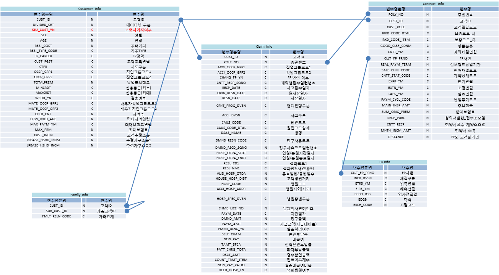

  * BGCON_CUST_DATA 데이터 설명
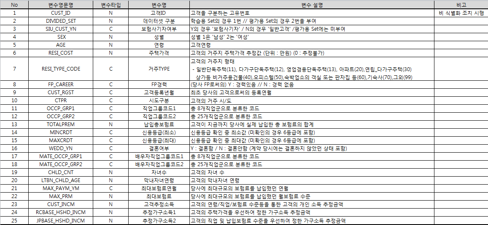

  * BGCON_CUST_DATA 실제 데이터
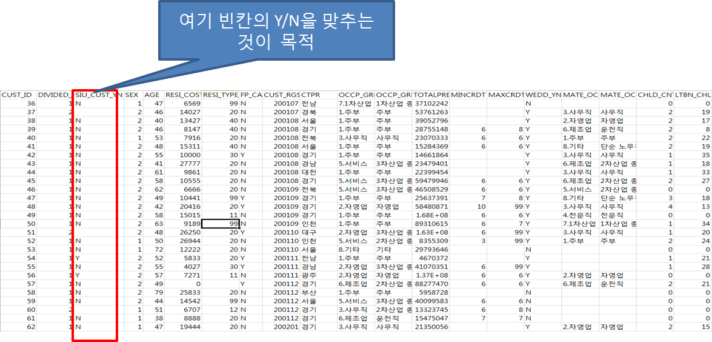

```{r, warning=F}
#Set path
setwd("C:\\Users\\jihwans.yun\\Desktop\\big")
#######################################################################
########################### PRE PROCESSING ############################
#######################################################################
#라이브러리 불러오기
#install.packages("randomForest")
suppressPackageStartupMessages({
  library(e1071)        # svm Models
  library(caret)
  library(corrplot)			# plot correlations
  library(doParallel)		# parallel processing
  library(dplyr)        # Used by caret
  library(gbm)				  # GBM Models
  library(pROC)				  # plot the ROC curve
  library(xgboost)      # Extreme Gradient Boosting
  library(missForest)   # Missing Data 채우는 패키지
  library(caretEnsemble)
  library(DMwR)
  library(randomForest) # for feature importance
})

###################### Set up for parallel procerssing
set.seed(13784)
registerDoParallel(4,cores=4)
getDoParWorkers()

# CSV Raw Data 불러오기
BGCON_CLAIM_DATA <- read.csv("data/BGCON_CLAIM_DATA.csv")
BGCON_CNTT_DATA <- read.csv("data/BGCON_CNTT_DATA.csv")
BGCON_CUST_DATA <- read.csv("data/BGCON_CUST_DATA.csv") # 기준 데이터
BGCON_FMLY_DATA <- read.csv("data/BGCON_FMLY_DATA.csv")
BGCON_FPINFO_DATA <- read.csv("data/BGCON_FPINFO_DATA.csv")
BGCON_RESULT <- read.csv("data/BGCON_RESULT.csv") # 정답 데이터

str(BGCON_CLAIM_DATA)
str(BGCON_CNTT_DATA)
str(BGCON_CUST_DATA)
str(BGCON_FMLY_DATA)
str(BGCON_FPINFO_DATA)
str(BGCON_RESULT)
```

####  간단한 모델 적용 테스트?
  * 앞서 보여드린 것과 같이
  * 문제 이해 -> 데이터 처리 -> 모델링 -> 평가 및 검증로 간단 수행

```
#######################################################################
######################### SIMPLE MODEL TEST ###########################
#######################################################################

######################### 데이터를 처리하고 ###########################
# 공백 컬럼 삭제
remove_missing_data_column <- function(df, threshold = 100){
   num_data <- nrow(df)
   for (name in colnames(df)){
       sum_mis_row <- sum(is.na(df[, name]))
       if (sum_mis_row > 0) {
         rate <- round(sum_mis_row/num_data*100, 1)
         cat(name, "(", class(df[, name]), ")" , "====", sum_mis_row, "\t\trate = ", rate)
         cat("\n")
         if(rate > threshold) {
           df[, name] <- NULL
         }
       }
   }
  return(df)
}
BGCON_CUST_DATA.removed <- remove_missing_data_column(BGCON_CUST_DATA, 0)
BGCON_CUST_DATA.removed$SIU_CUST_YN <- factor(BGCON_CUST_DATA.removed$SIU_CUST_YN)
BGCON_CUST_DATA.removed$OCCP_GRP_1 <- factor(BGCON_CUST_DATA.removed$OCCP_GRP_1)
BGCON_CUST_DATA.removed$OCCP_GRP_2 <- factor(BGCON_CUST_DATA.removed$OCCP_GRP_2)
BGCON_CUST_DATA.removed$FP_CAREER <- factor(BGCON_CUST_DATA.removed$FP_CAREER)
BGCON_CUST_DATA.removed$CTPR <- factor(BGCON_CUST_DATA.removed$CTPR)
BGCON_CUST_DATA.removed$WEDD_YN <- factor(BGCON_CUST_DATA.removed$WEDD_YN)
BGCON_CUST_DATA.removed$MATE_OCCP_GRP_1 <- factor(BGCON_CUST_DATA.removed$MATE_OCCP_GRP_1)
BGCON_CUST_DATA.removed$MATE_OCCP_GRP_2 <- factor(BGCON_CUST_DATA.removed$MATE_OCCP_GRP_2)

# 제출용 Test 데이터를 분리
BGCON_CUST_DATA.MAIN <- BGCON_CUST_DATA.removed[which(BGCON_CUST_DATA.removed$DIVIDED_SET == 1), ]
BGCON_CUST_DATA.SUBMIT <- BGCON_CUST_DATA.removed[which(BGCON_CUST_DATA.removed$DIVIDED_SET == 2), ]
BGCON_CUST_DATA.MAIN$SIU_CUST_YN <- factor(BGCON_CUST_DATA.MAIN$SIU_CUST_YN)


######################### 모델링 작업을 하고 ###########################
svm_model <- svm(SIU_CUST_YN ~ + . , data = BGCON_CUST_DATA.MAIN)

######################## 평가 및 검증을 수행 ###########################
evalution <- function(model, test_file, result_vec){
  pred <- predict(model, test_file)
  pred <- factor(pred, levels = c("Y", "N"))
  result_vec <- factor(result_vec, levels = c("Y", "N"))
  confusion <- confusionMatrix(pred, result_vec)
  
  # F-Score: 2 * precision(Pos Pred Value) * recall(Sensitivity) /(precision + recall):
  f1_score <- (2 * confusion$byClass[3] * confusion$byClass[1]) / (confusion$byClass[3] + confusion$byClass[1])
  names(f1_score) <- "F1 Score"
  
  print(confusion)
  print(f1_score)
}
evalution(svm_model, BGCON_CUST_DATA.SUBMIT, BGCON_RESULT$SIU_CUST_YN)

```
```
Confusion Matrix and Statistics

          Reference
Prediction    Y    N
         Y    1    0
         N  157 1635
                                          
               Accuracy : 0.9124          
                 95% CI : (0.8984, 0.9251)
    No Information Rate : 0.9119          
    P-Value [Acc > NIR] : 0.4879          
                                          
                  Kappa : 0.0115          
 Mcnemar's Test P-Value : <2e-16          
                                          
            Sensitivity : 0.0063291       
            Specificity : 1.0000000       
         Pos Pred Value : 1.0000000       
         Neg Pred Value : 0.9123884       
             Prevalence : 0.0881205       
         Detection Rate : 0.0005577       
   Detection Prevalence : 0.0005577       
      Balanced Accuracy : 0.5031646       
                                          
       'Positive' Class : Y 
  F1 Score 
0.01257862
```
###  간단한 모델 적용 결과
  * 정확도는 91.24%
  * 하지만 F1 Score는 1.257862% --> 의미없는 결과
  * 대충해서는 좋은 결과를 얻기 힘듦

  

####  나은 성능을 낼 수 있도록 분석을 수행
  * 문제 이해
    * 문제 정의 및 평가 메트릭 이해
    * 문제 해결을 위한 도메인 지식 습득
    * 분석 방법 설계 및 알고리즘 선정
  * 데이터 처리
    * 모델링을 위한 데이터 처리(Murging or Wrangling)
  * 모델링
    * 탐색적 데이터 분석(EDA, Exploratory data analysis)
    * 변수 처리
    * 모델 학습
    * 모델 파라미터 튜닝
  * 평가 및 성능 측정
    * 평가 및 성능 측정을 통하여 앞의 작업인 문제 이해 ~ 모델링까지를 다시 수행


### 문제 이해
#### 문제 정의 및 평가 메트릭 이해
  * F1 Score는 결국 Precision과 Recall의 harmonic mean
  * N를 맞추는 것도 중요하지만 Y를 맞추는 것이 관건
  * 평가 메트릭에 대한 이해
    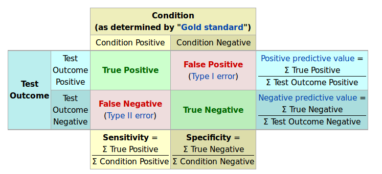
    * https://en.wikipedia.org/wiki/Confusion_matrix

  * 분류 문제: Y값이 명목 척도 형식, 오차 행렬(Confusion Matrix)을 통해 정확도(Accuracy), 정밀도(Precision), 재현율(Recall) 을 계산해서 성능평가.
  * 회귀 문제: Y값이 연속 수치 형식, 평균 제곱근 오차(Root Mean Squared Error, RMSE)로 을 계산해서 성능평가

#### 문제 해결을 위한 도메인 지식 습득
  * 보험 사기는 경성 사기와 연성 사기로 분류됨(보험사기에 대한 인식에 관한 연구.pdf)
    * 경성 사기 : 사고나 상해, 도난 방화를 사기를 목적으로 유발하거나 조작하는 행위.
    * 연성 사기 : 납부한 보험료에 대한 보상을 받기 위한 목적으로 피해금액을 부풀리는 행위
  
  * 보험사별로 IFDS(Insurance Fraud Detection System)이라는 것을 대부분 운영함(보험사기 방지 시스템 IFDS 구축 방안_IBM.pdf)
  * 보험 사기 판별을 위한 IFDS는 규칙(Rule) + 통계적 모형의 혼합방식으로 운영(SInsurance Fraud Detection_IFDS_삼성생명.pdf)
    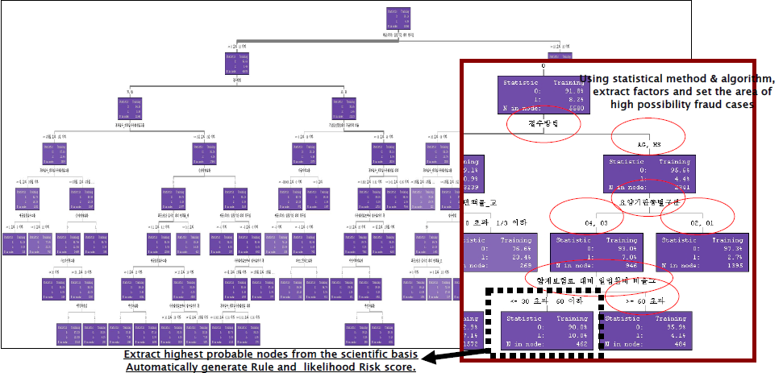   

#### 분석 방법 설계 및 알고리즘 선정
  * 앞서 확인한 자료들을 기반으로 분석 방법 설계 및 알고리즘을 선정함
  * 분석 방법은 예측분석에 적합한 데이터 처리 -> 탐색적 데이터 분석 -> 모델링 -> 평가 방식으로 작업
  * 앞서 습득한 자료에 따라 Tree 기반 알고리즘 중점으로 테스트
  * 예측 모형의 경우 기계학습 알고리즘을 잘 선택하는 것이 중요
        
    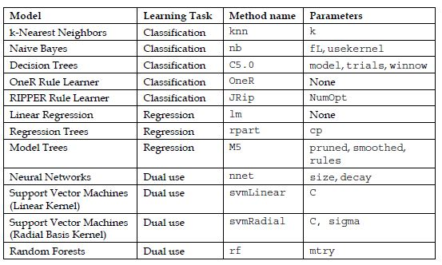
  
  > 통계와 기계학습의 가장 큰 차이점은 통계는 설명과 이해 를 위해 데이터를 활용하는 것이고, 기계학습은 예측(prediction) 을 위한다는 점에서 차이가 있다. 즉, 예측력(Predictive Power)과 설명력(Descriptive Power)에 초점을 달리 두고 있다.
  
  
### 데이터 처리
#### 모델링을 위한 데이터 처리(Murging or Wrangling)
  
  * 변수 확인
  
  * BGCON_CUST_DATA

변수영문명	변수명  
CUST_ID	고객ID  
DIVIDED_SET	데이터셋 구분  
SIU_CUST_YN	보험사기자여부  
 SEX	성별  
AGE	연령  
RESI_COST	주택가격  
RESI_TYPE_CODE	거주TYPE  
FP_CAREER	FP경력  
CUST_RGST	고객등록년월  
CTPR	시도구분  
OCCP_GRP1	직업그룹코드1  
OCCP_GRP2	직업그룹코드2  
TOTALPREM	납입총보험료  
MINCRDT	신용등급(최소)  
MAXCRDT	신용등급(최대)  
WEDD_YN	결혼여부  
MATE_OCCP_GRP1	배우자직업그룹코드1  
MATE_OCCP_GRP2	배우자직업그룹코드2  
CHLD_CNT	자녀수  
LTBN_CHLD_AGE	막내자녀연령  
MAX_PAYM_YM	최대보험료연월  
MAX_PRM	최대보험료  
CUST_INCM	고객추정소득  
RCBASE_HSHD_INCM	추정가구소득1  
JPBASE_HSHD_INCM	추정가구소득2  

  * BGCON_CNTT_DATA

POLY_NO	증권번호  
CUST_ID	고객ID  
CUST_ROLE	고객역할코드  
IRKD_CODE_DTAL	보종코드_세  
IRKD_CODE_ITEM	보종코드_목  
GOOD_CLSF_CDNM	상품분류  
CNTT_YM	계약체결년월  
CLLT_FP_PRNO	FP사번  
REAL_PAYM_TERM	실보험료납입기간  
SALE_CHNL_CODE	판매채널코드  
CNTT_STAT_CODE	계약상태코드  
EXPR_YM	만기년월  
EXTN_YM	소멸년월  
LAPS_YM	실효년월  
PAYM_CYCL_CODE	납입주기코드  
MAIN_INSR_AMT	주보험금  
SUM_ORIG_PREM	합계보험료  
RECP_PUBL	청약서발행_접수소요일  
CNTT_RECP	청약서접수_계약소요일  
MNTH_INCM_AMT	청약서 소득  
DISTANCE	FP와 고객의거리  

  * BGCON_CLAIM_DATA

CUST_ID	고객ID   
POLY_NO	증권번호   
ACCI_OCCP_GRP1	직업그룹코드1  
ACCI_OCCP_GRP2	직업그룹코드2  
CHANG_FP_YN	FP 변경 여부  
CNTT_RECP_SQNO	계약별접수일련번호  
RECP_DATE	사고접수일자   
ORIG_RESN_DATE	원사유일자   
RESN_DATE	사유일자   
CRNT_PROG_DVSN	현재진행구분   
ACCI_DVSN	사고구분  
CAUS_CODE	원인코드   
CAUS_CODE_DTAL	원인코드상세  
DSAS_NAME	병명  
DMND_RESN_CODE	청구사유코드   
DMND_RSCD_SQNO	청구사유코드일련번호  
HOSP_OTPA_STDT	입원/통원시작일자   
HOSP_OTPA_ENDT	입원/통원종료일자   
RESL_CD1	결과코드1   
RESL_NM1	결과명1(사인내용)   
VLID_HOSP_OTDA	유효입원/통원일수   
HOUSE_HOSP_DIST	고객병원거리   
HOSP_CODE	병원코드   
ACCI_HOSP_ADDR	병원지역(시도)   
HOSP_SPEC_DVSN	병원종별구분   
CHME_LICE_NO	담당의사면허번호   
PAYM_DATE	지급일자   
DMND_AMT	청구금액  
PAYM_AMT	지급금액(지급테이블)   
PMMI_DLNG_YN	실손처리여부   
SELF_CHAM	본인부담금   
NON_PAY	비급여   
TAMT_SFCA	전액본인부담금   
PATT_CHRG_TOTA	환자부담총액   
DSCT_AMT	영수할인금액   
COUNT_TRMT_ITEM	진료과목개수  
NON_PAY_RATIO	실손비급여비율  
HEED_HOSP_YN	유의병원여부  

  * BGCON_FMLY_DATA

CUST_ID	고객ID   
SUB_CUST_ID	가족고객ID  
FMLY_RELN_CODE	가족관계  

  * BGCON_FPINFO_DATA

CLLT_FP_PRNO	FP사번  
INCB_DVSN	재직구분  
ETRS_YM	위촉년월  
FIRE_YM	해촉년월  
BEFO_JOB	입사전직업  
EDGB	학력  
BRCH_CODE	지점코드  

  
```
# CSV Raw Data 불러오기
BGCON_CLAIM_DATA <- read.csv("data_back2/BGCON_CLAIM_DATA.csv")
BGCON_CNTT_DATA <- read.csv("data_back2/BGCON_CNTT_DATA.csv")
BGCON_CUST_DATA <- read.csv("data_back2/BGCON_CUST_DATA.csv") # 기준 데이터
BGCON_FMLY_DATA <- read.csv("data_back2/BGCON_FMLY_DATA.csv")
BGCON_FPINFO_DATA <- read.csv("data_back2/BGCON_FPINFO_DATA.csv")

#######################################################################
############################ DATA Murging  ############################
#######################################################################

############################################ Train Test, 정확히 분리하기
# 제출용 Test 데이터를 분리
BGCON_CUST_DATA.TRAIN <- BGCON_CUST_DATA[which(BGCON_CUST_DATA$DIVIDED_SET == 1), ]
BGCON_CUST_DATA.TEST <- BGCON_CUST_DATA[which(BGCON_CUST_DATA$DIVIDED_SET == 2), ]

############################# TRAIN ###################################
# CLAIM 데이터에서 CUST ID에 해당하는 ROW들만 추출해서 새로운 DF로 저장함
#cust_id <- data.frame(CUST_ID=train.batch.down$CUST_ID) 
#BGCON_CLAIM_DATA.TRAIN <- merge(x=BGCON_CLAIM_DATA, y=cust_id, by="CUST_ID", All.x=TRUE)
BGCON_CLAIM_DATA.TRAIN <- BGCON_CLAIM_DATA[BGCON_CLAIM_DATA$CUST_ID %in% BGCON_CUST_DATA.TRAIN$CUST_ID, ] #위 2줄과 동일한 효과
#for debugging
#head(unique(sort(train.batch.down$CUST_ID)), n = 10)
#head(unique(sort(BGCON_CLAIM_DATA.TRAIN$CUST_ID)), n = 10)

# BGCON_FMLY_DATA
BGCON_FMLY_DATA.TRAIN <- BGCON_FMLY_DATA[BGCON_FMLY_DATA$CUST_ID %in% BGCON_CUST_DATA.TRAIN$CUST_ID, ] 
#for debugging
#head(unique(sort(train.batch.down$CUST_ID)), n = 100)
#head(unique(sort(BGCON_FMLY_DATA.TRAIN$CUST_ID)), n = 100)

# BGCON_CNTT_DATA
BGCON_CNTT_DATA.TRAIN <- BGCON_CNTT_DATA[BGCON_CNTT_DATA$CUST_ID %in% BGCON_CUST_DATA.TRAIN$CUST_ID, ] 
#for debugging
#head(unique(sort(train.batch.down$CUST_ID)), n = 10)
#head(unique(sort(BGCON_CNTT_DATA.TRAIN$CUST_ID)), n = 10)

# BGCON_FPINFO_DATA
BGCON_FPINFO_DATA.TRAIN <- BGCON_FPINFO_DATA[BGCON_FPINFO_DATA$CLLT_FP_PRNO %in% BGCON_CNTT_DATA.TRAIN$CLLT_FP_PRNO, ]
#for debugging
#head(unique(sort(BGCON_CNTT_DATA.TRAIN$CLLT_FP_PRNO)), n = 10)
#head(unique(sort(BGCON_FPINFO_DATA.TRAIN$CLLT_FP_PRNO)), n = 10)

############################# TEST ###################################
# CLAIM 데이터에서 CUST ID에 해당하는 ROW들만 추출해서 새로운 DF로 저장함
BGCON_CLAIM_DATA.TEST <- BGCON_CLAIM_DATA[BGCON_CLAIM_DATA$CUST_ID %in% BGCON_CUST_DATA.TEST$CUST_ID, ]
BGCON_FMLY_DATA.TEST <- BGCON_FMLY_DATA[BGCON_FMLY_DATA$CUST_ID %in% BGCON_CUST_DATA.TEST$CUST_ID, ] 
BGCON_CNTT_DATA.TEST <- BGCON_CNTT_DATA[BGCON_CNTT_DATA$CUST_ID %in% BGCON_CUST_DATA.TEST$CUST_ID, ] 
BGCON_FPINFO_DATA.TEST <- BGCON_FPINFO_DATA[BGCON_FPINFO_DATA$CLLT_FP_PRNO %in% BGCON_CNTT_DATA.TEST$CLLT_FP_PRNO, ]
#head(unique(sort(BGCON_CNTT_DATA.TEST$CLLT_FP_PRNO)), n = 10)
#head(unique(sort(BGCON_FPINFO_DATA.TEST$CLLT_FP_PRNO)), n = 10)
```

### 모델링
#### 탐색적 데이터 분석(EDA, Exploratory data analysis)

  > 탐색적 데이터 분석의 목적은 데이터를 이해하는 것이다. 목적 달성을 위한 가장 쉬운 방법은 질문을 잘 만들어 이를 탐색과정을 거쳐 결국 데이터를 표현하는 적절한 모형, 시각화 산출물, 다음 과정을 위한 데이터를 생성해 내는 것이다.  
질문의 질은 결국 질문의 양에 비례한다. 데이터에 대해 아는 것이 없기 때문에 질문의 질을 최대한 빨리 높이는 길은 한정된 시간에 가능하면 많은 질문을 생성해 내고, 탐색과정을 거쳐 최대한 빨리 좋은 질문을 생성해 내는 것이다.

  * 대부분의 Competition 논문에서 EDA의 중요성을 언급


##### 결측치 확인
  * 실효년월(LAPS_YM) 이 대부분 비어 있음
  * 소멸년월(EXTN_YM) 많이 비어 있음
  * FP와 고객간의거리(DISTANCE)는 일부 비어 있음
  * MAXCRDT, MINCRDT는 중요한 factor로 보이지만 많은 데이터가 비어 있음

```{r, warning=F}
#install.packages("Amelia")
suppressPackageStartupMessages({
  require(Amelia)
})

missmap(BGCON_CLAIM_DATA, main="Missings Map", col=c("yellow", "black"), legend=FALSE)
missmap(BGCON_CNTT_DATA, main="Missings Map", col=c("yellow", "black"), legend=FALSE)
missmap(BGCON_CUST_DATA, main="Missings Map", col=c("yellow", "black"), legend=FALSE) 
missmap(BGCON_FMLY_DATA, main="Missings Map", col=c("yellow", "black"), legend=FALSE)
missmap(BGCON_FPINFO_DATA, main="Missings Map", col=c("yellow", "black"), legend=FALSE)

#### column 별 Missing Data 갯수 출력해주는 함수
print_missing_count <- function(df){
  for (name in colnames(df)){
    total <- sum(length(df[, name]))
    na.total <- sum(is.na(df[, name]))
    cat(name, "(", class(df[, name]), ")" , "===\t",  na.total,  "\t", (na.total/total)*100,  "%"  )
    cat("\n")
  }
}
print_missing_count(BGCON_CLAIM_DATA)
print_missing_count(BGCON_CNTT_DATA)
print_missing_count(BGCON_CUST_DATA)
print_missing_count(BGCON_FMLY_DATA)
print_missing_count(BGCON_FPINFO_DATA)
```

##### 데이터 분포 확인

```{r, warning=F}
# install.packages("Hmisc")
suppressPackageStartupMessages({
  library(Hmisc)
})
names(BGCON_CUST_DATA)

BGCON_CUST_DATA.SUM <- BGCON_CUST_DATA[which(BGCON_CUST_DATA$DIVIDED_SET == 1),]
BGCON_CUST_DATA.SUM$SIU_CUST_YN <- factor(BGCON_CUST_DATA.SUM$SIU_CUST_YN) 

summary(SIU_CUST_YN ~ ., data = BGCON_CUST_DATA.SUM, method="reverse")

```

##### SIU_CUST_YN 보험사기자를 기준으로 데이터를 확인

  * FP경력(FP_CAREER)이 5% 더 높음 하지만, 모수가 많지 않음

  * 신용등급_최소(MINCRDT)의 경우 7등급 이하의 하위가 더 높음
  * 신용등급_최대(MAXCRDT)의 경우 7등급 이하의 하위가 더 높음

  * 결혼여부(WEDD_YN) 결혼한 경우가 4% 더 높음

  * FMLY_RELN_CODE 형제 자매의 관계에서 사기로 분류된 경우가 많음, 가족 아이디로 엮인 부분이 더 많음

```{r, warning=F}
names(BGCON_CLAIM_DATA)

BGCON_CLAIM_DATA.SUM <- BGCON_CLAIM_DATA[which(BGCON_CLAIM_DATA$SIU_CUST_YN != ""),]
BGCON_CLAIM_DATA.SUM$SIU_CUST_YN <- factor(BGCON_CLAIM_DATA.SUM$SIU_CUST_YN)

summary(SIU_CUST_YN ~ ACCI_OCCP_GRP1 + ACCI_OCCP_GRP2 + CHANG_FP_YN + RECP_DATE + ORIG_RESN_DATE + RESN_DATE + CRNT_PROG_DVSN + ACCI_DVSN + HOSP_OTPA_STDT +  HOSP_OTPA_ENDT + VLID_HOSP_OTDA + HOUSE_HOSP_DIST + HOSP_CODE + ACCI_HOSP_ADDR + HOSP_SPEC_DVSN + PAYM_DATE + DMND_AMT + PAYM_AMT + PMMI_DLNG_YN + SELF_CHAM + NON_PAY + TAMT_SFCA + PATT_CHRG_TOTA + DSCT_AMT + COUNT_TRMT_ITEM + DCAF_CMPS_XCPA + NON_PAY_RATIO + HEED_HOSP_YN, data = BGCON_CLAIM_DATA.SUM, method="reverse")
```
  
#### BGCON_CLAIM_DATA

  * CLAIM 데이터의 경우, 보험처리건수로 여러개일 수 있기 때문에 중복 집계될 가능성이 높음
  * 좀더 정확히 보기 위해, 보험처리건수별 아이디 한개로 제한해서 테스트 해야함

  * 직업그룹코드1(ACCI_OCCP_GRP1)
    * 1.주부인 경우 6% 더 높음
    * 자영업 경우 6% 더 높음
    * 서비스직인 경우 3% 더 높음
    * 전문직인 경우 3% 더 낮음
    * 제조업인 경우 3% 더 낮음
  
  * 직업그룹코드2(ACCI_OCCP_GRP2)
    * 3차산업 종사자 경우 5% 더 높음
    * 1차산업종사자 1%, 2차산업종사자 3% 더 낮음
    * 자영업 경우 5% 더 높음
    * 주부 경우 6% 더 높음
    * 법무직 종사자의 경우 사기건수 미존재
    * 고소득 전문직의 경우 사기건수 미존재
  
  * 청구사유 코드(DMND_RESN_CODE)
    * 02(입원)이 유의미하게 높음 23%
    * 대신 수술(05)는 절반정도 낮음
  
  * 실소처리여부(PMMI_DLNG_YN)은 현격하게 낮음 15%
  
  * 금감원 유의병원 대상(HEED_HOSP_YN)유의 병원인 경우가 2%더 높음
  
  * 병원종별구분(HOSP_SPEC_DVSN)에서
    * 한방병원(80) 8%, 의료기관이외(95) 7%로 유의미 하게 높음
    * 종합병원(10) 20%로 유의미 하게 낮음
  
  * 유효입원/통원일수(VLID_HOSP_OTDA) 최소, 평균, 최대 모두 높게 나옴

  * 뉴스기사 : 지난해 보험사기 적발 6549억원…사상 최대
    * 위 뉴스기사와 비슷한 결과를 보이는 factor들이 많이 존재
    * 주부, 자영업의 직업군 영향이 높음

```{r, warning=F}
names(BGCON_CNTT_DATA)

BGCON_CNTT_DATA.SUM <- BGCON_CNTT_DATA[which(BGCON_CNTT_DATA$SIU_CUST_YN != ""),]
BGCON_CNTT_DATA.SUM$SIU_CUST_YN <- factor(BGCON_CNTT_DATA.SUM$SIU_CUST_YN)

summary(SIU_CUST_YN ~ CUST_ROLE + IRKD_CODE_DTAL + IRKD_CODE_ITEM + GOOD_CLSF_CDNM + CNTT_YM + CLLT_FP_PRNO + REAL_PAYM_TERM + SALE_CHNL_CODE +  CNTT_STAT_CODE + EXPR_YM + EXTN_YM + LAPS_YM + PAYM_CYCL_CODE + MAIN_INSR_AMT + SUM_ORIG_PREM + RECP_PUBL + CNTT_RECP + MNTH_INCM_AMT + DISTANCE, data = BGCON_CNTT_DATA.SUM, method="reverse")
```

#### BGCON_CNTT_DATA

  * FP경력(FP_CAREER)이 5% 더 높음 하지만, 모수가 많지 않음
  * 신용등급_최소(MINCRDT)의 경우 7등급 이하의 하위가 더 높음
  * 신용등급_최대(MAXCRDT)의 경우 7등급 이하의 하위가 더 높음
  * 결혼여부(WEDD_YN) 결혼한 경우가 4% 더 높음
  * FMLY_RELN_CODE 형제 자매의 관계에서 사기로 분류된 경우가 많음, 가족 아이디로 엮인 부분이 더 많음


```{r, warning=F}
names(BGCON_FPINFO_DATA)

BGCON_FMLY_DATA.SUM <- BGCON_FMLY_DATA[which(BGCON_FMLY_DATA$SIU_CUST_YN != ""),]
BGCON_FMLY_DATA.SUM$SIU_CUST_YN <- factor(BGCON_FMLY_DATA.SUM$SIU_CUST_YN)

BGCON_FPINFO_DATA.SUM <- BGCON_FPINFO_DATA[which(BGCON_FPINFO_DATA$SIU_CUST_YN != ""),]
BGCON_FPINFO_DATA.SUM$SIU_CUST_YN <- factor(BGCON_FPINFO_DATA.SUM$SIU_CUST_YN)

summary(SIU_CUST_YN ~ INCB_DVSN + BEFO_JOB + EDGB + BRCH_CODE, data = BGCON_FPINFO_DATA.SUM, method="reverse")

```

#### BGCON_FPINFO_DATA

  * 이전 직업(BEFO_JOB)에 보험관계인 비율이 N보다 높음(17%) 
  * 학력(EDGB)에 고졸 비율이 N보다 높음(62%)

***

#### 상관 분석
#### 피어슨 상관계수를 이용한 상관분석
  * 선형적인 상관 관계의 크기를 모수적(parametric)인 방법으로 나타내는 값
  * r = X와 Y가 함께 변하는 정도 / X와 Y가 따로 변하는 정도
      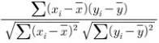
  * r 값은 X 와 Y 가 완전히 동일하면 +1, 전혀 다르면 0, 반대방향으로 완전히 동일 하면 –1 을 가진다. 

###### 스이어만 상관계
  * 데이터가 명목 척도일때
  * ---> 결과는 비슷했음

#### 상관 관계가 중요한 이유
  * 데이터가 적으면
    * 상관관계 < 인과관계
  * 데이터가 많으면(빅데이터)
    * 상관관계 > 인과관계
  * 하지만 검증은 해봐야...

  * 상관 관계에서 확인할 것 -> 다중 공선성문제
    * https://ko.m.wikipedia.org/wiki/%EB%8B%A4%EC%A4%91%EA%B3%B5%EC%84%A0%EC%84%B1

```{r, warning=F}
# 상관분석
#install.packages("corrgram")
#install.packages("plyr")
#install.packages("caret")
suppressPackageStartupMessages({
  require(corrgram)
  require(plyr)
  require(caret)
})

# 데이터 셋 reduce
set.seed(1234)
BGCON_CLAIM_DATA.df.down <- downSample(x = BGCON_CLAIM_DATA.SUM, y = BGCON_CLAIM_DATA.SUM$SIU_CUST_YN)
set.seed(1234)
BGCON_CNTT_DATA.df.down <- downSample(x = BGCON_CNTT_DATA.SUM, y = BGCON_CNTT_DATA.SUM$SIU_CUST_YN)
set.seed(1234)
BGCON_CUST_DATA.df.down <- downSample(x = BGCON_CUST_DATA.SUM, y =  BGCON_CUST_DATA.SUM$SIU_CUST_YN)
set.seed(1234)
BGCON_FMLY_DATA.df.down <- downSample(x = BGCON_FMLY_DATA.SUM, y =  BGCON_FMLY_DATA.SUM$SIU_CUST_YN)
set.seed(1234)
BGCON_FPINFO_DATA.df.down <- downSample(x = BGCON_FPINFO_DATA.SUM, y =  BGCON_FPINFO_DATA.SUM$SIU_CUST_YN)


#####BGCON_CLAIM_DATA.df
corrgram.data <- BGCON_CLAIM_DATA.df.down
names(corrgram.data)

## change features of factor type to numeric type for inclusion on correlogram
corrgram.data$SIU_CUST_YN <- as.numeric(corrgram.data$SIU_CUST_YN)
corrgram.data$ACCI_OCCP_GRP1 <- as.numeric(corrgram.data$ACCI_OCCP_GRP1)
corrgram.data$ACCI_OCCP_GRP2 <- as.numeric(corrgram.data$ACCI_OCCP_GRP2)
corrgram.data$CHANG_FP_YN <- as.numeric(corrgram.data$CHANG_FP_YN)
corrgram.data$ACCI_DVSN <- as.numeric (corrgram.data$ACCI_DVSN)
corrgram.data$CAUS_CODE <- as.numeric (corrgram.data$CAUS_CODE)
corrgram.data$CAUS_CODE_DTAL <- as.numeric (corrgram.data$CAUS_CODE_DTAL)
corrgram.data$RESL_CD1 <- as.numeric (corrgram.data$RESL_CD1)
corrgram.data$RESL_NM1 <- as.numeric (corrgram.data$RESL_NM1)
corrgram.data$ACCI_HOSP_ADDR <- as.numeric (corrgram.data$ACCI_HOSP_ADDR)
corrgram.data$PMMI_DLNG_YN <- as.numeric (corrgram.data$PMMI_DLNG_YN)
corrgram.data$HEED_HOSP_YN <- as.numeric (corrgram.data$HEED_HOSP_YN)

## generate correlogram : 피어슨 상관계수 계산
corrgram.vars <- c("SIU_CUST_YN", "ACCI_OCCP_GRP1", "ACCI_OCCP_GRP2", "CHANG_FP_YN", "ACCI_DVSN", "CNTT_RECP_SQNO", "RECP_DATE", "ORIG_RESN_DATE", "RESN_DATE","CRNT_PROG_DVSN","ACCI_DVSN","CAUS_CODE","CAUS_CODE_DTAL")
corrgram(corrgram.data[,corrgram.vars], order=FALSE, lower.panel=panel.conf, upper.panel=panel.pie, text.panel=panel.txt, main="coefficient")

corrgram.vars <- c("SIU_CUST_YN", "DSAS_NAME", "DMND_RESN_CODE", "DMND_RSCD_SQNO", "HOSP_OTPA_STDT", "HOSP_OTPA_ENDT", "RESL_CD1", "RESL_NM1","VLID_HOSP_OTDA","HOUSE_HOSP_DIST","HOSP_CODE","ACCI_HOSP_ADDR")
corrgram(corrgram.data[,corrgram.vars], order=FALSE, lower.panel=panel.conf, upper.panel=panel.pie, text.panel=panel.txt, main="coefficient")

corrgram.vars <- c("SIU_CUST_YN", "HOSP_SPEC_DVSN", "CHME_LICE_NO", "PAYM_DATE", "DMND_AMT", "PAYM_AMT", "PMMI_DLNG_YN")
#, "SELF_CHAM", "NON_PAY", "TAMT_SFCA","PATT_CHRG_TOTA","DSCT_AMT") #표준편차 0으로 에러 발생
corrgram(corrgram.data[,corrgram.vars], order=FALSE, lower.panel=panel.conf, upper.panel=panel.pie, text.panel=panel.txt, main="coefficient")

corrgram.vars <- c("SIU_CUST_YN", "DCAF_CMPS_XCPA", "COUNT_TRMT_ITEM", "NON_PAY_RATIO", "HEED_HOSP_YN")
#, "DCAF_CMPS_XCPA", "NON_PAY_RATIO", "HEED_HOSP_YN", "SUB_CUST_ID", "FMLY_RELN_CODE") #표준편차 0으로 에러 발생
corrgram(corrgram.data[,corrgram.vars], order=FALSE, lower.panel=panel.conf, upper.panel=panel.pie, text.panel=panel.txt, main="coefficient")


#####BGCON_CUST_DATA.df
corrgram.data <- BGCON_CUST_DATA.df.down
names(corrgram.data)

## change features of factor type to numeric type for inclusion on correlogram
corrgram.data$SIU_CUST_YN <- as.numeric(corrgram.data$SIU_CUST_YN)
corrgram.data$FP_CAREER <- as.numeric(corrgram.data$FP_CAREER)
corrgram.data$CTPR <- as.numeric(corrgram.data$CTPR)
corrgram.data$OCCP_GRP_1 <- as.numeric (corrgram.data$OCCP_GRP_1)
corrgram.data$OCCP_GRP_2 <- as.numeric (corrgram.data$OCCP_GRP_2)
corrgram.data$WEDD_YN <- as.numeric (corrgram.data$WEDD_YN)
corrgram.data$MATE_OCCP_GRP_1 <- as.numeric (corrgram.data$MATE_OCCP_GRP_1)
corrgram.data$MATE_OCCP_GRP_2 <- as.numeric (corrgram.data$MATE_OCCP_GRP_2)


## generate correlogram : 피어슨 상관계수 계산
corrgram.vars <- c("SIU_CUST_YN",  "SEX",  "AGE",  "RESI_COST", "CTPR", "OCCP_GRP_1", "OCCP_GRP_2", "TOTALPREM")
corrgram(corrgram.data[,corrgram.vars], order=FALSE, lower.panel=panel.conf, upper.panel=panel.pie, text.panel=panel.txt, main="coefficient")


corrgram.vars <- c("SIU_CUST_YN", "MINCRDT", "MAXCRDT", "WEDD_YN", "MATE_OCCP_GRP_1", "MATE_OCCP_GRP_2", "CHLD_CNT", "LTBN_CHLD_AGE", "MAX_PAYM_YM", "MAX_PRM", "CUST_INCM", "RCBASE_HSHD_INCM", "JPBASE_HSHD_INCM")
corrgram(corrgram.data[,corrgram.vars], order=FALSE, lower.panel=panel.conf, upper.panel=panel.pie, text.panel=panel.txt, main="coefficient")

#####BGCON_CUST_DATA.df
corrgram.data <- BGCON_CNTT_DATA.df.down
names(corrgram.data)


## change features of factor type to numeric type for inclusion on correlogram
corrgram.data$SIU_CUST_YN <- as.numeric(corrgram.data$SIU_CUST_YN)
corrgram.data$GOOD_CLSF_CDNM <- as.numeric(corrgram.data$GOOD_CLSF_CDNM)
corrgram.data$CLLT_FP_PRNO <- as.numeric(corrgram.data$CLLT_FP_PRNO)

## generate correlogram : 피어슨 상관계수 계산
corrgram.vars <- c("SIU_CUST_YN", "POLY_NO", "CUST_ROLE", "IRKD_CODE_DTAL", "IRKD_CODE_ITEM", "GOOD_CLSF_CDNM", "CNTT_YM", "CLLT_FP_PRNO", "REAL_PAYM_TERM", "SALE_CHNL_CODE", "CNTT_STAT_CODE", "EXPR_YM")
corrgram(corrgram.data[,corrgram.vars], order=FALSE, lower.panel=panel.conf, upper.panel=panel.pie, text.panel=panel.txt, main="coefficient")

```

#### 변수 처리
  * 앞서 본 데이터들을 날짜 관련 데이터의 의미가 있을 것으로 보임
  * 병명 코드의 앞 글자를 분리

```{r, warning=F}
head(BGCON_CLAIM_DATA$CAUS_CODE)
```
  
  
```
####DATE 변수들에서 YEAR를 추출함
#BGCON_CLAIM_DATA
BGCON_CLAIM_DATA.TRAIN$RECP_DATE_YEAR <- as.numeric(format(as.Date(as.character(BGCON_CLAIM_DATA.TRAIN$RECP_DATE), format = "%Y%m%d"), "%Y"))
BGCON_CLAIM_DATA.TRAIN$ORIG_RESN_DATE_YEAR <- as.numeric(format(as.Date(as.character(BGCON_CLAIM_DATA.TRAIN$ORIG_RESN_DATE), format = "%Y%m%d"), "%Y"))
BGCON_CLAIM_DATA.TRAIN$RESN_DATE_YEAR <- as.numeric(format(as.Date(as.character(BGCON_CLAIM_DATA.TRAIN$RESN_DATE), format = "%Y%m%d"), "%Y"))
BGCON_CLAIM_DATA.TRAIN$PAYM_DATE_YEAR <- as.numeric(format(as.Date(as.character(BGCON_CLAIM_DATA.TRAIN$PAYM_DATE), format = "%Y%m%d"), "%Y"))

#BGCON_CLAIM_DATA
BGCON_CUST_DATA.TRAIN$CUST_RGST_YEAR <- as.numeric(format(as.Date(paste(as.character(BGCON_CUST_DATA.TRAIN$CUST_RGST), c("01"), sep=""), format = "%Y%m%d"), "%Y"))
BGCON_CUST_DATA.TRAIN$MAX_PAYM_YM_YEAR <- as.numeric(format(as.Date(paste(as.character(BGCON_CUST_DATA.TRAIN$MAX_PAYM_YM), c("01"), sep=""), format = "%Y%m%d"), "%Y"))

#BGCON_CNTT_DATA
BGCON_CNTT_DATA.TRAIN$CNTT_YM_YEAR <- as.numeric(format(as.Date(paste(as.character(BGCON_CNTT_DATA.TRAIN$CNTT_YM), c("01"), sep=""), format = "%Y%m%d"), "%Y"))
BGCON_CNTT_DATA.TRAIN$EXPR_YM_YEAR <- as.numeric(format(as.Date(paste(as.character(BGCON_CNTT_DATA.TRAIN$EXPR_YM), c("01"), sep=""), format = "%Y%m%d"), "%Y"))
BGCON_CNTT_DATA.TRAIN$EXTN_YM_YEAR <- as.numeric(format(as.Date(paste(as.character(BGCON_CNTT_DATA.TRAIN$EXTN_YM), c("01"), sep=""), format = "%Y%m%d"), "%Y"))
BGCON_CNTT_DATA.TRAIN$LAPS_YM_YEAR <- as.numeric(format(as.Date(paste(as.character(BGCON_CNTT_DATA.TRAIN$LAPS_YM), c("01"), sep=""), format = "%Y%m%d"), "%Y"))

#BGCON_FPINFO_DATA
BGCON_FPINFO_DATA.TRAIN$ETRS_YM_YEAR <- as.numeric(format(as.Date(paste(as.character(BGCON_FPINFO_DATA.TRAIN$ETRS_YM), c("01"), sep=""), format = "%Y%m%d"), "%Y"))
BGCON_FPINFO_DATA.TRAIN$FIRE_YM_YEAR <- as.numeric(format(as.Date(paste(as.character(BGCON_FPINFO_DATA.TRAIN$FIRE_YM), c("01"), sep=""), format = "%Y%m%d"), "%Y"))

##BGCON_CLAIM_DATA 데이터에서 병명 데이터 앞글자를 분리 
BGCON_CLAIM_DATA.TRAIN$CAUS_CODE_FIRST <- substring(BGCON_CLAIM_DATA.TRAIN$CAUS_CODE, 1, 1)
BGCON_CLAIM_DATA.TRAIN$RESL_CD1_FIRST <- substring(BGCON_CLAIM_DATA.TRAIN$RESL_CD1, 1, 1)


############################# TEST ###################################
####DATE 변수들에서 YEAR를 추출함
BGCON_CLAIM_DATA.TEST$RECP_DATE_YEAR <- as.numeric(format(as.Date(as.character(BGCON_CLAIM_DATA.TEST$RECP_DATE), format = "%Y%m%d"), "%Y"))
BGCON_CLAIM_DATA.TEST$ORIG_RESN_DATE_YEAR <- as.numeric(format(as.Date(as.character(BGCON_CLAIM_DATA.TEST$ORIG_RESN_DATE), format = "%Y%m%d"), "%Y"))
BGCON_CLAIM_DATA.TEST$RESN_DATE_YEAR <- as.numeric(format(as.Date(as.character(BGCON_CLAIM_DATA.TEST$RESN_DATE), format = "%Y%m%d"), "%Y"))
BGCON_CLAIM_DATA.TEST$PAYM_DATE_YEAR <- as.numeric(format(as.Date(as.character(BGCON_CLAIM_DATA.TEST$PAYM_DATE), format = "%Y%m%d"), "%Y"))
BGCON_CUST_DATA.TEST$CUST_RGST_YEAR <- as.numeric(format(as.Date(paste(as.character(BGCON_CUST_DATA.TEST$CUST_RGST), c("01"), sep=""), format = "%Y%m%d"), "%Y"))
BGCON_CUST_DATA.TEST$MAX_PAYM_YM_YEAR <- as.numeric(format(as.Date(paste(as.character(BGCON_CUST_DATA.TEST$MAX_PAYM_YM), c("01"), sep=""), format = "%Y%m%d"), "%Y"))
BGCON_CNTT_DATA.TEST$CNTT_YM_YEAR <- as.numeric(format(as.Date(paste(as.character(BGCON_CNTT_DATA.TEST$CNTT_YM), c("01"), sep=""), format = "%Y%m%d"), "%Y"))
BGCON_CNTT_DATA.TEST$EXPR_YM_YEAR <- as.numeric(format(as.Date(paste(as.character(BGCON_CNTT_DATA.TEST$EXPR_YM), c("01"), sep=""), format = "%Y%m%d"), "%Y"))
BGCON_CNTT_DATA.TEST$EXTN_YM_YEAR <- as.numeric(format(as.Date(paste(as.character(BGCON_CNTT_DATA.TEST$EXTN_YM), c("01"), sep=""), format = "%Y%m%d"), "%Y"))
BGCON_CNTT_DATA.TEST$LAPS_YM_YEAR <- as.numeric(format(as.Date(paste(as.character(BGCON_CNTT_DATA.TEST$LAPS_YM), c("01"), sep=""), format = "%Y%m%d"), "%Y"))
BGCON_FPINFO_DATA.TEST$ETRS_YM_YEAR <- as.numeric(format(as.Date(paste(as.character(BGCON_FPINFO_DATA.TEST$ETRS_YM), c("01"), sep=""), format = "%Y%m%d"), "%Y"))
BGCON_FPINFO_DATA.TEST$FIRE_YM_YEAR <- as.numeric(format(as.Date(paste(as.character(BGCON_FPINFO_DATA.TEST$FIRE_YM), c("01"), sep=""), format = "%Y%m%d"), "%Y"))
##BGCON_CLAIM_DATA 데이터에서 병명 데이터 앞글자를 분리 
BGCON_CLAIM_DATA.TEST$CAUS_CODE_FIRST <- substring(BGCON_CLAIM_DATA.TEST$CAUS_CODE, 1, 1)
BGCON_CLAIM_DATA.TEST$RESL_CD1_FIRST <- substring(BGCON_CLAIM_DATA.TEST$RESL_CD1, 1, 1)

```


### 변수 처리
#### one-hot encoding
  * One-hot encoding 은 단 하나의 bit 만 '1' 혹은 '0' 이 되고 , 나머지 bit 는 반대값이 되도록 encoding 하는 방식
  * Tree 기반 알고리즘 Random Forest의 경우 Level을 32개 이하로 제한 --> 계산량이 많아지기 때문
  * 이외에도 결측치 처리에도 유리
  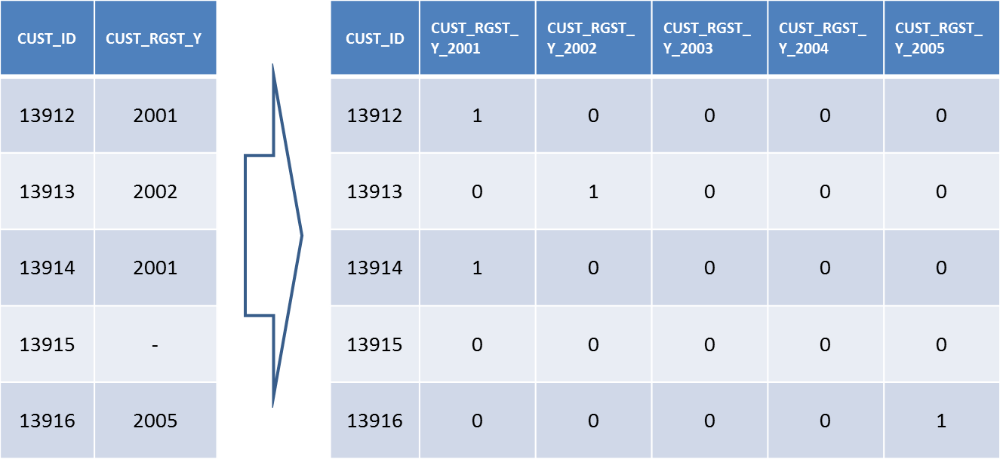
  

#### skewed variable 데이터의 편차를 줄임
  * log를 취하여 편차를 줄임]
  * ex_ 총 납입금액 1,000원 or 11,321,030원 이러한 편차를 줄임
    * log(20,000) = 9.90
    * log(25,000) = 10.12
    * log(200,000) = 12.20
    * log(205,000) = 12.23

```{r}
hist(BGCON_CUST_DATA$RESI_COST, breaks=50, freq=TRUE) # INCOME 히스토그램
hist(log(BGCON_CUST_DATA$RESI_COST), breaks=50, freq=TRUE) # INCOME 히스토그램
```

```
####다른 필드의 값을 Sum 하여 df1 필드에 채워줌
#df_from : 가져오려는 필드가 있는 df
#df_to : df_from에서 가져온 필드를 저장하려는 df
#t_col_name : df_from에서 가져오려 column 명
#c_col_name : 만들려는 column 이름
#by_col_name : merge 하기위해서 기준이 되는 column 명
#FUN : 적용할 function  ex) sum
#t_na : NA값 이 생길경우 넣을 값  ex)숫자의 경우 0으로 채움
merge_after_aggregate <- function(df_from, df_to, by_col_name, t_col_name, c_col_name, FUN, t_na=NULL){
  agg_df_temp <- aggregate(df_from[, t_col_name], by=list(df_from[, by_col_name]), FUN=FUN)
  colnames(agg_df_temp) <- c(by_col_name, c_col_name)
  ret_df <- merge(x = df_to, y = agg_df_temp, by = by_col_name, all=TRUE)
  #NA 값 채우기
  if(!is.null(t_na)){
    ret_df[is.na(ret_df[, c_col_name]), c_col_name] <- t_na
  }
  return (ret_df)
}

############################# TRAIN ###################################
## 각 아이디별 총 CLAIM(보험처리건수)를 기록하여 BGCON_CUST_DATA에 merge 함 
is.not.na <- function(x){ sum(!is.na(x)) }
BGCON_CUST_DATA.TRAIN <- merge_after_aggregate(BGCON_CLAIM_DATA.TRAIN, BGCON_CUST_DATA.TRAIN, "CUST_ID", "POLY_NO", "CLAIM_TOTAL", is.not.na, 0)

## BGCON_CLAIM_DATA의 numeric 값의 데이터중 TOTAL(SUM)이 가능한 값들을 SUM하여 BGCON_CUST_DATA에 merge 함
BGCON_CUST_DATA.TRAIN <- merge_after_aggregate(BGCON_CLAIM_DATA.TRAIN, BGCON_CUST_DATA.TRAIN, "CUST_ID", "VLID_HOSP_OTDA", "VLID_HOSP_OTDA_TOTAL", sum)
BGCON_CUST_DATA.TRAIN <- merge_after_aggregate(BGCON_CLAIM_DATA.TRAIN, BGCON_CUST_DATA.TRAIN, "CUST_ID", "VLID_HOSP_OTDA", "VLID_HOSP_OTDA_MEAN", mean)
BGCON_CUST_DATA.TRAIN <- merge_after_aggregate(BGCON_CLAIM_DATA.TRAIN, BGCON_CUST_DATA.TRAIN, "CUST_ID", "VLID_HOSP_OTDA", "VLID_HOSP_OTDA_MEDIAN", median)

BGCON_CUST_DATA.TRAIN <- merge_after_aggregate(BGCON_CLAIM_DATA.TRAIN, BGCON_CUST_DATA.TRAIN, "CUST_ID", "HOUSE_HOSP_DIST", "HOUSE_HOSP_DIST_TOTAL", sum)
BGCON_CUST_DATA.TRAIN <- merge_after_aggregate(BGCON_CLAIM_DATA.TRAIN, BGCON_CUST_DATA.TRAIN, "CUST_ID", "HOUSE_HOSP_DIST", "HOUSE_HOSP_DIST_MEAN", mean)
BGCON_CUST_DATA.TRAIN <- merge_after_aggregate(BGCON_CLAIM_DATA.TRAIN, BGCON_CUST_DATA.TRAIN, "CUST_ID", "HOUSE_HOSP_DIST", "HOUSE_HOSP_DIST_MEDIAN", median)
#정규분포로 정규화 하기위해 log + 1을 해줌
BGCON_CUST_DATA.TRAIN <- merge_after_aggregate(BGCON_CLAIM_DATA.TRAIN, BGCON_CUST_DATA.TRAIN, "CUST_ID", "DMND_AMT", "DMND_AMT_TOTAL", function(x){log(sum(x)+1)})
BGCON_CUST_DATA.TRAIN <- merge_after_aggregate(BGCON_CLAIM_DATA.TRAIN, BGCON_CUST_DATA.TRAIN, "CUST_ID", "DMND_AMT", "DMND_AMT_MEAN",  function(x){log(mean(x)+1)})
BGCON_CUST_DATA.TRAIN <- merge_after_aggregate(BGCON_CLAIM_DATA.TRAIN, BGCON_CUST_DATA.TRAIN, "CUST_ID", "DMND_AMT", "DMND_AMT_MEDIAN", function(x){log(median(x)+1)})

BGCON_CUST_DATA.TRAIN <- merge_after_aggregate(BGCON_CLAIM_DATA.TRAIN, BGCON_CUST_DATA.TRAIN, "CUST_ID", "PAYM_AMT", "PAYM_AMT_TOTAL", function(x){log(sum(x)+1)})
BGCON_CUST_DATA.TRAIN <- merge_after_aggregate(BGCON_CLAIM_DATA.TRAIN, BGCON_CUST_DATA.TRAIN, "CUST_ID", "PAYM_AMT", "PAYM_AMT_MEAN", function(x){log(mean(x)+1)})
BGCON_CUST_DATA.TRAIN <- merge_after_aggregate(BGCON_CLAIM_DATA.TRAIN, BGCON_CUST_DATA.TRAIN, "CUST_ID", "PAYM_AMT", "PAYM_AMT_MEDIAN", function(x){log(median(x)+1)})

BGCON_CUST_DATA.TRAIN <- merge_after_aggregate(BGCON_CLAIM_DATA.TRAIN, BGCON_CUST_DATA.TRAIN, "CUST_ID", "SELF_CHAM", "SELF_CHAM_TOTAL", sum)
BGCON_CUST_DATA.TRAIN <- merge_after_aggregate(BGCON_CLAIM_DATA.TRAIN, BGCON_CUST_DATA.TRAIN, "CUST_ID", "SELF_CHAM", "SELF_CHAM_MEAN", mean)
BGCON_CUST_DATA.TRAIN <- merge_after_aggregate(BGCON_CLAIM_DATA.TRAIN, BGCON_CUST_DATA.TRAIN, "CUST_ID", "SELF_CHAM", "SELF_CHAM_MEDIAN", median)

BGCON_CUST_DATA.TRAIN <- merge_after_aggregate(BGCON_CLAIM_DATA.TRAIN, BGCON_CUST_DATA.TRAIN, "CUST_ID", "NON_PAY", "NON_PAY_TOTAL", sum)
BGCON_CUST_DATA.TRAIN <- merge_after_aggregate(BGCON_CLAIM_DATA.TRAIN, BGCON_CUST_DATA.TRAIN, "CUST_ID", "NON_PAY", "NON_PAY_MEAN", mean)
BGCON_CUST_DATA.TRAIN <- merge_after_aggregate(BGCON_CLAIM_DATA.TRAIN, BGCON_CUST_DATA.TRAIN, "CUST_ID", "NON_PAY", "NON_PAY_MEDIAN", median)

BGCON_CUST_DATA.TRAIN <- merge_after_aggregate(BGCON_CLAIM_DATA.TRAIN, BGCON_CUST_DATA.TRAIN, "CUST_ID", "TAMT_SFCA", "TAMT_SFCA_TOTAL", sum)
BGCON_CUST_DATA.TRAIN <- merge_after_aggregate(BGCON_CLAIM_DATA.TRAIN, BGCON_CUST_DATA.TRAIN, "CUST_ID", "TAMT_SFCA", "TAMT_SFCA_MEAN", mean)
BGCON_CUST_DATA.TRAIN <- merge_after_aggregate(BGCON_CLAIM_DATA.TRAIN, BGCON_CUST_DATA.TRAIN, "CUST_ID", "TAMT_SFCA", "TAMT_SFCA_MEDIAN", median)

BGCON_CUST_DATA.TRAIN <- merge_after_aggregate(BGCON_CLAIM_DATA.TRAIN, BGCON_CUST_DATA.TRAIN, "CUST_ID", "PATT_CHRG_TOTA", "PATT_CHRG_TOTA_TOTAL",sum)
BGCON_CUST_DATA.TRAIN <- merge_after_aggregate(BGCON_CLAIM_DATA.TRAIN, BGCON_CUST_DATA.TRAIN, "CUST_ID", "PATT_CHRG_TOTA", "PATT_CHRG_TOTA_MEAN", mean)
BGCON_CUST_DATA.TRAIN <- merge_after_aggregate(BGCON_CLAIM_DATA.TRAIN, BGCON_CUST_DATA.TRAIN, "CUST_ID", "PATT_CHRG_TOTA", "PATT_CHRG_TOTA_MEDIAN", median)

BGCON_CUST_DATA.TRAIN <- merge_after_aggregate(BGCON_CLAIM_DATA.TRAIN, BGCON_CUST_DATA.TRAIN, "CUST_ID", "DSCT_AMT", "DSCT_AMT_TOTAL", sum)
BGCON_CUST_DATA.TRAIN <- merge_after_aggregate(BGCON_CLAIM_DATA.TRAIN, BGCON_CUST_DATA.TRAIN, "CUST_ID", "DSCT_AMT", "DSCT_AMT_MEAN", mean)
BGCON_CUST_DATA.TRAIN <- merge_after_aggregate(BGCON_CLAIM_DATA.TRAIN, BGCON_CUST_DATA.TRAIN, "CUST_ID", "DSCT_AMT", "DSCT_AMT_MEDIAN", median)

BGCON_CUST_DATA.TRAIN <- merge_after_aggregate(BGCON_CLAIM_DATA.TRAIN, BGCON_CUST_DATA.TRAIN, "CUST_ID", "COUNT_TRMT_ITEM", "COUNT_TRMT_ITEM_TOTAL",sum)
BGCON_CUST_DATA.TRAIN <- merge_after_aggregate(BGCON_CLAIM_DATA.TRAIN, BGCON_CUST_DATA.TRAIN, "CUST_ID", "COUNT_TRMT_ITEM", "COUNT_TRMT_ITEM_MEAN", mean)
BGCON_CUST_DATA.TRAIN <- merge_after_aggregate(BGCON_CLAIM_DATA.TRAIN, BGCON_CUST_DATA.TRAIN, "CUST_ID", "COUNT_TRMT_ITEM", "COUNT_TRMT_ITEM_MEDIAN", median)


## 각 아이디별 총 CNTT(보험가입건수)를 기록하여 BGCON_CUST_DATA에 merge 함 
BGCON_CUST_DATA.TRAIN <- merge_after_aggregate(BGCON_CNTT_DATA.TRAIN, BGCON_CUST_DATA.TRAIN, "CUST_ID", "POLY_NO", "CNTT_TOTAL", is.not.na, 0)

## BGCON_CNTT_DATA의 numeric 값의 데이터중 TOTAL(SUM)이 가능한 값들을 SUM하여 BGCON_CUST_DATA에 merge 함
BGCON_CUST_DATA.TRAIN <- merge_after_aggregate(BGCON_CNTT_DATA.TRAIN, BGCON_CUST_DATA.TRAIN, "CUST_ID", "REAL_PAYM_TERM", "REAL_PAYM_TERM_TOTAL",sum)
BGCON_CUST_DATA.TRAIN <- merge_after_aggregate(BGCON_CNTT_DATA.TRAIN, BGCON_CUST_DATA.TRAIN, "CUST_ID", "REAL_PAYM_TERM", "REAL_PAYM_TERM_MEAN", mean)
BGCON_CUST_DATA.TRAIN <- merge_after_aggregate(BGCON_CNTT_DATA.TRAIN, BGCON_CUST_DATA.TRAIN, "CUST_ID", "REAL_PAYM_TERM", "REAL_PAYM_TERM_MEDIAN", median)

BGCON_CUST_DATA.TRAIN <- merge_after_aggregate(BGCON_CNTT_DATA.TRAIN, BGCON_CUST_DATA.TRAIN, "CUST_ID", "MAIN_INSR_AMT", "MAIN_INSR_AMT_TOTAL", function(x){log(sum(as.numeric(x))+1)})
BGCON_CUST_DATA.TRAIN <- merge_after_aggregate(BGCON_CNTT_DATA.TRAIN, BGCON_CUST_DATA.TRAIN, "CUST_ID", "MAIN_INSR_AMT", "MAIN_INSR_AMT_MEAN", function(x){log(mean(x)+1)})
BGCON_CUST_DATA.TRAIN <- merge_after_aggregate(BGCON_CNTT_DATA.TRAIN, BGCON_CUST_DATA.TRAIN, "CUST_ID", "MAIN_INSR_AMT", "MAIN_INSR_AMT_MEDIAN", function(x){log(median(x)+1)})

BGCON_CUST_DATA.TRAIN <- merge_after_aggregate(BGCON_CNTT_DATA.TRAIN, BGCON_CUST_DATA.TRAIN, "CUST_ID", "SUM_ORIG_PREM", "SUM_ORIG_PREM_TOTAL", function(x){log(sum(x)+1)})
BGCON_CUST_DATA.TRAIN <- merge_after_aggregate(BGCON_CNTT_DATA.TRAIN, BGCON_CUST_DATA.TRAIN, "CUST_ID", "SUM_ORIG_PREM", "SUM_ORIG_PREM_MEAN", function(x){log(mean(x)+1)})
BGCON_CUST_DATA.TRAIN <- merge_after_aggregate(BGCON_CNTT_DATA.TRAIN, BGCON_CUST_DATA.TRAIN, "CUST_ID", "SUM_ORIG_PREM", "SUM_ORIG_PREM_MEDIAN", function(x){log(median(x)+1)})

BGCON_CUST_DATA.TRAIN <- merge_after_aggregate(BGCON_CNTT_DATA.TRAIN, BGCON_CUST_DATA.TRAIN, "CUST_ID", "MNTH_INCM_AMT", "MNTH_INCM_AMT_TOTAL", function(x){log(sum(x)+1)})
BGCON_CUST_DATA.TRAIN <- merge_after_aggregate(BGCON_CNTT_DATA.TRAIN, BGCON_CUST_DATA.TRAIN, "CUST_ID", "MNTH_INCM_AMT", "MNTH_INCM_AMT_MEAN", function(x){log(mean(x)+1)})
BGCON_CUST_DATA.TRAIN <- merge_after_aggregate(BGCON_CNTT_DATA.TRAIN, BGCON_CUST_DATA.TRAIN, "CUST_ID", "MNTH_INCM_AMT", "MNTH_INCM_AMT_MEDIAN", function(x){log(median(x)+1)})

BGCON_CUST_DATA.TRAIN <- merge_after_aggregate(BGCON_CNTT_DATA.TRAIN, BGCON_CUST_DATA.TRAIN, "CUST_ID", "DISTANCE", "DISTANCE_TOTAL", sum)
BGCON_CUST_DATA.TRAIN <- merge_after_aggregate(BGCON_CNTT_DATA.TRAIN, BGCON_CUST_DATA.TRAIN, "CUST_ID", "DISTANCE", "DISTANCE_MEAN", mean)
BGCON_CUST_DATA.TRAIN <- merge_after_aggregate(BGCON_CNTT_DATA.TRAIN, BGCON_CUST_DATA.TRAIN, "CUST_ID", "DISTANCE", "DISTANCE_MEDIAN", median)

## 부동산금액 정규화
BGCON_CUST_DATA.TRAIN <- transform(BGCON_CUST_DATA.TRAIN, TOTALPREM_LOG = log(TOTALPREM + 1))
BGCON_CUST_DATA.TRAIN <- transform(BGCON_CUST_DATA.TRAIN, MAX_PRM_LOG = log(MAX_PRM + 1))


############################# TEST ###################################
## 각 아이디별 총 CLAIM(보험처리건수)를 기록하여 BGCON_CUST_DATA에 merge 함 
is.not.na <- function(x){ sum(!is.na(x)) }
BGCON_CUST_DATA.TEST <- merge_after_aggregate(BGCON_CLAIM_DATA.TEST, BGCON_CUST_DATA.TEST, "CUST_ID", "POLY_NO", "CLAIM_TOTAL", is.not.na, 0)

## BGCON_CLAIM_DATA의 numeric 값의 데이터중 TOTAL(SUM)이 가능한 값들을 SUM하여 BGCON_CUST_DATA에 merge 함
BGCON_CUST_DATA.TEST <- merge_after_aggregate(BGCON_CLAIM_DATA.TEST, BGCON_CUST_DATA.TEST, "CUST_ID", "VLID_HOSP_OTDA", "VLID_HOSP_OTDA_TOTAL", sum)
BGCON_CUST_DATA.TEST <- merge_after_aggregate(BGCON_CLAIM_DATA.TEST, BGCON_CUST_DATA.TEST, "CUST_ID", "VLID_HOSP_OTDA", "VLID_HOSP_OTDA_MEAN", mean)
BGCON_CUST_DATA.TEST <- merge_after_aggregate(BGCON_CLAIM_DATA.TEST, BGCON_CUST_DATA.TEST, "CUST_ID", "VLID_HOSP_OTDA", "VLID_HOSP_OTDA_MEDIAN", median)

BGCON_CUST_DATA.TEST <- merge_after_aggregate(BGCON_CLAIM_DATA.TEST, BGCON_CUST_DATA.TEST, "CUST_ID", "HOUSE_HOSP_DIST", "HOUSE_HOSP_DIST_TOTAL", sum)
BGCON_CUST_DATA.TEST <- merge_after_aggregate(BGCON_CLAIM_DATA.TEST, BGCON_CUST_DATA.TEST, "CUST_ID", "HOUSE_HOSP_DIST", "HOUSE_HOSP_DIST_MEAN", mean)
BGCON_CUST_DATA.TEST <- merge_after_aggregate(BGCON_CLAIM_DATA.TEST, BGCON_CUST_DATA.TEST, "CUST_ID", "HOUSE_HOSP_DIST", "HOUSE_HOSP_DIST_MEDIAN", median)
#정규분포로 정규화 하기위해 log + 1을 해줌
BGCON_CUST_DATA.TEST <- merge_after_aggregate(BGCON_CLAIM_DATA.TEST, BGCON_CUST_DATA.TEST, "CUST_ID", "DMND_AMT", "DMND_AMT_TOTAL", function(x){log(sum(x)+1)})
BGCON_CUST_DATA.TEST <- merge_after_aggregate(BGCON_CLAIM_DATA.TEST, BGCON_CUST_DATA.TEST, "CUST_ID", "DMND_AMT", "DMND_AMT_MEAN",  function(x){log(mean(x)+1)})
BGCON_CUST_DATA.TEST <- merge_after_aggregate(BGCON_CLAIM_DATA.TEST, BGCON_CUST_DATA.TEST, "CUST_ID", "DMND_AMT", "DMND_AMT_MEDIAN", function(x){log(median(x)+1)})

BGCON_CUST_DATA.TEST <- merge_after_aggregate(BGCON_CLAIM_DATA.TEST, BGCON_CUST_DATA.TEST, "CUST_ID", "PAYM_AMT", "PAYM_AMT_TOTAL", function(x){log(sum(x)+1)})
BGCON_CUST_DATA.TEST <- merge_after_aggregate(BGCON_CLAIM_DATA.TEST, BGCON_CUST_DATA.TEST, "CUST_ID", "PAYM_AMT", "PAYM_AMT_MEAN", function(x){log(mean(x)+1)})
BGCON_CUST_DATA.TEST <- merge_after_aggregate(BGCON_CLAIM_DATA.TEST, BGCON_CUST_DATA.TEST, "CUST_ID", "PAYM_AMT", "PAYM_AMT_MEDIAN", function(x){log(median(x)+1)})

BGCON_CUST_DATA.TEST <- merge_after_aggregate(BGCON_CLAIM_DATA.TEST, BGCON_CUST_DATA.TEST, "CUST_ID", "SELF_CHAM", "SELF_CHAM_TOTAL", sum)
BGCON_CUST_DATA.TEST <- merge_after_aggregate(BGCON_CLAIM_DATA.TEST, BGCON_CUST_DATA.TEST, "CUST_ID", "SELF_CHAM", "SELF_CHAM_MEAN", mean)
BGCON_CUST_DATA.TEST <- merge_after_aggregate(BGCON_CLAIM_DATA.TEST, BGCON_CUST_DATA.TEST, "CUST_ID", "SELF_CHAM", "SELF_CHAM_MEDIAN", median)

BGCON_CUST_DATA.TEST <- merge_after_aggregate(BGCON_CLAIM_DATA.TEST, BGCON_CUST_DATA.TEST, "CUST_ID", "NON_PAY", "NON_PAY_TOTAL", sum)
BGCON_CUST_DATA.TEST <- merge_after_aggregate(BGCON_CLAIM_DATA.TEST, BGCON_CUST_DATA.TEST, "CUST_ID", "NON_PAY", "NON_PAY_MEAN", mean)
BGCON_CUST_DATA.TEST <- merge_after_aggregate(BGCON_CLAIM_DATA.TEST, BGCON_CUST_DATA.TEST, "CUST_ID", "NON_PAY", "NON_PAY_MEDIAN", median)

BGCON_CUST_DATA.TEST <- merge_after_aggregate(BGCON_CLAIM_DATA.TEST, BGCON_CUST_DATA.TEST, "CUST_ID", "TAMT_SFCA", "TAMT_SFCA_TOTAL", sum)
BGCON_CUST_DATA.TEST <- merge_after_aggregate(BGCON_CLAIM_DATA.TEST, BGCON_CUST_DATA.TEST, "CUST_ID", "TAMT_SFCA", "TAMT_SFCA_MEAN", mean)
BGCON_CUST_DATA.TEST <- merge_after_aggregate(BGCON_CLAIM_DATA.TEST, BGCON_CUST_DATA.TEST, "CUST_ID", "TAMT_SFCA", "TAMT_SFCA_MEDIAN", median)

BGCON_CUST_DATA.TEST <- merge_after_aggregate(BGCON_CLAIM_DATA.TEST, BGCON_CUST_DATA.TEST, "CUST_ID", "PATT_CHRG_TOTA", "PATT_CHRG_TOTA_TOTAL",sum)
BGCON_CUST_DATA.TEST <- merge_after_aggregate(BGCON_CLAIM_DATA.TEST, BGCON_CUST_DATA.TEST, "CUST_ID", "PATT_CHRG_TOTA", "PATT_CHRG_TOTA_MEAN", mean)
BGCON_CUST_DATA.TEST <- merge_after_aggregate(BGCON_CLAIM_DATA.TEST, BGCON_CUST_DATA.TEST, "CUST_ID", "PATT_CHRG_TOTA", "PATT_CHRG_TOTA_MEDIAN", median)

BGCON_CUST_DATA.TEST <- merge_after_aggregate(BGCON_CLAIM_DATA.TEST, BGCON_CUST_DATA.TEST, "CUST_ID", "DSCT_AMT", "DSCT_AMT_TOTAL", sum)
BGCON_CUST_DATA.TEST <- merge_after_aggregate(BGCON_CLAIM_DATA.TEST, BGCON_CUST_DATA.TEST, "CUST_ID", "DSCT_AMT", "DSCT_AMT_MEAN", mean)
BGCON_CUST_DATA.TEST <- merge_after_aggregate(BGCON_CLAIM_DATA.TEST, BGCON_CUST_DATA.TEST, "CUST_ID", "DSCT_AMT", "DSCT_AMT_MEDIAN", median)

BGCON_CUST_DATA.TEST <- merge_after_aggregate(BGCON_CLAIM_DATA.TEST, BGCON_CUST_DATA.TEST, "CUST_ID", "COUNT_TRMT_ITEM", "COUNT_TRMT_ITEM_TOTAL",sum)
BGCON_CUST_DATA.TEST <- merge_after_aggregate(BGCON_CLAIM_DATA.TEST, BGCON_CUST_DATA.TEST, "CUST_ID", "COUNT_TRMT_ITEM", "COUNT_TRMT_ITEM_MEAN", mean)
BGCON_CUST_DATA.TEST <- merge_after_aggregate(BGCON_CLAIM_DATA.TEST, BGCON_CUST_DATA.TEST, "CUST_ID", "COUNT_TRMT_ITEM", "COUNT_TRMT_ITEM_MEDIAN", median)


## 각 아이디별 총 CNTT(보험가입건수)를 기록하여 BGCON_CUST_DATA에 merge 함 
BGCON_CUST_DATA.TEST <- merge_after_aggregate(BGCON_CNTT_DATA.TEST, BGCON_CUST_DATA.TEST, "CUST_ID", "POLY_NO", "CNTT_TOTAL", is.not.na, 0)

## BGCON_CNTT_DATA의 numeric 값의 데이터중 TOTAL(SUM)이 가능한 값들을 SUM하여 BGCON_CUST_DATA에 merge 함
BGCON_CUST_DATA.TEST <- merge_after_aggregate(BGCON_CNTT_DATA.TEST, BGCON_CUST_DATA.TEST, "CUST_ID", "REAL_PAYM_TERM", "REAL_PAYM_TERM_TOTAL",sum)
BGCON_CUST_DATA.TEST <- merge_after_aggregate(BGCON_CNTT_DATA.TEST, BGCON_CUST_DATA.TEST, "CUST_ID", "REAL_PAYM_TERM", "REAL_PAYM_TERM_MEAN", mean)
BGCON_CUST_DATA.TEST <- merge_after_aggregate(BGCON_CNTT_DATA.TEST, BGCON_CUST_DATA.TEST, "CUST_ID", "REAL_PAYM_TERM", "REAL_PAYM_TERM_MEDIAN", median)

BGCON_CUST_DATA.TEST <- merge_after_aggregate(BGCON_CNTT_DATA.TEST, BGCON_CUST_DATA.TEST, "CUST_ID", "MAIN_INSR_AMT", "MAIN_INSR_AMT_TOTAL", function(x){log(sum(as.numeric(x))+1)})
BGCON_CUST_DATA.TEST <- merge_after_aggregate(BGCON_CNTT_DATA.TEST, BGCON_CUST_DATA.TEST, "CUST_ID", "MAIN_INSR_AMT", "MAIN_INSR_AMT_MEAN", function(x){log(mean(x)+1)})
BGCON_CUST_DATA.TEST <- merge_after_aggregate(BGCON_CNTT_DATA.TEST, BGCON_CUST_DATA.TEST, "CUST_ID", "MAIN_INSR_AMT", "MAIN_INSR_AMT_MEDIAN", function(x){log(median(x)+1)})

BGCON_CUST_DATA.TEST <- merge_after_aggregate(BGCON_CNTT_DATA.TEST, BGCON_CUST_DATA.TEST, "CUST_ID", "SUM_ORIG_PREM", "SUM_ORIG_PREM_TOTAL", function(x){log(sum(x)+1)})
BGCON_CUST_DATA.TEST <- merge_after_aggregate(BGCON_CNTT_DATA.TEST, BGCON_CUST_DATA.TEST, "CUST_ID", "SUM_ORIG_PREM", "SUM_ORIG_PREM_MEAN", function(x){log(mean(x)+1)})
BGCON_CUST_DATA.TEST <- merge_after_aggregate(BGCON_CNTT_DATA.TEST, BGCON_CUST_DATA.TEST, "CUST_ID", "SUM_ORIG_PREM", "SUM_ORIG_PREM_MEDIAN", function(x){log(median(x)+1)})

BGCON_CUST_DATA.TEST <- merge_after_aggregate(BGCON_CNTT_DATA.TEST, BGCON_CUST_DATA.TEST, "CUST_ID", "MNTH_INCM_AMT", "MNTH_INCM_AMT_TOTAL", function(x){log(sum(x)+1)})
BGCON_CUST_DATA.TEST <- merge_after_aggregate(BGCON_CNTT_DATA.TEST, BGCON_CUST_DATA.TEST, "CUST_ID", "MNTH_INCM_AMT", "MNTH_INCM_AMT_MEAN", function(x){log(mean(x)+1)})
BGCON_CUST_DATA.TEST <- merge_after_aggregate(BGCON_CNTT_DATA.TEST, BGCON_CUST_DATA.TEST, "CUST_ID", "MNTH_INCM_AMT", "MNTH_INCM_AMT_MEDIAN", function(x){log(median(x)+1)})

BGCON_CUST_DATA.TEST <- merge_after_aggregate(BGCON_CNTT_DATA.TEST, BGCON_CUST_DATA.TEST, "CUST_ID", "DISTANCE", "DISTANCE_TOTAL", sum)
BGCON_CUST_DATA.TEST <- merge_after_aggregate(BGCON_CNTT_DATA.TEST, BGCON_CUST_DATA.TEST, "CUST_ID", "DISTANCE", "DISTANCE_MEAN", mean)
BGCON_CUST_DATA.TEST <- merge_after_aggregate(BGCON_CNTT_DATA.TEST, BGCON_CUST_DATA.TEST, "CUST_ID", "DISTANCE", "DISTANCE_MEDIAN", median)

## 부동산금액 정규화
BGCON_CUST_DATA.TEST <- transform(BGCON_CUST_DATA.TEST, TOTALPREM_LOG = log(TOTALPREM + 1))
BGCON_CUST_DATA.TEST <- transform(BGCON_CUST_DATA.TEST, MAX_PRM_LOG = log(MAX_PRM + 1))


#df_from : 가져오려는 필드가 있는 df
#df_to : df_from에서 가져온 필드를 저장하려는 df
#t_col_name : df_from에서 가져오려 column 명
#by_col_name : merge 하기위해서 기준이 되는 column 명
#t_na : NA값 이 생길경우 넣을 값  ex)숫자의 경우 0으로 채움
add_count_of_value_by_colname <- function(df_from, df_from2, df_to, t_col_name, by_col_name, t_na=NULL){

  df_from[, t_col_name] <- factor(df_from[, t_col_name])
  df_from2[, t_col_name] <- factor(df_from2[, t_col_name])

  #t_col_arr <- levels(df_from[, t_col_name])
  t_col_arr <- unique(c(levels(df_from[, t_col_name]), levels(df_from2[, t_col_name])))
  levels(df_from[, t_col_name]) <- t_col_arr
  cat("levels(df_from[, t_col_name])", levels(df_from[, t_col_name]), "\n")
  cat("levels(df_from2[, t_col_name])", levels(df_from2[, t_col_name]), "\n")
  cat(t_col_arr, "\n")

  for (t_val in t_col_arr){

    col_temp <- paste(t_col_name, "_", t_val, sep="")

    if(nrow(df_from[which(df_from[, t_col_name]== t_val), ]) > 0){

      agg_temp <- aggregate(df_from[which(df_from[, t_col_name]== t_val), t_col_name], by=list(df_from[which(df_from[, t_col_name] == t_val), by_col_name]), FUN=function(x){ sum(!is.na(x))
      })

      colnames(agg_temp) <- c(by_col_name, col_temp)

      df_to <- merge(x = df_to, y = agg_temp, by = by_col_name, all=TRUE)

      #NA 
      if(!is.null(t_na)){
        df_to[is.na(df_to[, col_temp]), col_temp] <- t_na
      }
    }else{

      df_to[, col_temp] <- NA

      #NA 
      if(!is.null(t_na)){
        df_to[is.na(df_to[, col_temp]), col_temp] <- t_na
      }
    }
  }
  return (df_to)
}


############################# TRAIN ###################################
## BGCON_CUST_DATA의  YEAR로 추출한 데이터를 하나의 컬럼으로 만들어 BGCON_CUST_DATA에 merge함
BGCON_CUST_DATA.TRAIN <- add_count_of_value_by_colname(BGCON_CUST_DATA.TRAIN, BGCON_CUST_DATA.TEST, BGCON_CUST_DATA.TRAIN, "CUST_RGST_YEAR", "CUST_ID", 0)
BGCON_CUST_DATA.TRAIN <- add_count_of_value_by_colname(BGCON_CUST_DATA.TRAIN, BGCON_CUST_DATA.TEST, BGCON_CUST_DATA.TRAIN, "MAX_PAYM_YM_YEAR", "CUST_ID", 0)

## BGCON_CLAIM_DATA에서 YEAR로 추출한 데이터를 하나의 컬럼으로 만들어 BGCON_CUST_DATA에 merge함
BGCON_CUST_DATA.TRAIN <- add_count_of_value_by_colname(BGCON_CLAIM_DATA.TRAIN, BGCON_CLAIM_DATA.TEST, BGCON_CUST_DATA.TRAIN, "RECP_DATE_YEAR", "CUST_ID", 0)
BGCON_CUST_DATA.TRAIN <- add_count_of_value_by_colname(BGCON_CLAIM_DATA.TRAIN, BGCON_CLAIM_DATA.TEST, BGCON_CUST_DATA.TRAIN, "ORIG_RESN_DATE_YEAR", "CUST_ID", 0)
BGCON_CUST_DATA.TRAIN <- add_count_of_value_by_colname(BGCON_CLAIM_DATA.TRAIN, BGCON_CLAIM_DATA.TEST, BGCON_CUST_DATA.TRAIN, "RESN_DATE_YEAR", "CUST_ID", 0)
BGCON_CUST_DATA.TRAIN <- add_count_of_value_by_colname(BGCON_CLAIM_DATA.TRAIN, BGCON_CLAIM_DATA.TEST, BGCON_CUST_DATA.TRAIN, "PAYM_DATE_YEAR", "CUST_ID", 0)

## BGCON_CNTT_DATA에서 YEAR로 추출한 데이터를 하나의 컬럼으로 만들어 BGCON_CUST_DATA에 merge함
BGCON_CUST_DATA.TRAIN <- add_count_of_value_by_colname(BGCON_CNTT_DATA.TRAIN, BGCON_CNTT_DATA.TEST, BGCON_CUST_DATA.TRAIN, "CNTT_YM_YEAR", "CUST_ID", 0)
BGCON_CUST_DATA.TRAIN <- add_count_of_value_by_colname(BGCON_CNTT_DATA.TRAIN, BGCON_CNTT_DATA.TEST, BGCON_CUST_DATA.TRAIN, "EXPR_YM_YEAR", "CUST_ID", 0)
BGCON_CUST_DATA.TRAIN <- add_count_of_value_by_colname(BGCON_CNTT_DATA.TRAIN, BGCON_CNTT_DATA.TEST, BGCON_CUST_DATA.TRAIN, "EXTN_YM_YEAR", "CUST_ID", 0)
BGCON_CUST_DATA.TRAIN <- add_count_of_value_by_colname(BGCON_CNTT_DATA.TRAIN, BGCON_CNTT_DATA.TEST, BGCON_CUST_DATA.TRAIN, "LAPS_YM_YEAR", "CUST_ID", 0)

## BGCON_FPINFO_DATA에서 YEAR로 추출한 데이터를 하나의 컬럼으로 만들어 BGCON_CNTT_DATA에 merge함
BGCON_CNTT_DATA.TRAIN <- add_count_of_value_by_colname(BGCON_FPINFO_DATA.TRAIN, BGCON_FPINFO_DATA.TEST, BGCON_CNTT_DATA.TRAIN, "ETRS_YM_YEAR", "CLLT_FP_PRNO", 0)
BGCON_CNTT_DATA.TRAIN <- add_count_of_value_by_colname(BGCON_FPINFO_DATA.TRAIN, BGCON_FPINFO_DATA.TEST, BGCON_CNTT_DATA.TRAIN, "FIRE_YM_YEAR", "CLLT_FP_PRNO", 0)


## BGCON_CLAIM_DATA에서 병명 앞글자로 추출한 데이터를 하나의 컬럼으로 만들어 BGCON_CUST_DATA에 merge함
BGCON_CUST_DATA.TRAIN <- add_count_of_value_by_colname(BGCON_CLAIM_DATA.TRAIN, BGCON_CLAIM_DATA.TEST, BGCON_CUST_DATA.TRAIN, "CAUS_CODE_FIRST", "CUST_ID", 0)
BGCON_CUST_DATA.TRAIN <- add_count_of_value_by_colname(BGCON_CLAIM_DATA.TRAIN, BGCON_CLAIM_DATA.TEST, BGCON_CUST_DATA.TRAIN, "RESL_CD1_FIRST", "CUST_ID", 0)

## BGCON_CLAIM_DATA에서 FP 변경 여부(CHANG_FP_YN)데이터를 하나의 컬럼으로 만들어 BGCON_CUST_DATA에 merge함
BGCON_CUST_DATA.TRAIN <- add_count_of_value_by_colname(BGCON_CLAIM_DATA.TRAIN, BGCON_CLAIM_DATA.TEST, BGCON_CUST_DATA.TRAIN, "CHANG_FP_YN", "CUST_ID", 0)

## BGCON_CLAIM_DATA에서 현재진행구분(CRNT_PROG_DVSN)데이터를 하나의 컬럼으로 만들어 BGCON_CUST_DATA에 merge함
BGCON_CUST_DATA.TRAIN <- add_count_of_value_by_colname(BGCON_CLAIM_DATA.TRAIN, BGCON_CLAIM_DATA.TEST, BGCON_CUST_DATA.TRAIN, "CRNT_PROG_DVSN", "CUST_ID", 0)

## BGCON_CLAIM_DATA에서 사고구분(ACCI_DVSN)데이터를 하나의 컬럼으로 만들어 BGCON_CUST_DATA에 merge함
BGCON_CUST_DATA.TRAIN <- add_count_of_value_by_colname(BGCON_CLAIM_DATA.TRAIN, BGCON_CLAIM_DATA.TEST, BGCON_CUST_DATA.TRAIN, "ACCI_DVSN", "CUST_ID", 0)

## BGCON_CLAIM_DATA에서 청구사유코드(DMND_RESN_CODE)데이터를 하나의 컬럼으로 만들어 BGCON_CUST_DATA에 merge함
BGCON_CUST_DATA.TRAIN <- add_count_of_value_by_colname(BGCON_CLAIM_DATA.TRAIN, BGCON_CLAIM_DATA.TEST, BGCON_CUST_DATA.TRAIN, "DMND_RESN_CODE", "CUST_ID", 0)

## BGCON_CLAIM_DATA에서 유의병원여부(ACCI_HOSP_ADDR)데이터를 하나의 컬럼으로 만들어 BGCON_CUST_DATA에 merge함
BGCON_CUST_DATA.TRAIN <- add_count_of_value_by_colname(BGCON_CLAIM_DATA.TRAIN, BGCON_CLAIM_DATA.TEST, BGCON_CUST_DATA.TRAIN, "ACCI_HOSP_ADDR", "CUST_ID", 0)

## BGCON_CLAIM_DATA에서 병원종별구분(HOSP_SPEC_DVSN)데이터를 하나의 컬럼으로 만들어 BGCON_CUST_DATA에 merge함
BGCON_CUST_DATA.TRAIN <- add_count_of_value_by_colname(BGCON_CLAIM_DATA.TRAIN, BGCON_CLAIM_DATA.TEST, BGCON_CUST_DATA.TRAIN, "HOSP_SPEC_DVSN", "CUST_ID", 0)

## BGCON_CLAIM_DATA에서 유의병원여부(HEED_HOSP_YN)데이터를 하나의 컬럼으로 만들어 BGCON_CUST_DATA에 merge함
BGCON_CUST_DATA.TRAIN <- add_count_of_value_by_colname(BGCON_CLAIM_DATA.TRAIN, BGCON_CLAIM_DATA.TEST, BGCON_CUST_DATA.TRAIN, "HEED_HOSP_YN", "CUST_ID", 0)

## CLAIM 건수별 유의병원여부(VLID_HOSP_OTDA_TOTAL) = 총 유의병원여부 / 보험처리건
BGCON_CUST_DATA.TRAIN$HEED_HOSP_YN_Y_DIV_BY_CLAIM <- BGCON_CUST_DATA.TRAIN$HEED_HOSP_YN_Y / BGCON_CUST_DATA.TRAIN$CLAIM_TOTAL


## FMLY에서 각 연관 아이디별로 보험사기 여부
BGCON_CUST_DATA.TRAIN.TEMP <- BGCON_CUST_DATA.TRAIN[, c("CUST_ID", "SIU_CUST_YN")]
colnames(BGCON_CUST_DATA.TRAIN.TEMP) <- c("SUB_CUST_ID", "FMLY_SIU_CUST_YN")
MERGE.TEMP.TRAIN <- merge(x=BGCON_FMLY_DATA.TRAIN, y=BGCON_CUST_DATA.TRAIN.TEMP, by = "SUB_CUST_ID", all.x=TRUE)
## FMLY 데이터에 대하여 각 Column을 생성
BGCON_CUST_DATA.TRAIN <- add_count_of_value_by_colname(MERGE.TEMP.TRAIN, MERGE.TEMP.TRAIN, BGCON_CUST_DATA.TRAIN, "FMLY_SIU_CUST_YN", "CUST_ID", 0)
BGCON_CUST_DATA.TRAIN <- add_count_of_value_by_colname(MERGE.TEMP.TRAIN, MERGE.TEMP.TRAIN, BGCON_CUST_DATA.TRAIN, "FMLY_RELN_CODE", "CUST_ID", 0)


## BGCON_CNTT_DATA에서 고객역할코드(CUST_ROLE)데이터를 하나의 컬럼으로 만들어 BGCON_CUST_DATA에 merge함
BGCON_CUST_DATA.TRAIN <- add_count_of_value_by_colname(BGCON_CNTT_DATA.TRAIN, BGCON_CNTT_DATA.TEST, BGCON_CUST_DATA.TRAIN, "CUST_ROLE", "CUST_ID", 0)

## BGCON_CNTT_DATA에서 상품분류(GOOD_CLSF_CDNM)데이터를 하나의 컬럼으로 만들어 BGCON_CUST_DATA에 merge함
#BGCON_CNTT_DATA.TRAIN$GOOD_CLSF_CDNM <- factor(as.numeric(factor(BGCON_CNTT_DATA.TRAIN$GOOD_CLSF_CDNM))) #### 한글변수 테스트
#BGCON_CNTT_DATA.TEST$GOOD_CLSF_CDNM <- factor(as.numeric(factor(BGCON_CNTT_DATA.TEST$GOOD_CLSF_CDNM)))  #### 한글변수 테스트
BGCON_CUST_DATA.TRAIN <- add_count_of_value_by_colname(BGCON_CNTT_DATA.TRAIN, BGCON_CNTT_DATA.TEST, BGCON_CUST_DATA.TRAIN, "GOOD_CLSF_CDNM", "CUST_ID", 0)

## BGCON_CNTT_DATA에서 판매채널코(SALE_CHNL_CODE)데이터를 하나의 컬럼으로 만들어 BGCON_CUST_DATA에 merge함
BGCON_CUST_DATA.TRAIN <- add_count_of_value_by_colname(BGCON_CNTT_DATA.TRAIN, BGCON_CNTT_DATA.TEST, BGCON_CUST_DATA.TRAIN, "SALE_CHNL_CODE", "CUST_ID", 0)

## BGCON_CNTT_DATA에서 계약상태코드(CNTT_STAT_CODE)데이터를 하나의 컬럼으로 만들어 BGCON_CUST_DATA에 merge함
BGCON_CUST_DATA.TRAIN <- add_count_of_value_by_colname(BGCON_CNTT_DATA.TRAIN, BGCON_CNTT_DATA.TEST, BGCON_CUST_DATA.TRAIN, "CNTT_STAT_CODE", "CUST_ID", 0)

## BGCON_CNTT_DATA에서 납입주기코드(PAYM_CYCL_CODE)데이터를 하나의 컬럼으로 만들어 BGCON_CUST_DATA에 merge함
BGCON_CUST_DATA.TRAIN <- add_count_of_value_by_colname(BGCON_CNTT_DATA.TRAIN, BGCON_CNTT_DATA.TEST, BGCON_CUST_DATA.TRAIN, "PAYM_CYCL_CODE", "CUST_ID", 0)


# 신용도
BGCON_CUST_DATA.TRAIN <- add_count_of_value_by_colname(BGCON_CUST_DATA.TRAIN, BGCON_CUST_DATA.TEST, BGCON_CUST_DATA.TRAIN, "MAXCRDT", "CUST_ID", 0)

# 최소 신용도
BGCON_CUST_DATA.TRAIN <- add_count_of_value_by_colname(BGCON_CUST_DATA.TRAIN, BGCON_CUST_DATA.TEST, BGCON_CUST_DATA.TRAIN, "MINCRDT", "CUST_ID", 0)


## BGCON_FPINFO_DATA 재직구분(INCB_DVSN)데이터를 하나의 컬럼으로 만들어 BGCON_CNTT_DATA merge함
BGCON_CNTT_DATA.TRAIN <- add_count_of_value_by_colname(BGCON_FPINFO_DATA.TRAIN, BGCON_FPINFO_DATA.TEST, BGCON_CNTT_DATA.TRAIN, "INCB_DVSN", "CLLT_FP_PRNO", 0)

## BGCON_FPINFO_DATA 최종학력(EDGB)데이터를 하나의 컬럼으로 만들어 BGCON_CNTT_DATA merge함
#BGCON_FPINFO_DATA.TRAIN$EDGB <- factor(as.numeric(BGCON_FPINFO_DATA.TRAIN$EDGB)) #### 한글변수 테스트
#BGCON_FPINFO_DATA.TEST$EDGB <- factor(as.numeric(BGCON_FPINFO_DATA.TEST$EDGB)) #### 한글변수 테스트
BGCON_CNTT_DATA.TRAIN <- add_count_of_value_by_colname(BGCON_FPINFO_DATA.TRAIN, BGCON_FPINFO_DATA.TEST, BGCON_CNTT_DATA.TRAIN, "EDGB", "CLLT_FP_PRNO", 0)

## BGCON_FPINFO_DATA 입사전직업(BEFO_JOB)데이터를 하나의 컬럼으로 만들어 BGCON_CNTT_DATA merge함
#BGCON_FPINFO_DATA.TRAIN$BEFO_JOB <- factor(as.numeric(BGCON_FPINFO_DATA.TRAIN$BEFO_JOB)) #### 한글변수 테스트
BGCON_CNTT_DATA.TRAIN <- add_count_of_value_by_colname(BGCON_FPINFO_DATA.TRAIN, BGCON_FPINFO_DATA.TEST, BGCON_CNTT_DATA.TRAIN, "BEFO_JOB", "CLLT_FP_PRNO", 0)


# 테스트중
BGCON_CUST_DATA.TRAIN <- merge_after_aggregate(BGCON_CNTT_DATA.TRAIN, BGCON_CUST_DATA.TRAIN, "CUST_ID", "CLLT_FP_PRNO", "CLLT_FP_TOTAL", is.not.na, 0)

BGCON_CUST_DATA.TRAIN <- merge_after_aggregate(BGCON_CNTT_DATA.TRAIN, BGCON_CUST_DATA.TRAIN, "CUST_ID", "INCB_DVSN_", "INCB_DVSN__TOTAL", mean)
BGCON_CUST_DATA.TRAIN <- merge_after_aggregate(BGCON_CNTT_DATA.TRAIN, BGCON_CUST_DATA.TRAIN, "CUST_ID", "INCB_DVSN_#", "INCB_DVSN_SHAP_TOTAL", mean)
BGCON_CUST_DATA.TRAIN <- merge_after_aggregate(BGCON_CNTT_DATA.TRAIN, BGCON_CUST_DATA.TRAIN, "CUST_ID", "INCB_DVSN_C", "INCB_DVSN_C_TOTAL", mean)
BGCON_CUST_DATA.TRAIN <- merge_after_aggregate(BGCON_CNTT_DATA.TRAIN, BGCON_CUST_DATA.TRAIN, "CUST_ID", "INCB_DVSN_D", "INCB_DVSN_D_TOTAL", mean)
BGCON_CUST_DATA.TRAIN <- merge_after_aggregate(BGCON_CNTT_DATA.TRAIN, BGCON_CUST_DATA.TRAIN, "CUST_ID", "INCB_DVSN_P", "INCB_DVSN_P_TOTAL", mean)
BGCON_CUST_DATA.TRAIN <- merge_after_aggregate(BGCON_CNTT_DATA.TRAIN, BGCON_CUST_DATA.TRAIN, "CUST_ID", "INCB_DVSN_R", "INCB_DVSN_R_TOTAL", mean)

BGCON_CUST_DATA.TRAIN <- merge_after_aggregate(BGCON_CNTT_DATA.TRAIN, BGCON_CUST_DATA.TRAIN, "CUST_ID", "EDGB_", "EDGB__TOTAL", mean)
BGCON_CUST_DATA.TRAIN <- merge_after_aggregate(BGCON_CNTT_DATA.TRAIN, BGCON_CUST_DATA.TRAIN, "CUST_ID", "EDGB_#", "EDGB_SHAP_TOTAL", mean)
BGCON_CUST_DATA.TRAIN <- merge_after_aggregate(BGCON_CNTT_DATA.TRAIN, BGCON_CUST_DATA.TRAIN, "CUST_ID", "EDGB_고졸", "EDGB_고졸_TOTAL", mean)
BGCON_CUST_DATA.TRAIN <- merge_after_aggregate(BGCON_CNTT_DATA.TRAIN, BGCON_CUST_DATA.TRAIN, "CUST_ID", "EDGB_대학원졸", "EDGB_대학원졸_TOTAL", mean)
BGCON_CUST_DATA.TRAIN <- merge_after_aggregate(BGCON_CNTT_DATA.TRAIN, BGCON_CUST_DATA.TRAIN, "CUST_ID", "EDGB_대학졸", "EDGB_대학졸_TOTAL", mean)
BGCON_CUST_DATA.TRAIN <- merge_after_aggregate(BGCON_CNTT_DATA.TRAIN, BGCON_CUST_DATA.TRAIN, "CUST_ID", "EDGB_전문대졸", "EDGB_전문대졸_TOTAL", mean)
BGCON_CUST_DATA.TRAIN <- merge_after_aggregate(BGCON_CNTT_DATA.TRAIN, BGCON_CUST_DATA.TRAIN, "CUST_ID", "EDGB_중졸", "EDGB_중졸_TOTAL", mean)
BGCON_CUST_DATA.TRAIN <- merge_after_aggregate(BGCON_CNTT_DATA.TRAIN, BGCON_CUST_DATA.TRAIN, "CUST_ID", "EDGB_초등졸", "EDGB_초등졸_TOTAL", mean)

BGCON_CUST_DATA.TRAIN <- merge_after_aggregate(BGCON_CNTT_DATA.TRAIN, BGCON_CUST_DATA.TRAIN, "CUST_ID", "BEFO_JOB_", "BEFO_JOB__TOTAL", mean)
BGCON_CUST_DATA.TRAIN <- merge_after_aggregate(BGCON_CNTT_DATA.TRAIN, BGCON_CUST_DATA.TRAIN, "CUST_ID", "BEFO_JOB_#", "BEFO_JOB_SHAP_TOTAL", mean)
BGCON_CUST_DATA.TRAIN <- merge_after_aggregate(BGCON_CNTT_DATA.TRAIN, BGCON_CUST_DATA.TRAIN, "CUST_ID", "BEFO_JOB_경찰", "BEFO_JOB_경찰_TOTAL", mean)
BGCON_CUST_DATA.TRAIN <- merge_after_aggregate(BGCON_CNTT_DATA.TRAIN, BGCON_CUST_DATA.TRAIN, "CUST_ID", "BEFO_JOB_공무원", "BEFO_JOB_공무원_TOTAL", mean)
BGCON_CUST_DATA.TRAIN <- merge_after_aggregate(BGCON_CNTT_DATA.TRAIN, BGCON_CUST_DATA.TRAIN, "CUST_ID", "BEFO_JOB_교육공무원", "BEFO_JOB_교육공무원_TOTAL", mean)
BGCON_CUST_DATA.TRAIN <- merge_after_aggregate(BGCON_CNTT_DATA.TRAIN, BGCON_CUST_DATA.TRAIN, "CUST_ID", "BEFO_JOB_교육부문", "BEFO_JOB_교육부문_TOTAL", mean)
BGCON_CUST_DATA.TRAIN <- merge_after_aggregate(BGCON_CNTT_DATA.TRAIN, BGCON_CUST_DATA.TRAIN, "CUST_ID", "BEFO_JOB_국영기업체", "BEFO_JOB_국영기업체_TOTAL", mean)
BGCON_CUST_DATA.TRAIN <- merge_after_aggregate(BGCON_CNTT_DATA.TRAIN, BGCON_CUST_DATA.TRAIN, "CUST_ID", "BEFO_JOB_군인", "BEFO_JOB_군인_TOTAL", mean)
BGCON_CUST_DATA.TRAIN <- merge_after_aggregate(BGCON_CNTT_DATA.TRAIN, BGCON_CUST_DATA.TRAIN, "CUST_ID", "BEFO_JOB_금융부문", "BEFO_JOB_금융부문_TOTAL", mean)
BGCON_CUST_DATA.TRAIN <- merge_after_aggregate(BGCON_CNTT_DATA.TRAIN, BGCON_CUST_DATA.TRAIN, "CUST_ID", "BEFO_JOB_기타", "BEFO_JOB_기타_TOTAL", mean)
BGCON_CUST_DATA.TRAIN <- merge_after_aggregate(BGCON_CNTT_DATA.TRAIN, BGCON_CUST_DATA.TRAIN, "CUST_ID", "BEFO_JOB_농수축산업", "BEFO_JOB_농수축산업_TOTAL", mean)
BGCON_CUST_DATA.TRAIN <- merge_after_aggregate(BGCON_CNTT_DATA.TRAIN, BGCON_CUST_DATA.TRAIN, "CUST_ID", "BEFO_JOB_무직", "BEFO_JOB_무직_TOTAL", sum)
BGCON_CUST_DATA.TRAIN <- merge_after_aggregate(BGCON_CNTT_DATA.TRAIN, BGCON_CUST_DATA.TRAIN, "CUST_ID", "BEFO_JOB_보험관계인", "BEFO_JOB_보험관계인_TOTAL", mean)
BGCON_CUST_DATA.TRAIN <- merge_after_aggregate(BGCON_CNTT_DATA.TRAIN, BGCON_CUST_DATA.TRAIN, "CUST_ID", "BEFO_JOB_사기업체", "BEFO_JOB_사기업체_TOTAL", mean)
BGCON_CUST_DATA.TRAIN <- merge_after_aggregate(BGCON_CNTT_DATA.TRAIN, BGCON_CUST_DATA.TRAIN, "CUST_ID", "BEFO_JOB_영업직(판", "BEFO_JOB_영업직_TOTAL", mean)
BGCON_CUST_DATA.TRAIN <- merge_after_aggregate(BGCON_CNTT_DATA.TRAIN, BGCON_CUST_DATA.TRAIN, "CUST_ID", "BEFO_JOB_의료부문", "BEFO_JOB_의료부문_TOTAL", mean)
BGCON_CUST_DATA.TRAIN <- merge_after_aggregate(BGCON_CNTT_DATA.TRAIN, BGCON_CUST_DATA.TRAIN, "CUST_ID", "BEFO_JOB_일반공무원", "BEFO_JOB_일반공무원_TOTAL", mean)
BGCON_CUST_DATA.TRAIN <- merge_after_aggregate(BGCON_CNTT_DATA.TRAIN, BGCON_CUST_DATA.TRAIN, "CUST_ID", "BEFO_JOB_일반기업", "BEFO_JOB_일반기업_TOTAL", mean)
BGCON_CUST_DATA.TRAIN <- merge_after_aggregate(BGCON_CNTT_DATA.TRAIN, BGCON_CUST_DATA.TRAIN, "CUST_ID", "BEFO_JOB_자유업", "BEFO_JOB_자유업_TOTAL", mean)
BGCON_CUST_DATA.TRAIN <- merge_after_aggregate(BGCON_CNTT_DATA.TRAIN, BGCON_CUST_DATA.TRAIN, "CUST_ID", "BEFO_JOB_자영업", "BEFO_JOB_자영업_TOTAL", mean)
BGCON_CUST_DATA.TRAIN <- merge_after_aggregate(BGCON_CNTT_DATA.TRAIN, BGCON_CUST_DATA.TRAIN, "CUST_ID", "BEFO_JOB_학생", "BEFO_JOB_학생_TOTAL", mean)


## BGCON_FPINFO_DATA 각 연관 아이디별로 보험사기 여부
#BGCON_CUST_DATA.FOR.FP.SIU <- train.batch
#BGCON_CNTT_DATA.FOR.FP.SIU <- BGCON_CNTT_DATA[BGCON_CNTT_DATA$CUST_ID %in% BGCON_CUST_DATA.FOR.FP.SIU$CUST_ID, ] 

#BGCON_CUST_DATA.FOR.FP.SIU.TEMP <- BGCON_CUST_DATA.FOR.FP.SIU[, c("CUST_ID", "SIU_CUST_YN")]
#BGCON_CNTT_DATA.FOR.FP.SIU.TEMP <- BGCON_CNTT_DATA.FOR.FP.SIU[, c("CUST_ID", "CLLT_FP_PRNO")]
#MERGE.TEMP <- merge(x=BGCON_CNTT_DATA.FOR.FP.SIU.TEMP, y=BGCON_CUST_DATA.FOR.FP.SIU.TEMP, by = "CUST_ID", all=TRUE)

## BGCON_FPINFO_DATA 데이터에 대하여 각 Column을 생성
#BGCON_FPINFO_DATA.FOR.FP.SIU.TEMP <- add_count_of_value_by_colname(MERGE.TEMP, MERGE.TEMP, BGCON_FPINFO_DATA, "SIU_CUST_YN", "CLLT_FP_PRNO", 0)

## BGCON_FPINFO_DATA FP 보험 사기자 보험 가입 여부 비율 계산
#BGCON_FPINFO_DATA.FOR.FP.SIU.TEMP$SIU_CUST_YN_DIV <- (BGCON_FPINFO_DATA.FOR.FP.SIU.TEMP$SIU_CUST_YN_Y + 1) / (BGCON_FPINFO_DATA.FOR.FP.SIU.TEMP$SIU_CUST_YN_N + 1)

#
#BGCON_CNTT_DATA.FOR.FP.SIU <- merge(x=BGCON_CNTT_DATA, y=BGCON_FPINFO_DATA.FOR.FP.SIU.TEMP, by = "CLLT_FP_PRNO", all=TRUE)

################################################
#BGCON_CNTT_DATA.FOR.FP.SIU <- BGCON_CNTT_DATA.FOR.FP.SIU[BGCON_CNTT_DATA.FOR.FP.SIU$CUST_ID %in% #BGCON_CUST_DATA.TRAIN$CUST_ID, ] 
#BGCON_CUST_DATA.TRAIN <- merge_after_aggregate(BGCON_CNTT_DATA.FOR.FP.SIU, BGCON_CUST_DATA.TRAIN, "CUST_ID", "SIU_CUST_YN_DIV", "FP_SIU_CUST_YN_DIV_MEDIAN", median, 0)


############################# TEST ###################################
## BGCON_CUST_DATA의  YEAR로 추출한 데이터를 하나의 컬럼으로 만들어 BGCON_CUST_DATA에 merge함
BGCON_CUST_DATA.TEST <- add_count_of_value_by_colname(BGCON_CUST_DATA.TEST, BGCON_CUST_DATA.TRAIN, BGCON_CUST_DATA.TEST, "CUST_RGST_YEAR", "CUST_ID", 0)
BGCON_CUST_DATA.TEST <- add_count_of_value_by_colname(BGCON_CUST_DATA.TEST, BGCON_CUST_DATA.TRAIN, BGCON_CUST_DATA.TEST, "MAX_PAYM_YM_YEAR", "CUST_ID", 0)

## BGCON_CLAIM_DATA에서 YEAR로 추출한 데이터를 하나의 컬럼으로 만들어 BGCON_CUST_DATA에 merge함
BGCON_CUST_DATA.TEST <- add_count_of_value_by_colname(BGCON_CLAIM_DATA.TEST, BGCON_CLAIM_DATA.TRAIN, BGCON_CUST_DATA.TEST, "RECP_DATE_YEAR", "CUST_ID", 0)
BGCON_CUST_DATA.TEST <- add_count_of_value_by_colname(BGCON_CLAIM_DATA.TEST, BGCON_CLAIM_DATA.TRAIN, BGCON_CUST_DATA.TEST, "ORIG_RESN_DATE_YEAR", "CUST_ID", 0)
BGCON_CUST_DATA.TEST <- add_count_of_value_by_colname(BGCON_CLAIM_DATA.TEST, BGCON_CLAIM_DATA.TRAIN, BGCON_CUST_DATA.TEST, "RESN_DATE_YEAR", "CUST_ID", 0)
BGCON_CUST_DATA.TEST <- add_count_of_value_by_colname(BGCON_CLAIM_DATA.TEST, BGCON_CLAIM_DATA.TRAIN, BGCON_CUST_DATA.TEST, "PAYM_DATE_YEAR", "CUST_ID", 0)

## BGCON_CNTT_DATA.TEST에서 YEAR로 추출한 데이터를 하나의 컬럼으로 만들어 BGCON_CUST_DATA에 merge함
BGCON_CUST_DATA.TEST <- add_count_of_value_by_colname(BGCON_CNTT_DATA.TEST, BGCON_CNTT_DATA.TRAIN, BGCON_CUST_DATA.TEST, "CNTT_YM_YEAR", "CUST_ID", 0)
BGCON_CUST_DATA.TEST <- add_count_of_value_by_colname(BGCON_CNTT_DATA.TEST, BGCON_CNTT_DATA.TRAIN, BGCON_CUST_DATA.TEST, "EXPR_YM_YEAR", "CUST_ID", 0)
BGCON_CUST_DATA.TEST <- add_count_of_value_by_colname(BGCON_CNTT_DATA.TEST, BGCON_CNTT_DATA.TRAIN, BGCON_CUST_DATA.TEST, "EXTN_YM_YEAR", "CUST_ID", 0)
BGCON_CUST_DATA.TEST <- add_count_of_value_by_colname(BGCON_CNTT_DATA.TEST, BGCON_CNTT_DATA.TRAIN, BGCON_CUST_DATA.TEST, "LAPS_YM_YEAR", "CUST_ID", 0)

## BGCON_FPINFO_DATA에서 YEAR로 추출한 데이터를 하나의 컬럼으로 만들어 BGCON_CNTT_DATA에 merge함
BGCON_CNTT_DATA.TEST <- add_count_of_value_by_colname(BGCON_FPINFO_DATA.TEST, BGCON_FPINFO_DATA.TRAIN, BGCON_CNTT_DATA.TEST, "ETRS_YM_YEAR", "CLLT_FP_PRNO", 0)
BGCON_CNTT_DATA.TEST <- add_count_of_value_by_colname(BGCON_FPINFO_DATA.TEST, BGCON_FPINFO_DATA.TRAIN, BGCON_CNTT_DATA.TEST, "FIRE_YM_YEAR", "CLLT_FP_PRNO", 0)


## BGCON_CLAIM_DATA에서 병명 앞글자로 추출한 데이터를 하나의 컬럼으로 만들어 BGCON_CUST_DATA에 merge함
BGCON_CUST_DATA.TEST <- add_count_of_value_by_colname(BGCON_CLAIM_DATA.TEST, BGCON_CLAIM_DATA.TRAIN, BGCON_CUST_DATA.TEST, "CAUS_CODE_FIRST", "CUST_ID", 0)
BGCON_CUST_DATA.TEST <- add_count_of_value_by_colname(BGCON_CLAIM_DATA.TEST, BGCON_CLAIM_DATA.TRAIN, BGCON_CUST_DATA.TEST, "RESL_CD1_FIRST", "CUST_ID", 0)

## BGCON_CLAIM_DATA.TEST에서 FP 변경 여부(CHANG_FP_YN)데이터를 하나의 컬럼으로 만들어 BGCON_CUST_DATA에 merge함
BGCON_CUST_DATA.TEST <- add_count_of_value_by_colname(BGCON_CLAIM_DATA.TEST, BGCON_CLAIM_DATA.TRAIN, BGCON_CUST_DATA.TEST, "CHANG_FP_YN", "CUST_ID", 0)

## BGCON_CLAIM_DATA.TEST에서 현재진행구분(CRNT_PROG_DVSN)데이터를 하나의 컬럼으로 만들어 BGCON_CUST_DATA.TEST에 merge함
BGCON_CUST_DATA.TEST <- add_count_of_value_by_colname(BGCON_CLAIM_DATA.TEST, BGCON_CLAIM_DATA.TRAIN, BGCON_CUST_DATA.TEST, "CRNT_PROG_DVSN", "CUST_ID", 0)

## BGCON_CLAIM_DATA.TEST에서 사고구분(ACCI_DVSN)데이터를 하나의 컬럼으로 만들어 BGCON_CUST_DATA.TEST에 merge함
BGCON_CUST_DATA.TEST <- add_count_of_value_by_colname(BGCON_CLAIM_DATA.TEST, BGCON_CLAIM_DATA.TRAIN, BGCON_CUST_DATA.TEST, "ACCI_DVSN", "CUST_ID", 0)

## BGCON_CLAIM_DATA.TEST에서 청구사유코드(DMND_RESN_CODE)데이터를 하나의 컬럼으로 만들어 BGCON_CUST_DATA.TEST에 merge함
BGCON_CUST_DATA.TEST <- add_count_of_value_by_colname(BGCON_CLAIM_DATA.TEST, BGCON_CLAIM_DATA.TRAIN, BGCON_CUST_DATA.TEST, "DMND_RESN_CODE", "CUST_ID", 0)

## BGCON_CLAIM_DATA.TEST에서 유의병원여부(ACCI_HOSP_ADDR)데이터를 하나의 컬럼으로 만들어 BGCON_CUST_DATA.TEST에 merge함
BGCON_CUST_DATA.TEST <- add_count_of_value_by_colname(BGCON_CLAIM_DATA.TEST, BGCON_CLAIM_DATA.TRAIN, BGCON_CUST_DATA.TEST, "ACCI_HOSP_ADDR", "CUST_ID", 0)

## BGCON_CLAIM_DATA.TEST에서 병원종별구분(HOSP_SPEC_DVSN)데이터를 하나의 컬럼으로 만들어 BGCON_CUST_DATA.TEST에 merge함
BGCON_CUST_DATA.TEST <- add_count_of_value_by_colname(BGCON_CLAIM_DATA.TEST, BGCON_CLAIM_DATA.TRAIN, BGCON_CUST_DATA.TEST, "HOSP_SPEC_DVSN", "CUST_ID", 0)

## BGCON_CLAIM_DATA.TEST에서 유의병원여부(HEED_HOSP_YN)데이터를 하나의 컬럼으로 만들어 BGCON_CUST_DATA.TEST에 merge함
BGCON_CUST_DATA.TEST <- add_count_of_value_by_colname(BGCON_CLAIM_DATA.TEST, BGCON_CLAIM_DATA.TRAIN, BGCON_CUST_DATA.TEST, "HEED_HOSP_YN", "CUST_ID", 0)

## CLAIM 건수별 유의병원여부(VLID_HOSP_OTDA_TOTAL) = 총 유의병원여부 / 보험처리건
BGCON_CUST_DATA.TEST$HEED_HOSP_YN_Y_DIV_BY_CLAIM <- BGCON_CUST_DATA.TEST$HEED_HOSP_YN_Y / BGCON_CUST_DATA.TEST$CLAIM_TOTAL


## FMLY에서 각 연관 아이디별로 보험사기 여부
BGCON_CUST_DATA.TEST.TEMP <- BGCON_CUST_DATA.TEST[, c("CUST_ID", "SIU_CUST_YN")]
colnames(BGCON_CUST_DATA.TEST.TEMP) <- c("SUB_CUST_ID", "FMLY_SIU_CUST_YN")
MERGE.TEMP.TEST <- merge(x=BGCON_FMLY_DATA.TEST, y=BGCON_CUST_DATA.TEST.TEMP, by = "SUB_CUST_ID", all.x=TRUE)
## FMLY 데이터에 대하여 각 Column을 생성
BGCON_CUST_DATA.TEST <- add_count_of_value_by_colname(MERGE.TEMP.TEST, MERGE.TEMP.TRAIN, BGCON_CUST_DATA.TEST, "FMLY_SIU_CUST_YN", "CUST_ID", 0)
BGCON_CUST_DATA.TEST <- add_count_of_value_by_colname(MERGE.TEMP.TEST, MERGE.TEMP.TRAIN, BGCON_CUST_DATA.TEST, "FMLY_RELN_CODE", "CUST_ID", 0)


## BGCON_CNTT_DATA에서 고객역할코드(CUST_ROLE)데이터를 하나의 컬럼으로 만들어 BGCON_CUST_DATA.TEST에 merge함
BGCON_CUST_DATA.TEST <- add_count_of_value_by_colname(BGCON_CNTT_DATA.TEST, BGCON_CNTT_DATA.TRAIN, BGCON_CUST_DATA.TEST, "CUST_ROLE", "CUST_ID", 0)

## BGCON_CNTT_DATA에서 상품분류(GOOD_CLSF_CDNM)데이터를 하나의 컬럼으로 만들어 BGCON_CUST_DATA.TEST에 merge함
#BGCON_CNTT_DATA.TEST$GOOD_CLSF_CDNM <- factor(as.numeric(factor(BGCON_CNTT_DATA.TEST$GOOD_CLSF_CDNM)))
#BGCON_CNTT_DATA.TRAIN$GOOD_CLSF_CDNM <- factor(as.numeric(factor(BGCON_CNTT_DATA.TRAIN$GOOD_CLSF_CDNM)))
BGCON_CUST_DATA.TEST <- add_count_of_value_by_colname(BGCON_CNTT_DATA.TEST, BGCON_CNTT_DATA.TRAIN, BGCON_CUST_DATA.TEST, "GOOD_CLSF_CDNM", "CUST_ID", 0)

## BGCON_CNTT_DATA에서 판매채널코(SALE_CHNL_CODE)데이터를 하나의 컬럼으로 만들어 BGCON_CUST_DATA.TEST에 merge함
BGCON_CUST_DATA.TEST <- add_count_of_value_by_colname(BGCON_CNTT_DATA.TEST, BGCON_CNTT_DATA.TRAIN, BGCON_CUST_DATA.TEST, "SALE_CHNL_CODE", "CUST_ID", 0)

## BGCON_CNTT_DATA에서 계약상태코드(CNTT_STAT_CODE)데이터를 하나의 컬럼으로 만들어 BGCON_CUST_DATA.TEST에 merge함
BGCON_CUST_DATA.TEST <- add_count_of_value_by_colname(BGCON_CNTT_DATA.TEST, BGCON_CNTT_DATA.TRAIN, BGCON_CUST_DATA.TEST, "CNTT_STAT_CODE", "CUST_ID", 0)

## BGCON_CNTT_DATA에서 납입주기코드(PAYM_CYCL_CODE)데이터를 하나의 컬럼으로 만들어 BGCON_CUST_DATA.TEST에 merge함
BGCON_CUST_DATA.TEST <- add_count_of_value_by_colname(BGCON_CNTT_DATA.TEST, BGCON_CNTT_DATA.TRAIN, BGCON_CUST_DATA.TEST, "PAYM_CYCL_CODE", "CUST_ID", 0)


# 신용도
BGCON_CUST_DATA.TEST <- add_count_of_value_by_colname(BGCON_CUST_DATA.TEST, BGCON_CUST_DATA.TRAIN, BGCON_CUST_DATA.TEST, "MAXCRDT", "CUST_ID", 0)

# 최소 신용도
BGCON_CUST_DATA.TEST <- add_count_of_value_by_colname(BGCON_CUST_DATA.TEST, BGCON_CUST_DATA.TRAIN, BGCON_CUST_DATA.TEST, "MINCRDT", "CUST_ID", 0)


## BGCON_FPINFO_DATA 재직구분(INCB_DVSN)데이터를 하나의 컬럼으로 만들어 BGCON_CNTT_DATA merge함
BGCON_CNTT_DATA.TEST <- add_count_of_value_by_colname(BGCON_FPINFO_DATA.TEST, BGCON_FPINFO_DATA.TRAIN, BGCON_CNTT_DATA.TEST, "INCB_DVSN", "CLLT_FP_PRNO", 0)

## BGCON_FPINFO_DATA 최종학력(EDGB)데이터를 하나의 컬럼으로 만들어 BGCON_CNTT_DATA merge함
#BGCON_FPINFO_DATA.TEST$EDGB <- factor(as.numeric(BGCON_FPINFO_DATA.TEST$EDGB))
#BGCON_FPINFO_DATA.TRAIN$EDGB <- factor(as.numeric(BGCON_FPINFO_DATA.TRAIN$EDGB))
BGCON_CNTT_DATA.TEST <- add_count_of_value_by_colname(BGCON_FPINFO_DATA.TEST, BGCON_FPINFO_DATA.TRAIN, BGCON_CNTT_DATA.TEST, "EDGB", "CLLT_FP_PRNO", 0)

## BGCON_FPINFO_DATA 입사전직업(BEFO_JOB)데이터를 하나의 컬럼으로 만들어 BGCON_CNTT_DATA merge함
#BGCON_FPINFO_DATA.TEST$BEFO_JOB <- factor(as.numeric(BGCON_FPINFO_DATA.TEST$BEFO_JOB))
#BGCON_FPINFO_DATA.TRAIN$BEFO_JOB <- factor(as.numeric(BGCON_FPINFO_DATA.TRAIN$BEFO_JOB))
BGCON_CNTT_DATA.TEST <- add_count_of_value_by_colname(BGCON_FPINFO_DATA.TEST, BGCON_FPINFO_DATA.TRAIN, BGCON_CNTT_DATA.TEST, "BEFO_JOB", "CLLT_FP_PRNO", 0)


# 테스트중
BGCON_CUST_DATA.TEST <- merge_after_aggregate(BGCON_CNTT_DATA.TEST, BGCON_CUST_DATA.TEST, "CUST_ID", "CLLT_FP_PRNO", "CLLT_FP_TOTAL", is.not.na, 0)

BGCON_CUST_DATA.TEST <- merge_after_aggregate(BGCON_CNTT_DATA.TEST, BGCON_CUST_DATA.TEST, "CUST_ID", "INCB_DVSN_", "INCB_DVSN__TOTAL", mean)
BGCON_CUST_DATA.TEST <- merge_after_aggregate(BGCON_CNTT_DATA.TEST, BGCON_CUST_DATA.TEST, "CUST_ID", "INCB_DVSN_#", "INCB_DVSN_SHAP_TOTAL", mean)
BGCON_CUST_DATA.TEST <- merge_after_aggregate(BGCON_CNTT_DATA.TEST, BGCON_CUST_DATA.TEST, "CUST_ID", "INCB_DVSN_C", "INCB_DVSN_C_TOTAL", mean)
BGCON_CUST_DATA.TEST <- merge_after_aggregate(BGCON_CNTT_DATA.TEST, BGCON_CUST_DATA.TEST, "CUST_ID", "INCB_DVSN_D", "INCB_DVSN_D_TOTAL", mean)
BGCON_CUST_DATA.TEST <- merge_after_aggregate(BGCON_CNTT_DATA.TEST, BGCON_CUST_DATA.TEST, "CUST_ID", "INCB_DVSN_P", "INCB_DVSN_P_TOTAL", mean)
BGCON_CUST_DATA.TEST <- merge_after_aggregate(BGCON_CNTT_DATA.TEST, BGCON_CUST_DATA.TEST, "CUST_ID", "INCB_DVSN_R", "INCB_DVSN_R_TOTAL", mean)

BGCON_CUST_DATA.TEST <- merge_after_aggregate(BGCON_CNTT_DATA.TEST, BGCON_CUST_DATA.TEST, "CUST_ID", "EDGB_", "EDGB__TOTAL", mean)
BGCON_CUST_DATA.TEST <- merge_after_aggregate(BGCON_CNTT_DATA.TEST, BGCON_CUST_DATA.TEST, "CUST_ID", "EDGB_#", "EDGB_SHAP_TOTAL", mean)
BGCON_CUST_DATA.TEST <- merge_after_aggregate(BGCON_CNTT_DATA.TEST, BGCON_CUST_DATA.TEST, "CUST_ID", "EDGB_고졸", "EDGB_고졸_TOTAL", mean)
BGCON_CUST_DATA.TEST <- merge_after_aggregate(BGCON_CNTT_DATA.TEST, BGCON_CUST_DATA.TEST, "CUST_ID", "EDGB_대학원졸", "EDGB_대학원졸_TOTAL", mean)
BGCON_CUST_DATA.TEST <- merge_after_aggregate(BGCON_CNTT_DATA.TEST, BGCON_CUST_DATA.TEST, "CUST_ID", "EDGB_대학졸", "EDGB_대학졸_TOTAL", mean)
BGCON_CUST_DATA.TEST <- merge_after_aggregate(BGCON_CNTT_DATA.TEST, BGCON_CUST_DATA.TEST, "CUST_ID", "EDGB_전문대졸", "EDGB_전문대졸_TOTAL", mean)
BGCON_CUST_DATA.TEST <- merge_after_aggregate(BGCON_CNTT_DATA.TEST, BGCON_CUST_DATA.TEST, "CUST_ID", "EDGB_중졸", "EDGB_중졸_TOTAL", mean)
BGCON_CUST_DATA.TEST <- merge_after_aggregate(BGCON_CNTT_DATA.TEST, BGCON_CUST_DATA.TEST, "CUST_ID", "EDGB_초등졸", "EDGB_초등졸_TOTAL", mean)

BGCON_CUST_DATA.TEST <- merge_after_aggregate(BGCON_CNTT_DATA.TEST, BGCON_CUST_DATA.TEST, "CUST_ID", "BEFO_JOB_", "BEFO_JOB__TOTAL", mean)
BGCON_CUST_DATA.TEST <- merge_after_aggregate(BGCON_CNTT_DATA.TEST, BGCON_CUST_DATA.TEST, "CUST_ID", "BEFO_JOB_#", "BEFO_JOB_SHAP_TOTAL", mean)
BGCON_CUST_DATA.TEST <- merge_after_aggregate(BGCON_CNTT_DATA.TEST, BGCON_CUST_DATA.TEST, "CUST_ID", "BEFO_JOB_경찰", "BEFO_JOB_경찰_TOTAL", mean)
BGCON_CUST_DATA.TEST <- merge_after_aggregate(BGCON_CNTT_DATA.TEST, BGCON_CUST_DATA.TEST, "CUST_ID", "BEFO_JOB_공무원", "BEFO_JOB_공무원_TOTAL", mean)
BGCON_CUST_DATA.TEST <- merge_after_aggregate(BGCON_CNTT_DATA.TEST, BGCON_CUST_DATA.TEST, "CUST_ID", "BEFO_JOB_교육공무원", "BEFO_JOB_교육공무원_TOTAL", mean)
BGCON_CUST_DATA.TEST <- merge_after_aggregate(BGCON_CNTT_DATA.TEST, BGCON_CUST_DATA.TEST, "CUST_ID", "BEFO_JOB_교육부문", "BEFO_JOB_교육부문_TOTAL", mean)
BGCON_CUST_DATA.TEST <- merge_after_aggregate(BGCON_CNTT_DATA.TEST, BGCON_CUST_DATA.TEST, "CUST_ID", "BEFO_JOB_국영기업체", "BEFO_JOB_국영기업체_TOTAL", mean)
BGCON_CUST_DATA.TEST <- merge_after_aggregate(BGCON_CNTT_DATA.TEST, BGCON_CUST_DATA.TEST, "CUST_ID", "BEFO_JOB_군인", "BEFO_JOB_군인_TOTAL", mean)
BGCON_CUST_DATA.TEST <- merge_after_aggregate(BGCON_CNTT_DATA.TEST, BGCON_CUST_DATA.TEST, "CUST_ID", "BEFO_JOB_금융부문", "BEFO_JOB_금융부문_TOTAL", mean)
BGCON_CUST_DATA.TEST <- merge_after_aggregate(BGCON_CNTT_DATA.TEST, BGCON_CUST_DATA.TEST, "CUST_ID", "BEFO_JOB_기타", "BEFO_JOB_기타_TOTAL", mean)
BGCON_CUST_DATA.TEST <- merge_after_aggregate(BGCON_CNTT_DATA.TEST, BGCON_CUST_DATA.TEST, "CUST_ID", "BEFO_JOB_농수축산업", "BEFO_JOB_농수축산업_TOTAL", mean)
BGCON_CUST_DATA.TEST <- merge_after_aggregate(BGCON_CNTT_DATA.TEST, BGCON_CUST_DATA.TEST, "CUST_ID", "BEFO_JOB_무직", "BEFO_JOB_무직_TOTAL", sum)
BGCON_CUST_DATA.TEST <- merge_after_aggregate(BGCON_CNTT_DATA.TEST, BGCON_CUST_DATA.TEST, "CUST_ID", "BEFO_JOB_보험관계인", "BEFO_JOB_보험관계인_TOTAL", mean)
BGCON_CUST_DATA.TEST <- merge_after_aggregate(BGCON_CNTT_DATA.TEST, BGCON_CUST_DATA.TEST, "CUST_ID", "BEFO_JOB_사기업체", "BEFO_JOB_사기업체_TOTAL", mean)
BGCON_CUST_DATA.TEST <- merge_after_aggregate(BGCON_CNTT_DATA.TEST, BGCON_CUST_DATA.TEST, "CUST_ID", "BEFO_JOB_영업직(판", "BEFO_JOB_영업직_TOTAL", mean)
BGCON_CUST_DATA.TEST <- merge_after_aggregate(BGCON_CNTT_DATA.TEST, BGCON_CUST_DATA.TEST, "CUST_ID", "BEFO_JOB_의료부문", "BEFO_JOB_의료부문_TOTAL", mean)
BGCON_CUST_DATA.TEST <- merge_after_aggregate(BGCON_CNTT_DATA.TEST, BGCON_CUST_DATA.TEST, "CUST_ID", "BEFO_JOB_일반공무원", "BEFO_JOB_일반공무원_TOTAL", mean)
BGCON_CUST_DATA.TEST <- merge_after_aggregate(BGCON_CNTT_DATA.TEST, BGCON_CUST_DATA.TEST, "CUST_ID", "BEFO_JOB_일반기업", "BEFO_JOB_일반기업_TOTAL", mean)
BGCON_CUST_DATA.TEST <- merge_after_aggregate(BGCON_CNTT_DATA.TEST, BGCON_CUST_DATA.TEST, "CUST_ID", "BEFO_JOB_자유업", "BEFO_JOB_자유업_TOTAL", mean)
BGCON_CUST_DATA.TEST <- merge_after_aggregate(BGCON_CNTT_DATA.TEST, BGCON_CUST_DATA.TEST, "CUST_ID", "BEFO_JOB_자영업", "BEFO_JOB_자영업_TOTAL", mean)
BGCON_CUST_DATA.TEST <- merge_after_aggregate(BGCON_CNTT_DATA.TEST, BGCON_CUST_DATA.TEST, "CUST_ID", "BEFO_JOB_학생", "BEFO_JOB_학생_TOTAL", mean)


##### Test Data 에 맞는 처리 방법 필요
## BGCON_FPINFO_DATA 각 연관 아이디별로 보험사기 여부
#BGCON_CUST_DATA.FOR.FP.SIU <- train.batch
#BGCON_CNTT_DATA.FOR.FP.SIU <- BGCON_CNTT_DATA[BGCON_CNTT_DATA$CUST_ID %in% BGCON_CUST_DATA.FOR.FP.SIU$CUST_ID, ] 
#BGCON_CUST_DATA.FOR.FP.SIU.TEMP <- BGCON_CUST_DATA.FOR.FP.SIU[, c("CUST_ID", "SIU_CUST_YN")]
#BGCON_CNTT_DATA.FOR.FP.SIU.TEMP <- BGCON_CNTT_DATA.FOR.FP.SIU[, c("CUST_ID", "CLLT_FP_PRNO")]
#MERGE.TEMP <- merge(x=BGCON_CNTT_DATA.FOR.FP.SIU.TEMP, y=BGCON_CUST_DATA.FOR.FP.SIU.TEMP, by = "CUST_ID", all=TRUE)
## BGCON_FPINFO_DATA 데이터에 대하여 각 Column을 생성
#BGCON_FPINFO_DATA.FOR.FP.SIU.TEMP <- add_count_of_value_by_colname(MERGE.TEMP, MERGE.TEMP, BGCON_FPINFO_DATA, "SIU_CUST_YN", "CLLT_FP_PRNO", 0)
## BGCON_FPINFO_DATA FP 보험 사기자 보험 가입 여부 비율 계산
#BGCON_FPINFO_DATA.FOR.FP.SIU.TEMP$SIU_CUST_YN_DIV <- (BGCON_FPINFO_DATA.FOR.FP.SIU.TEMP$SIU_CUST_YN_Y + 1) / (BGCON_FPINFO_DATA.FOR.FP.SIU.TEMP$SIU_CUST_YN_N + 1)
#
#BGCON_CNTT_DATA.FOR.FP.SIU <- merge(x=BGCON_CNTT_DATA, y=BGCON_FPINFO_DATA.FOR.FP.SIU.TEMP, by = "CLLT_FP_PRNO", all=TRUE)
################################################
#BGCON_CNTT_DATA.FOR.FP.SIU <- BGCON_CNTT_DATA.FOR.FP.SIU[BGCON_CNTT_DATA.FOR.FP.SIU$CUST_ID %in% #BGCON_CUST_DATA.TEST$CUST_ID, ] 
#BGCON_CUST_DATA.TEST <- merge_after_aggregate(BGCON_CNTT_DATA.FOR.FP.SIU, BGCON_CUST_DATA.TEST, "CUST_ID", "SIU_CUST_YN_DIV", "FP_SIU_CUST_YN_DIV_MEDIAN", median, 0)


#######################################################################
############################ WRITE RESULT #############################
#######################################################################
# 처리된 데이터 csv 파일로 저장
#write.csv(BGCON_CLAIM_DATA.TRAIN, "data/BGCON_CLAIM_DATA_TRAIN.csv")
#write.csv(BGCON_CNTT_DATA.TRAIN, "data/BGCON_CNTT_DATA_TRAIN.csv")
#write.csv(BGCON_CUST_DATA.TRAIN, "data/BGCON_CUST_DATA_TRAIN.csv")
#write.csv(BGCON_FMLY_DATA.TRAIN, "data/BGCON_FMLY_DATA_TRAIN.csv")
#write.csv(BGCON_FPINFO_DATA.TRAIN, "data/BGCON_FPINFO_DATA_TRAIN.csv")

#write.csv(BGCON_CLAIM_DATA.TEST, "data/BGCON_CLAIM_DATA_TEST.csv")
#write.csv(BGCON_CNTT_DATA.TEST, "data/BGCON_CNTT_DATA_TEST.csv")
#write.csv(BGCON_CUST_DATA.TEST, "data/BGCON_CUST_DATA_TEST.csv")
#write.csv(BGCON_FMLY_DATA.TEST, "data/BGCON_FMLY_DATA_TEST.csv")
#write.csv(BGCON_FPINFO_DATA.TEST, "data/BGCON_FPINFO_DATA_TEST.csv")


#######################################################################
########################### MISSING VALUE #############################
#######################################################################
print_missing_count <- function(df, all = FALSE){
   num_data <- nrow(df)
   for (name in colnames(df)){
       sum_col <- sum(is.na(df[, name]))
       if (all == TRUE || sum_col > 0) {
           cat(name, "(", class(df[, name]), ")" , "====", sum_col, "\t\trate = ", round(sum_col/num_data*100, 1))
           cat("\n")
       }
   }
}
remove_missing_data_column <- function(df, threshold = 100){
   num_data <- nrow(df)
   for (name in colnames(df)){
       sum_mis_row <- sum(is.na(df[, name]))
       if (sum_mis_row > 0) {
         rate <- round(sum_mis_row/num_data*100, 1)
         cat(name, "(", class(df[, name]), ")" , "====", sum_mis_row, "\t\trate = ", rate)
         cat("\n")
         if(rate > threshold) {
           df[, name] <- NULL
         }
       }
   }
  return(df)
}
remove_missing_data_row <- function(df){
   num_data <- nrow(df)
   for (name in colnames(df)){
     sum_mis_row <- sum(is.na(df[, name]))
     if (sum_mis_row > 0) {
       df[is.na(df[, name]),] <- NULL
     }
   }
  return(df)
}

colnames(BGCON_CUST_DATA.TRAIN)
colnames(BGCON_CUST_DATA.TEST)
BGCON_CUST_DATA.TEST$FMLY_SIU_CUST_YN_ <- NULL

BGCON_CUST_DATA.TRAIN.MTEST <- BGCON_CUST_DATA.TRAIN
BGCON_CUST_DATA.TEST.MTEST <- BGCON_CUST_DATA.TEST

BGCON_CUST_DATA.TRAIN.MTEST$SET <- 1 #TRAIN
BGCON_CUST_DATA.TEST.MTEST$SET <- 2 #TEST

BGCON_CUST_DATA.MISS.SET <- rbind(BGCON_CUST_DATA.TRAIN.MTEST, BGCON_CUST_DATA.TEST.MTEST)
print_missing_count(BGCON_CUST_DATA)

###살려야할 결측치 변수들
# RESI_TYPE_CODE  거주TYPE
# CHLD_CNT  자녀수
# LTBN_CHLD_AGE  만내 자녀 연령
# RCBASE_HSHD_INCM  추정가구소득1 고객의 주택가격을 우선하여 정한 가구소득 추정금액
# JPBASE_HSHD_INCM  추정가구소득2 고객의 직업 및 납입보험료 수준을 우선하여 정한 가구소득 추정금액
# MAIN_INSR_AMT_TOTAL 주보험금  주계약의 보험금액(단위:원)
# MAIN_INSR_AMT_MEAN 
# MAIN_INSR_AMT_MEDIAN
# SUM_ORIG_PREM_TOTAL 합계보험료   계약(주계약 + 특약)의 전체 보험료
# SUM_ORIG_PREM_MEAN
# SUM_ORIG_PREM_MEDIAN
# MNTH_INCM_AMT_TOTAL
# MNTH_INCM_AMT_MEAN 청약서 소득   청약서에 기재한 월소득금액
# MNTH_INCM_AMT_MEDIAN 청약서 소득 청약서에 기재한 월소득금액
#### df missing column 제거
#test.df <- remove_missing_data_column(BGCON_CUST_DATA.MISS.SET, 10)
#print_missing_count(test.df)

#impute missing values, using all parameters as default values
#test.df.imp <- missForest(test.df)

#check imputed values
#test.df.imp$ximp

#check imputation error
#test.df.imp$OOBerror

#str(test.df.imp)
#write.csv(test.df.imp$ximp, "data/MISSING_FILL_DATA.csv")

#INPUT <- test.df.imp$ximp$SIU_CUST_YN
#BGCON_CUST_DATA.TRAIN.MS <- test.df.imp$ximp[which(test.df.imp$ximp$SET == 1), ]
#BGCON_CUST_DATA.TEST.MS <- test.df.imp$ximp[which(test.df.imp$ximp$SET == 2), ]


######## Missing Value채우않고 경우
BGCON_CUST_DATA.MISS.SET <- remove_missing_data_column(BGCON_CUST_DATA.MISS.SET, 0)
BGCON_CUST_DATA.TRAIN.MS <- BGCON_CUST_DATA.MISS.SET[which(BGCON_CUST_DATA.MISS.SET$SET == 1), ]
BGCON_CUST_DATA.TEST.MS <- BGCON_CUST_DATA.MISS.SET[which(BGCON_CUST_DATA.MISS.SET$SET == 2), ]

#######################################################################
########################## MODEL TRAIN PRE ############################
#######################################################################

###################### Model Test용으로 복사
set.seed(13784)
#trainningData <- downSample(x = BGCON_CUST_DATA.TRAIN.MS, y = BGCON_CUST_DATA.TRAIN.MS$SIU_CUST_YN)
trainningData <- BGCON_CUST_DATA.TRAIN.MS
testingData <- BGCON_CUST_DATA.TEST.MS

###################### 앙상블로 데이터 분리
#set.seed(23)
#ensemble.rows <- createDataPartition(BGCON_CUST_DATA.TEST.MODEL$SIU_CUST_YN,  p = 0.5, list = FALSE)
#blenderData <- BGCON_CUST_DATA.TEST.MODEL[ensemble.rows, ]
#testingData <- BGCON_CUST_DATA.TEST.MODEL[-ensemble.rows, ]

####################### Train 시 영향을 주는 정답 변수 제거
#A.BGCON_CUST_DATA.TRAIN.MODEL <- BGCON_CUST_DATA.TRAIN.MS
#A.BGCON_CUST_DATA.TEST.MODEL <- BGCON_CUST_DATA.TEST.MS

#A.BGCON_CUST_DATA.TRAIN.MODEL$SIU_CUST_YN <- as.numeric(A.BGCON_CUST_DATA.TRAIN.MODEL$SIU_CUST_YN)
#A.BGCON_CUST_DATA.TRAIN.MODEL$FP_CAREER <- as.numeric(A.BGCON_CUST_DATA.TRAIN.MODEL$FP_CAREER)
#A.BGCON_CUST_DATA.TRAIN.MODEL$CTPR <- as.numeric(A.BGCON_CUST_DATA.TRAIN.MODEL$CTPR)
#A.BGCON_CUST_DATA.TRAIN.MODEL$OCCP_GRP_1 <- as.numeric(A.BGCON_CUST_DATA.TRAIN.MODEL$OCCP_GRP_1)
#A.BGCON_CUST_DATA.TRAIN.MODEL$OCCP_GRP_2 <- as.numeric(A.BGCON_CUST_DATA.TRAIN.MODEL$OCCP_GRP_2)
#A.BGCON_CUST_DATA.TRAIN.MODEL$MATE_OCCP_GRP_1 <- as.numeric(A.BGCON_CUST_DATA.TRAIN.MODEL$MATE_OCCP_GRP_1)
#A.BGCON_CUST_DATA.TRAIN.MODEL$MATE_OCCP_GRP_2 <- as.numeric(A.BGCON_CUST_DATA.TRAIN.MODEL$MATE_OCCP_GRP_2)
#A.BGCON_CUST_DATA.TRAIN.MODEL$WEDD_YN <- as.numeric(A.BGCON_CUST_DATA.TRAIN.MODEL$WEDD_YN)
#A.BGCON_CUST_DATA.TRAIN.MODEL$SET <- NULL

#A.BGCON_CUST_DATA.TEST.MODEL$SIU_CUST_YN <- as.numeric(A.BGCON_CUST_DATA.TEST.MODEL$SIU_CUST_YN)
#A.BGCON_CUST_DATA.TEST.MODEL$FP_CAREER <- as.numeric(A.BGCON_CUST_DATA.TEST.MODEL$FP_CAREER)
#A.BGCON_CUST_DATA.TEST.MODEL$CTPR <- as.numeric(A.BGCON_CUST_DATA.TEST.MODEL$CTPR)
#A.BGCON_CUST_DATA.TEST.MODEL$OCCP_GRP_1 <- as.numeric(A.BGCON_CUST_DATA.TEST.MODEL$OCCP_GRP_1)
#A.BGCON_CUST_DATA.TEST.MODEL$OCCP_GRP_2 <- as.numeric(A.BGCON_CUST_DATA.TEST.MODEL$OCCP_GRP_2)
#A.BGCON_CUST_DATA.TEST.MODEL$MATE_OCCP_GRP_1 <- as.numeric(A.BGCON_CUST_DATA.TEST.MODEL$MATE_OCCP_GRP_1)
#A.BGCON_CUST_DATA.TEST.MODEL$MATE_OCCP_GRP_2 <- as.numeric(A.BGCON_CUST_DATA.TEST.MODEL$MATE_OCCP_GRP_2)
#A.BGCON_CUST_DATA.TEST.MODEL$WEDD_YN <- as.numeric(A.BGCON_CUST_DATA.TEST.MODEL$WEDD_YN)
#A.BGCON_CUST_DATA.TEST.MODEL$SET <- NULL


#######################################################################
############################ SMOTE RESULT #############################
#######################################################################
set.seed(13784)
#trainningData.smote <- SMOTE(SIU_CUST_YN ~ . , trainningData, perc.over = 200, perc.under = 300)
trainningData.smote <- trainningData

trainningData.smote$SIU_CUST_YN <- factor(trainningData.smote$SIU_CUST_YN)
trainningData.smote$FP_CAREER <- as.numeric(trainningData.smote$FP_CAREER)
trainningData.smote$CTPR <- as.numeric(trainningData.smote$CTPR)
trainningData.smote$OCCP_GRP_1 <- as.numeric(trainningData.smote$OCCP_GRP_1)
trainningData.smote$OCCP_GRP_2 <- as.numeric(trainningData.smote$OCCP_GRP_2)
trainningData.smote$MATE_OCCP_GRP_1 <- as.numeric(trainningData.smote$MATE_OCCP_GRP_1)
trainningData.smote$MATE_OCCP_GRP_2 <- as.numeric(trainningData.smote$MATE_OCCP_GRP_2)
trainningData.smote$WEDD_YN <- as.numeric(trainningData.smote$WEDD_YN)
trainningData.smote$SET <- NULL


testingData$FP_CAREER <- as.numeric(testingData$FP_CAREER)
testingData$CTPR <- as.numeric(testingData$CTPR)
testingData$OCCP_GRP_1 <- as.numeric(testingData$OCCP_GRP_1)
testingData$OCCP_GRP_2 <- as.numeric(testingData$OCCP_GRP_2)
testingData$MATE_OCCP_GRP_1 <- as.numeric(testingData$MATE_OCCP_GRP_1)
testingData$MATE_OCCP_GRP_2 <- as.numeric(testingData$MATE_OCCP_GRP_2)
testingData$WEDD_YN <- as.numeric(testingData$WEDD_YN)
testingData$SET <- NULL


#######################################################################
######################### Feature Importance ##########################
#######################################################################

rf.feature.importance <- randomForest(SIU_CUST_YN ~ ., data = trainningData.smote.svm, importance = TRUE)
importance(rf.feature.importance)
varImpPlot(rf.feature.importance, main = "varImpPlot")
head(rf.feature.importance$importance[order(rf.feature.importance$importance[, 3], decreasing=FALSE),])

```
#### 주요 변수 확인
  * 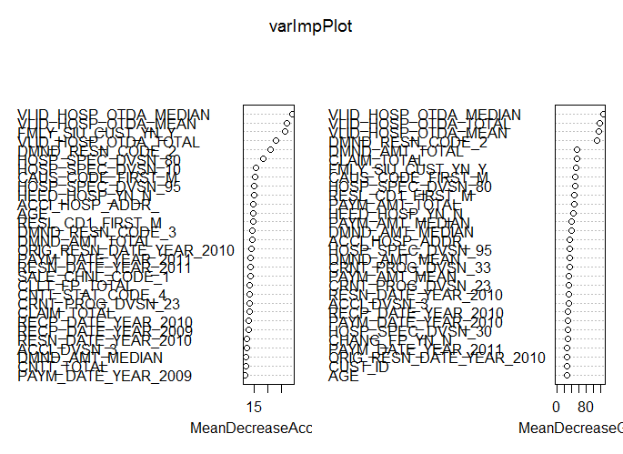

### 모델 학습 및 파라미터 튜닝

#### hold-out 기법

  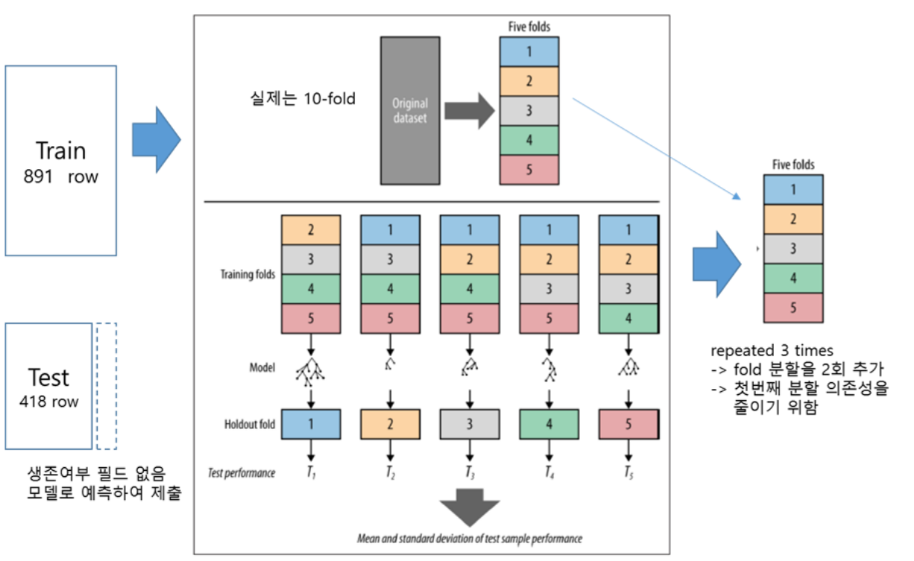

  * 교차 검증 후 테스트 
    * 데이터를 훈련 데이터와 테스트 데이터로 분리함 
    * 훈련 데이터에 대해 K겹 교차 검증(보통 10겹) 을 수행하여 어떤 모델링 기법이 가장 우수한지를 결정함 
      1. 데이터를 10 등분하여 $D_{1}$, $D_{2}$,,,,, $D_{10}$으로 분할함 
      2. K 값을 1로 초기화 함
      3. $D_{K}$ 를 검증 데이터, 그 외의 데이터를 훈련 데이터로 하여 모델을 생성함 
      4. 검증 데이터 $D_{K}$ 를 사용해 모델의 성능을 평가함, 평가된 모델의 성능을 $P_{K}$ 라 함 
      5.  K 가 9이하인 값이면 K = K + 1 을 하고 다시 3단계로 감, 만약 K=10 이면 종료함 
        * 모델의 성능이 $P_{1}$,$P_{2}$,,,, $P_{10}$ 으로 구해지며, 최종 성능은 이들의 산술 평균으로 정함 
    
    * 해당 모델링 기법으로 훈련 데이터 전체를 사용해 최종 모델을 만듬
    * 테스트 데이터에 최종 모델을 적용해 성능을 평가하고, 그 결과를 최종 모델과 함께 제출함
      
    * Trainnig Data의 갯수
      * 많은면 많을 수록 좋다. 최근 추세는 Clean한 데이터를 Train하는 추세
        * 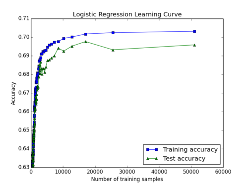
    * [과적합(Overfiting)](https://en.wikipedia.org/wiki/Overfitting)
      * 많은 데이터를 Train 하게되면 unseen 데이터에 대해 낮은 예측력이 생길 수 있다.  
        * 


#### Overfitting? 

  * 데이터가 편향 되었다면 고려해볼 사항
    * up sampling, down samping, SMOTE, ROSE
    
  * down sampling이 정답인가?
    * 데이터가 많다면 그렇다고 할 수 있다.
    * 하지만 데이터가 충분하지 않다면 down samping이 효과적이지 않다
    * up sampling 효과를 본적이 없음...

  * SMOTE같은 방식의 변수 생성방식 적용
  * 아래 논문 에서 보면 무조건 Balance를 맞춰 작업한다고 좋은 결과를 얻는다고 할 수 없다.
    * Handling class imbalance in customer churn prediction. Expert Systems with Applications
    * http://doi.org/10.1016/j.eswa.2008.05.027
  * 아래 논문에서 앙상블 방식으로 데이터를 채우는 방식을 제안
    * Class Imbalance , Redux
    * http://doi.org/10.1109/ICDM.2011.33
  
  * 변수들이 시계열의 특성을 가질 수 있다. 잘못 학습하면 오버피팅에 빠짐
  * ex 2016년 claim 건수
   * --> 3년간 총 claim수 대비 2016년 Claim 건수
   * 0 ~ 1사이의 값을 갖게 해주는게 좋다 편차가 적기 때문이다.


#### SVM (support vector machine)

  * 서포트 벡터머신은 서로 다른 분류에 속한 데이터 간에 간격이 최대가 되는 선(또는 평면)을 찾아 이를 기준으로 데이터를 분류하는 모델임  
      
    * 서포트 벡터 머신은 각 분류에 속하는 데이터로부터 같은 간격으로, 그리고 최대로 멀리 떨어진 선 또는 평면을 찾음 
    * 이러한 선 또는 평면을 최대 여백 초평면(Maximum Margin Hyperplane) 이라고 하고, 이 평면이 분류를 나누는 기준이 됨 
    * 하지만, 모든 데이터를 항상 초평면으로 나눌 수 있는 것은 아님
      * 아래 왼쪽의 경우, 곡선 기준을 통해 평면을 찾을 수 없기 때문에 주어진 데이터를 적절한 고차원으로 옮긴 뒤 변환된 차원에서 서포트 벡터 머신을 사용해 초평면을 찾는 방식을 사용하는데 이를 커널 트릭이라고 함 
       
      * 커널 트릭에서는 실제로 데이터를 고차원으로 변환하는 대신 고차원에서 벡터 간 내적 계산을 했을 때와 같은 값을 반환하는 함수들을 사용한다. 
        * 이 함수들을 사용하면 마치 데이터를 고차원으로 옮긴 듯한 효과를 일으키면서도 데이터를 고차원으로 옮기는데 따른 계산 비용 증가는 피할 수 있고 .. 이러한 함수들을 커널함수라고 부른다. 
        * 대표적인 커널 함수로 다항 커널(Polynomial Kernel), 가우시안 커널(Gaussian Kernel),  레이디얼 베이스 함수(Radial Basis Function Kernel) 이 있음
        * 또한 이들 커널 함수는 커널 파라미터를 갖고, 이 파라미터를 조정함으로써 최적화를 할 수 있다.  
        * 여기서는 Radial Basis Function Kernel 함수를 사용하고,  tuneLength = 9를 통해 Cost 파라미터 C (제약을 위반하는 비용을 명시하는 수임 ) 값의 범위 c(0.25, 0.5, 1, 2, 4, 8, 16, 32, 64) 에서의 성능을 표시함으로써 적절한 파라미터값을 찾는 과정을 보여 줄 것이다. 
    * SVM 의 장점은   
      * 범주나 수치 예측 문제에 대해 사용할 수 있음 
      * 노이즈 데이터에 영향을 크게 받지 않고 잘 과적합화되지 않음 
      * 신경망보다 사용하기 쉽다. 
      * 높은 정확도로 인기가 높음 
    * SVM의 단점은 
      * 최적의 모델을 찾기 위해 커널과 모델에서 매개변수의 여러 가지 조합 테스트가 필요함 
      * 특히 입력 데이터셋이 예제 개수와 속성의 수가 많다면 훈련이 느릴 수 있음 
      * 해석하기 불가능하지는 않지만, 어렵고 복잡한 블랙박스를 만든다. 
  * 서포트 벡터머신에 대해 보다 자세한 설명은 아래 링크를 참고 
    * https://ko.wikipedia.org/wiki/%EC%84%9C%ED%8F%AC%ED%8A%B8_%EB%B2%A1%ED%84%B0_%EB%A8%B8%EC%8B%A0음


#### 랜덤포레스트

  * 앙상블 학습 기법을 사용한 모델임 
    * 앙상블 학습 : 주어진 데이터로부터 여러개의 모델을 학습한 다음, 예측 시 여러 모델의 예측 결과들을 종합해 사용하여 정확도를 높이는 기법
    * 여러 앙상블 기법 중 배깅(bagging) 이라는게 있고,
      * 하나의 학습 알고리즘을 사용해 여러 모델을 생성하는 방식임, 모델의 예측은 투표(분류의 경우)나 투표(수치 예측의 경우)을 사용해 합함 
      * decision tree 모델에 추가적인 다양성을 더하기 위해 무작위 속성선택과 배깅을 접목한 것이 랜덤포레스트(random forest) 이다. 
      * 랜덤포레스트(random forest) 장점
        * 대부분 문제에 잘 수행되는 다용도 모델임 
        * 노이즈 데이터와 결측치 데이터를 다룰 수 있음
        * 가장 중요한 속성을 선택 할 수 있음
        * 극단적으로 큰 속성이나 예제를 가진 데이터를 다룰 수 있음 
        * 배깅 쪽이 그렇듯 개별적인 약한 학습기를 훈련할 때 이전의 약한 학습기으 훈련에 의존하지 않기 때문에 훈련 과정을 별렬화시킬 수 있음 
      * 단점으로는, 
        * decision tree 와 달리 모델이 쉽게 해석되지 않음 (원리를 제3자에게 설명하기 어려움)
        * 데이터에 대한 모델을 조절하는 많은 작업이 필요함 
  * 보다 자세한 랜덤포레스트에서 대해서는 아래 링크를 확인   
    * https://ko.wikipedia.org/wiki/%EB%9E%9C%EB%8D%A4_%ED%8F%AC%EB%A0%88%EC%8A%A4%ED%8A%B8


#### Gradient Boosting

  * Ensemble으로서 순차적인 기법을 사용
  * 이러한 방법은 Weak learner 들의 집합을 결합하여 예측 정확도를 증대시킴
  * 어떤 instant t에서 모델 결과는 이전의 instant t-1의 결과보다 가중된다
  * 도출된 정확한 예측결과는 좀더 낮은 가중치를 갖고, 잘못 분류된 것은 더 높게 가중치를 갖는다.
  * regression에서도 유사한 방법이 따른다.


#### XGBoost

  * "Extreme Gradient Boosting"의 줄임말로, "Gradient Boosting"은 Friedman에 의해 쓰인 Greedy Function Approximation: A Gradient Boosting Machine 에 연구논문에서 제안
  * CART(classification and regression trees)의 집합
  * 최근 다양한 데이터 분석 Competition에서 좋은 성적을 거둔 알고리즘
  

```
#######################################################################
############################ TRAIN MODEL ##############################
#######################################################################
# Set up training control
set.seed(13784)
cv.ctrl <- trainControl(method = "repeatedcv",   # 10fold cross validation
                        number = 3,                         # do 5 repititions of cv
                        summaryFunction = twoClassSummary,  # Use AUC to pick the best model
                        classProbs=TRUE,
                        allowParallel = TRUE)
                        
#######################################################################
################################ svm  #################################
#######################################################################
trainningData.smote.svm <- trainningData.smote
trainningData.smote.svm$SIU_CUST_YN <- factor(trainningData.smote.svm$SIU_CUST_YN)

svm.tune.2 <- train(SIU_CUST_YN ~ VLID_HOSP_OTDA_TOTAL  + VLID_HOSP_OTDA_MEDIAN  + VLID_HOSP_OTDA_MEAN  + DMND_RESN_CODE_2  + PAYM_AMT_TOTAL  + DMND_AMT_TOTAL  + PAYM_AMT_MEAN  + DMND_AMT_MEAN  + CLAIM_TOTAL  + HEED_HOSP_YN_N  + PAYM_AMT_MEDIAN  + DMND_AMT_MEDIAN  + RESL_CD1_FIRST_M  + CRNT_PROG_DVSN_23  + HOSP_SPEC_DVSN_80  + CAUS_CODE_FIRST_M  + ACCI_DVSN_3  + OCCP_GRP_2 + RESN_DATE_YEAR_2010  + PAYM_DATE_YEAR_2010  + HOSP_SPEC_DVSN_30  + RECP_DATE_YEAR_2010  + PAYM_DATE_YEAR_2011  + ORIG_RESN_DATE_YEAR_2010  + CTPR  + HOSP_SPEC_DVSN_95  + RECP_DATE_YEAR_2011  + RESL_CD1_FIRST_S  + ACCI_HOSP_ADDR_  + PAYM_DATE_YEAR_2009  + CRNT_PROG_DVSN_33  + OCCP_GRP_1  + CHANG_FP_YN_N  + RECP_DATE_YEAR_2009  + RESN_DATE_YEAR_2011  + DMND_RESN_CODE_3  + HOSP_SPEC_DVSN_10  + CAUS_CODE_FIRST_W  + RESN_DATE_YEAR_2009  + ACCI_DVSN_1  + AGE  + DMND_RESN_CODE_5  + CHANG_FP_YN_Y  + ORIG_RESN_DATE_YEAR_2009  + ORIG_RESN_DATE_YEAR_2011  + REAL_PAYM_TERM_TOTAL  + SALE_CHNL_CODE_1  + CNTT_STAT_CODE_4  + DMND_RESN_CODE_6  + CNTT_STAT_CODE_1  + ACCI_DVSN_2  + RESN_DATE_YEAR_2012  + CLLT_FP_TOTAL  + PAYM_CYCL_CODE_1  + REAL_PAYM_TERM_MEAN  + CNTT_TOTAL  + PAYM_DATE_YEAR_2012  + RECP_DATE_YEAR_2012  + CAUS_CODE_FIRST_V  + ACCI_HOSP_ADDR_서울  + PAYM_DATE_YEAR_2013  + EXPR_YM_YEAR_9999  + HOSP_SPEC_DVSN_20  + ORIG_RESN_DATE_YEAR_2008  + RESN_DATE_YEAR_2013  + ORIG_RESN_DATE_YEAR_2012  + ORIG_RESN_DATE_YEAR_2013  + MATE_OCCP_GRP_2  + CNTT_STAT_CODE_B  + BEFO_JOB_보험관계인_TOTAL  + RECP_DATE_YEAR_2008  + DMND_RESN_CODE_4  + CUST_ROLE_1  + MATE_OCCP_GRP_1
                    ,data = trainningData.smote.svm
                    ,method = "svmRadial"
                    ,metric = "ROC"
                    ,trControl = cv.ctrl)

svm.tune.2; plot(svm.tune.2);

#################### Evaluation #######################
evalution(svm.tune.2, testingData, BGCON_RESULT$SIU_CUST_YN)

Confusion Matrix and Statistics

          Reference
Prediction    Y    N
         Y   59   16
         N   99 1619
                                          
               Accuracy : 0.9359          
                 95% CI : (0.9235, 0.9468)
    No Information Rate : 0.9119          
    P-Value [Acc > NIR] : 0.0001115       
                                          
                  Kappa : 0.4768          
 Mcnemar's Test P-Value : 2.065e-14       
                                          
            Sensitivity : 0.37342         
            Specificity : 0.99021         
         Pos Pred Value : 0.78667         
         Neg Pred Value : 0.94237         
             Prevalence : 0.08812         
         Detection Rate : 0.03291         
   Detection Prevalence : 0.04183         
      Balanced Accuracy : 0.68182         
                                          
       'Positive' Class : Y               
                                          
 F1 Score 
0.5064378
```

#### svm model after processing variable
모델 | F1 score |
--- | --- |
svm.tune.1  | 0.01257862 |
svm.tune.2  | 0.5064378 |


```
#######################################################################
################################ gbm  #################################
#######################################################################
trainningData.smote.svm <- trainningData.smote
trainningData.smote.svm$SIU_CUST_YN <- factor(trainningData.smote.svm$SIU_CUST_YN)

gbm.tune.1 <- train(SIU_CUST_YN ~ VLID_HOSP_OTDA_TOTAL  + VLID_HOSP_OTDA_MEDIAN  + VLID_HOSP_OTDA_MEAN  + DMND_RESN_CODE_2  + PAYM_AMT_TOTAL  + DMND_AMT_TOTAL  + PAYM_AMT_MEAN  + DMND_AMT_MEAN  + CLAIM_TOTAL  + HEED_HOSP_YN_N  + PAYM_AMT_MEDIAN  + DMND_AMT_MEDIAN  + RESL_CD1_FIRST_M  + CRNT_PROG_DVSN_23  + HOSP_SPEC_DVSN_80  + CAUS_CODE_FIRST_M  + ACCI_DVSN_3  + OCCP_GRP_2 + RESN_DATE_YEAR_2010  + PAYM_DATE_YEAR_2010  + HOSP_SPEC_DVSN_30  + RECP_DATE_YEAR_2010  + PAYM_DATE_YEAR_2011  + ORIG_RESN_DATE_YEAR_2010  + CTPR  + HOSP_SPEC_DVSN_95  + RECP_DATE_YEAR_2011  + RESL_CD1_FIRST_S  + ACCI_HOSP_ADDR_  + PAYM_DATE_YEAR_2009  + CRNT_PROG_DVSN_33  + OCCP_GRP_1  + CHANG_FP_YN_N  + RECP_DATE_YEAR_2009  + RESN_DATE_YEAR_2011  + DMND_RESN_CODE_3  + HOSP_SPEC_DVSN_10  + CAUS_CODE_FIRST_W  + RESN_DATE_YEAR_2009  + ACCI_DVSN_1  + AGE  + DMND_RESN_CODE_5  + CHANG_FP_YN_Y  + ORIG_RESN_DATE_YEAR_2009  + ORIG_RESN_DATE_YEAR_2011  + REAL_PAYM_TERM_TOTAL  + SALE_CHNL_CODE_1  + CNTT_STAT_CODE_4  + DMND_RESN_CODE_6  + CNTT_STAT_CODE_1  + ACCI_DVSN_2  + RESN_DATE_YEAR_2012  + CLLT_FP_TOTAL  + PAYM_CYCL_CODE_1  + REAL_PAYM_TERM_MEAN  + CNTT_TOTAL  + PAYM_DATE_YEAR_2012  + RECP_DATE_YEAR_2012  + CAUS_CODE_FIRST_V  + ACCI_HOSP_ADDR_서울  + PAYM_DATE_YEAR_2013  + EXPR_YM_YEAR_9999  + HOSP_SPEC_DVSN_20  + ORIG_RESN_DATE_YEAR_2008  + RESN_DATE_YEAR_2013  + ORIG_RESN_DATE_YEAR_2012  + ORIG_RESN_DATE_YEAR_2013  + MATE_OCCP_GRP_2  + CNTT_STAT_CODE_B  + BEFO_JOB_보험관계인_TOTAL  + RECP_DATE_YEAR_2008  + DMND_RESN_CODE_4  + CUST_ROLE_1  + MATE_OCCP_GRP_1
                    ,data = trainningData.smote.svm
                    ,method = "gbm"
                    ,metric = "ROC"
                    ,trControl = cv.ctrl)

gbm.tune.1; plot(gbm.tune.1);

#################### Evaluation #######################
evalution(gbm.tune.1, testingData, BGCON_RESULT$SIU_CUST_YN)

Confusion Matrix and Statistics

          Reference
Prediction    Y    N
         Y   69   12
         N   89 1623
                                         
               Accuracy : 0.9437         
                 95% CI : (0.932, 0.9539)
    No Information Rate : 0.9119         
    P-Value [Acc > NIR] : 2.910e-07      
                                         
                  Kappa : 0.5506         
 Mcnemar's Test P-Value : 3.961e-14      
                                         
            Sensitivity : 0.43671        
            Specificity : 0.99266        
         Pos Pred Value : 0.85185        
         Neg Pred Value : 0.94801        
             Prevalence : 0.08812        
         Detection Rate : 0.03848        
   Detection Prevalence : 0.04518        
      Balanced Accuracy : 0.71468        
                                         
       'Positive' Class : Y              
                                         
 F1 Score 
0.5774059 
```

#### gbm model
모델 | F1 score |
--- | --- |
svm.tune.1  | 0.01257862 |
svm.tune.2  | 0.5064378 |
gbm.tune.1  | 0.5774059 |

```
#######################################################################
########################### random forest  ############################
#######################################################################
trainningData.smote.svm <- trainningData.smote
trainningData.smote.svm$SIU_CUST_YN <- factor(trainningData.smote.svm$SIU_CUST_YN)

rf.tune.1 <- train(SIU_CUST_YN ~ VLID_HOSP_OTDA_TOTAL  + VLID_HOSP_OTDA_MEDIAN  + VLID_HOSP_OTDA_MEAN  + DMND_RESN_CODE_2  + PAYM_AMT_TOTAL  + DMND_AMT_TOTAL  + PAYM_AMT_MEAN  + DMND_AMT_MEAN  + CLAIM_TOTAL  + HEED_HOSP_YN_N  + PAYM_AMT_MEDIAN  + DMND_AMT_MEDIAN  + RESL_CD1_FIRST_M  + CRNT_PROG_DVSN_23  + HOSP_SPEC_DVSN_80  + CAUS_CODE_FIRST_M  + ACCI_DVSN_3  + OCCP_GRP_2 + RESN_DATE_YEAR_2010  + PAYM_DATE_YEAR_2010  + HOSP_SPEC_DVSN_30  + RECP_DATE_YEAR_2010  + PAYM_DATE_YEAR_2011  + ORIG_RESN_DATE_YEAR_2010  + CTPR  + HOSP_SPEC_DVSN_95  + RECP_DATE_YEAR_2011  + RESL_CD1_FIRST_S  + ACCI_HOSP_ADDR_  + PAYM_DATE_YEAR_2009  + CRNT_PROG_DVSN_33  + OCCP_GRP_1  + CHANG_FP_YN_N  + RECP_DATE_YEAR_2009  + RESN_DATE_YEAR_2011  + DMND_RESN_CODE_3  + HOSP_SPEC_DVSN_10  + CAUS_CODE_FIRST_W  + RESN_DATE_YEAR_2009  + ACCI_DVSN_1  + AGE  + DMND_RESN_CODE_5  + CHANG_FP_YN_Y  + ORIG_RESN_DATE_YEAR_2009  + ORIG_RESN_DATE_YEAR_2011  + REAL_PAYM_TERM_TOTAL  + SALE_CHNL_CODE_1  + CNTT_STAT_CODE_4  + DMND_RESN_CODE_6  + CNTT_STAT_CODE_1  + ACCI_DVSN_2  + RESN_DATE_YEAR_2012  + CLLT_FP_TOTAL  + PAYM_CYCL_CODE_1  + REAL_PAYM_TERM_MEAN  + CNTT_TOTAL  + PAYM_DATE_YEAR_2012  + RECP_DATE_YEAR_2012  + CAUS_CODE_FIRST_V  + ACCI_HOSP_ADDR_서울  + PAYM_DATE_YEAR_2013  + EXPR_YM_YEAR_9999  + HOSP_SPEC_DVSN_20  + ORIG_RESN_DATE_YEAR_2008  + RESN_DATE_YEAR_2013  + ORIG_RESN_DATE_YEAR_2012  + ORIG_RESN_DATE_YEAR_2013  + MATE_OCCP_GRP_2  + CNTT_STAT_CODE_B  + BEFO_JOB_보험관계인_TOTAL  + RECP_DATE_YEAR_2008  + DMND_RESN_CODE_4  + CUST_ROLE_1  + MATE_OCCP_GRP_1
                    ,data = trainningData.smote.svm
                    ,method = "rf"
                    ,metric = "ROC"
                    ,trControl = cv.ctrl)

rf.tune.1; plot(rf.tune.1);

#################### Evaluation #######################
evalution(rf.tune.1, testingData, BGCON_RESULT$SIU_CUST_YN)

Confusion Matrix and Statistics

          Reference
Prediction    Y    N
         Y   70   12
         N   88 1623
                                          
               Accuracy : 0.9442          
                 95% CI : (0.9326, 0.9544)
    No Information Rate : 0.9119          
    P-Value [Acc > NIR] : 1.768e-07       
                                          
                  Kappa : 0.5566          
 Mcnemar's Test P-Value : 6.382e-14       
                                          
            Sensitivity : 0.44304         
            Specificity : 0.99266         
         Pos Pred Value : 0.85366         
         Neg Pred Value : 0.94857         
             Prevalence : 0.08812         
         Detection Rate : 0.03904         
   Detection Prevalence : 0.04573         
      Balanced Accuracy : 0.71785         
                                          
       'Positive' Class : Y               
                                          
 F1 Score 
0.5833333
```

#### random forest model
모델 | F1 score |
--- | --- |
svm.tune.1  | 0.01257862 |
svm.tune.2  | 0.5064378 |
gbm.tune.1  | 0.5774059 |
rf.tune.1  | 0.5833333 |

```
#######################################################################
############################## xgboost  ###############################
#######################################################################

model.tune.1 <- train(SIU_CUST_YN ~ VLID_HOSP_OTDA_TOTAL  + VLID_HOSP_OTDA_MEDIAN  + VLID_HOSP_OTDA_MEAN  + DMND_RESN_CODE_2  + PAYM_AMT_TOTAL  + DMND_AMT_TOTAL  + PAYM_AMT_MEAN  + DMND_AMT_MEAN  + CLAIM_TOTAL  + HEED_HOSP_YN_N  + PAYM_AMT_MEDIAN  + DMND_AMT_MEDIAN  + RESL_CD1_FIRST_M  + CRNT_PROG_DVSN_23  + HOSP_SPEC_DVSN_80  + CAUS_CODE_FIRST_M  + ACCI_DVSN_3  + OCCP_GRP_2 + RESN_DATE_YEAR_2010  + PAYM_DATE_YEAR_2010  + HOSP_SPEC_DVSN_30  + RECP_DATE_YEAR_2010  + PAYM_DATE_YEAR_2011  + ORIG_RESN_DATE_YEAR_2010  + CTPR  + HOSP_SPEC_DVSN_95  + RECP_DATE_YEAR_2011  + RESL_CD1_FIRST_S  + ACCI_HOSP_ADDR_  + PAYM_DATE_YEAR_2009  + CRNT_PROG_DVSN_33  + OCCP_GRP_1  + CHANG_FP_YN_N  + RECP_DATE_YEAR_2009  + RESN_DATE_YEAR_2011  + DMND_RESN_CODE_3  + HOSP_SPEC_DVSN_10  + CAUS_CODE_FIRST_W  + RESN_DATE_YEAR_2009  + ACCI_DVSN_1  + AGE  + DMND_RESN_CODE_5  + CHANG_FP_YN_Y  + ORIG_RESN_DATE_YEAR_2009  + ORIG_RESN_DATE_YEAR_2011  + REAL_PAYM_TERM_TOTAL  + SALE_CHNL_CODE_1  + CNTT_STAT_CODE_4  + DMND_RESN_CODE_6  + CNTT_STAT_CODE_1  + ACCI_DVSN_2  + RESN_DATE_YEAR_2012  + CLLT_FP_TOTAL  + PAYM_CYCL_CODE_1  + REAL_PAYM_TERM_MEAN  + CNTT_TOTAL  + PAYM_DATE_YEAR_2012  + RECP_DATE_YEAR_2012  + CAUS_CODE_FIRST_V  + ACCI_HOSP_ADDR_서울  + PAYM_DATE_YEAR_2013  + EXPR_YM_YEAR_9999  + HOSP_SPEC_DVSN_20  + ORIG_RESN_DATE_YEAR_2008  + RESN_DATE_YEAR_2013  + ORIG_RESN_DATE_YEAR_2012  + ORIG_RESN_DATE_YEAR_2013  + MATE_OCCP_GRP_2  + CNTT_STAT_CODE_B  + BEFO_JOB_보험관계인_TOTAL  + RECP_DATE_YEAR_2008  + DMND_RESN_CODE_4  + CUST_ROLE_1  + MATE_OCCP_GRP_1
                    ,data=trainningData.smote
                    ,method = "xgbTree"
                    ,metric = "ROC"
                    ,trControl = cv.ctrl)

model.tune.1; plot(model.tune.1);

#################### Evaluation #######################
evalution(model.tune.1, testingData, BGCON_RESULT$SIU_CUST_YN)


Confusion Matrix and Statistics

          Reference
Prediction    Y    N
         Y   75   15
         N   83 1620
                                          
               Accuracy : 0.9453          
                 95% CI : (0.9338, 0.9554)
    No Information Rate : 0.9119          
    P-Value [Acc > NIR] : 6.332e-08       
                                          
                  Kappa : 0.5778          
 Mcnemar's Test P-Value : 1.306e-11       
                                          
            Sensitivity : 0.47468         
            Specificity : 0.99083         
         Pos Pred Value : 0.83333         
         Neg Pred Value : 0.95126         
             Prevalence : 0.08812         
         Detection Rate : 0.04183         
   Detection Prevalence : 0.05020         
      Balanced Accuracy : 0.73275         
                                          
       'Positive' Class : Y               
                                          
 F1 Score 
0.6048387

```

#### xgboost without SMOTE
모델 | F1 score |
--- | --- |
svm.tune.1  | 0.01257862 |
svm.tune.2  | 0.5064378 |
gbm.tune.1  | 0.5774059 |
rf.tune.1  | 0.5833333 |
xgb.tune.1  | 0.6048387 |


#### SMOTE(Synthetic Minority Over-sampling Technique)? 
  * 데이터 분포의 차이가 많기 때문에 Balance를 맞추는 방법이 필요
  * 다양한 데이터 balance 맞추는 방법이 존재 up sample, down sample, ..
  * 이중 효과를 본 것은 SMOTE 방법
  
  * SMOTE는 비율이 낮은 분류의 데이터를 만들어내는 방법
  * SMOTE는 개수가 적은 쪼의 데이터의 샘플을 취한 뒤 이 샘픙릐 k 최근접 이웃(k nearest neighbor)를 찾는다.
    * https://ko.wikipedia.org/wiki/K-%EC%B5%9C%EA%B7%BC%EC%A0%91_%EC%9D%B4%EC%9B%83_%EC%95%8C%EA%B3%A0%EB%A6%AC%EC%A6%98
  * 그리고 현재 샘플과 이들 k개 이웃 간의 차를 구하고, 이 차이에 0 ~ 1 사이의 임의의 값을 곱하여 원래 샘플을 더한다.
  * 결과적으로 SMOTE는 기존의 샘플을 주변의 이웃을 고려해서 약간씩 이동시킨 점들을 추가하는 방식으로 동작

```
#######################################################################
###################### final result with SMOTE ########################
#######################################################################
BGCON_SUBMIT_SMOTE <- read.csv("data/BGCON_SUBMIT_SMOTE.csv")

pred <- factor(BGCON_SUBMIT_SMOTE$SIU_CUST_YN, levels = c("Y", "N"))
result_vec <- factor(BGCON_RESULT$SIU_CUST_YN, levels = c("Y", "N"))
confusion <- confusionMatrix(pred, result_vec)
confusion
f1_score <- (2 * confusion$byClass[3] * confusion$byClass[1]) / (confusion$byClass[3] + confusion$byClass[1])
names(f1_score) <- "F1 Score"
f1_score

```
```
Confusion Matrix and Statistics

          Reference
Prediction    Y    N
         Y   94   45
         N   64 1590
                                          
               Accuracy : 0.9392          
                 95% CI : (0.9271, 0.9498)
    No Information Rate : 0.9119          
    P-Value [Acc > NIR] : 1.093e-05       
                                          
                  Kappa : 0.6             
 Mcnemar's Test P-Value : 0.08469         
                                          
            Sensitivity : 0.59494         
            Specificity : 0.97248         
         Pos Pred Value : 0.67626         
         Neg Pred Value : 0.96131         
             Prevalence : 0.08812         
         Detection Rate : 0.05243         
   Detection Prevalence : 0.07752         
      Balanced Accuracy : 0.78371         
                                          
       'Positive' Class : Y               

 F1 Score 
0.6329966

```

#### xgboost with SMOTE

모델 | F1 score |
--- | --- |
svm.tune.1  | 0.01257862 |
svm.tune.2  | 0.5064378 |
gbm.tune.1  | 0.5774059 |
rf.tune.1  | 0.5833333 |
xgb.tune.1  | 0.6048387 |
xgb.tune.2(SMOTE)  | 0.6329966 |


### 기타

#### 최종 결과 100여팀중 10등
  * 아쉽게도 수상은 실패 (1 ~ 6등까지 시상)
  * 저희 최종 F1 score는 0.633 
  * 1등은 F1 score 0.729    ㅠㅠ
  

#### 부족한 부분?
  * 변수 생성을 위한 가정 설정 및 해결 부분
  * 다양한 변수 발굴
  * PCA를 통한 변수 최적화
  * 결측치 처리 및 이상치 처리
  * 딥러닝의 테스트
  * Stacking(Blending) 테스트
  * Data Mining for Car Insurance Claims Prediction, Dan Huangfu
    * 기존 연구들을 미리 파악하는 것도 중요!!!
  
#### kaggle 소개  
  * http://www.kaggle.com
  * 데이터 분석 Competition
  

```
#######################################################################
######################### write final result ##########################
#######################################################################

final_result <- cbind(model.pred.1, testingData)
write.csv(final_result, file="final_result.csv")
```

[자료 출처]
- R을 이용한 데이터 처리&분석 실무, 서민구 저 
